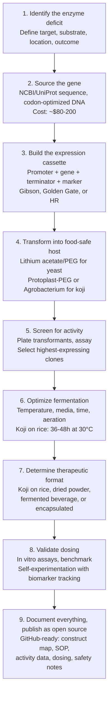

# Open Enzyme: Founding Vision

An open source library of food-grade, engineered microbial strains — each producing a therapeutic enzyme, each growable at home, each freely available to anyone.

**By:** Brian Abent  
**Date:** April 2026  
**Document Type:** North Star Document

---

## 1. The Problem

Hundreds of millions of people worldwide suffer from enzyme deficits. Not rare genetic anomalies — common, often debilitating conditions where the body either lost the ability to produce an enzyme (like uricase, silenced in all humans ~15 million years ago) or can't produce enough of one (like the lipases, proteases, and amylases needed to digest food).

| Statistic | Value |
|-----------|-------|
| Americans with gout (uricase deficit) | 9.2M |
| Global population with lactose malabsorption | ~65% |
| Americans with exocrine pancreatic insufficiency | ~90K |
| Annual cost of IV enzyme replacement therapies | $50K+ |

The list goes on: phenylketonuria (PKU), oxalate kidney stones, histamine intolerance, sucrase-isomaltase deficiency. Each is an enzyme deficit. Each leaves patients caught between pharmaceutical interventions that are staggeringly expensive ($50,000+ per year for IV enzyme replacement, $30–100/month for daily supplements forever) or simply suffering.

These aren't problems of understanding. The enzymes are well-characterized. The genes are sequenced. The biology is solved. What's missing is **accessibility** — a way to bridge the gap between what science knows how to make and what patients can actually get.

---

## 2. The Insight

The organisms we need are already in our kitchens. *Aspergillus oryzae* (koji mold) has been used in East Asian food production for over a thousand years. *Saccharomyces cerevisiae* (brewer's yeast) has been baking bread and fermenting beer for millennia. Both hold GRAS (Generally Recognized As Safe) status from the FDA. Both are among the most genetically tractable organisms on Earth, with decades of established transformation protocols and industrial-scale use.

> **The critical realization:** These organisms already produce therapeutic enzymes naturally. Koji produces lipase, protease, and amylase — the same enzymes that patients with exocrine pancreatic insufficiency pay $30–100/month to take as supplements. And for the enzymes they don't produce natively, we have mature, routine genetic engineering techniques to add them.

Genetic engineering of *S. cerevisiae* is undergraduate coursework. Transformation of *A. oryzae* is decades-old industrial practice. Expression of heterologous enzymes in these hosts is published, reproduced, and well-understood. The missing piece was never the biology. It was the packaging — nobody has assembled this knowledge into a platform that a motivated non-scientist can use.

---

## 3. The Platform Vision

Open Enzyme is an open source library of engineered microbial strains. Each strain addresses a specific enzyme deficit. Each is built in a food-safe (GRAS) host organism. Each comes with everything needed to reproduce it: the gene construct, transformation protocol, fermentation instructions, dosing math, and safety data.

Every strain can be grown at home with simple equipment — rice, a basic incubator, a fermentation vessel. No clean room. No bioreactor. No prescription.

### The GitHub Analogy

If you think about this as software, the architecture snaps into focus:

| Software World | Open Enzyme |
|---|---|
| Repository | → Strain definition (enzyme + host + construct) |
| Source code | → Gene construct (promoter + gene + terminator) |
| Runtime / VM | → Host organism (S. cerevisiae, A. oryzae, etc.) |
| Deployment | → Fermentation protocol (grow on rice, dry, capsule) |
| Dependencies | → Selection markers, auxotrophies, media recipes |
| CI / Testing | → In vitro activity assays, biomarker tracking |
| Fork & PR | → Modify a strain, contribute improvements back |

No patents. No prescriptions. No gatekeeping. Fork it, modify it, contribute back. This is **enzyme production as open source infrastructure.**

---

## 4. First Targets

### Uricase — Gout (Active Development)

*S. cerevisiae* or *S. boulardii* expressing the *Aspergillus flavus* uricase gene (*uaZ*). The enzyme degrades uric acid in the gut lumen, exploiting the ABCG2 secretion pathway through which approximately one-third of the body's uric acid is excreted into the intestine. By placing the enzyme where the substrate already concentrates, we avoid the need for systemic delivery entirely.

**Validated by:** Rasburicase (FDA-approved since 2001, same A. flavus uricase gene expressed in S. cerevisiae) • ALLN-346 oral uricase (Phase 2a: statistically significant reduction in serum uric acid via gut-lumen degradation) • PULSE probiotic (Cell Reports Medicine, Oct 2025: engineered E. coli Nissle expressing uricase, validated in rodent models) • Engineered S. boulardii for UA degradation (ACS Synthetic Biology, 2025: 365 μmol/h/OD enzymatic activity)

### Digestive Enzymes — EPI / SIBO (Ready Now)

Wild-type *Aspergillus oryzae* (koji). No genetic engineering needed. Traditional koji grown on steamed rice already produces lipase, protease, and amylase at therapeutically relevant levels. This is the simplest possible entry point — a food that has been consumed for over a millennium, produced with equipment available in any kitchen, providing the same enzymes that patients with exocrine pancreatic insufficiency currently buy as pharmaceutical supplements.

**Evidence:** Koji enzyme profiles are extensively characterized in food science literature • Commercial enzyme supplements (Creon, Zenpep) use fungal-derived enzymes from the same family • A. oryzae holds FDA GRAS status with decades of safety data

### Expanding the Library (Future Targets)

Each represents a well-characterized enzyme deficit with a known gene and a feasible GRAS-host expression strategy:

- **Lactase** (lactose intolerance, ~4.7B people globally)
- **Oxalate decarboxylase** (oxalate kidney stones, ~10% lifetime prevalence)
- **Phenylalanine hydroxylase** (PKU, ~1:10,000 births)
- **Diamine oxidase** (histamine intolerance, estimated 1–3% of population)

---

## 5. The Science That Makes This Real

Every claim in this document traces to established, published science. This isn't speculative biology — it's an integration play, assembling known, validated components into a new configuration. Here is the evidence base:

### 1. ALLN-346 Phase 2a Clinical Trial

Oral uricase enzyme (non-living, acid-stable formulation) demonstrated statistically significant reduction in serum uric acid levels via gut-lumen degradation. Proof that an enzyme active in the intestine can lower systemic uric acid without entering the bloodstream.

### 2. PULSE Probiotic (Cell Reports Medicine, Oct 2025)

Engineered *E. coli* Nissle 1917 expressing uricase, validated in rodent models. Demonstrates that a living, orally-delivered microbe can express enough active uricase in the gut to meaningfully reduce uric acid levels.

### 3. Engineered S. boulardii (ACS Synthetic Biology, 2025)

*S. boulardii* engineered for uric acid degradation achieved 365 μmol/h/OD enzymatic activity. Demonstrates that a GRAS yeast can be engineered to express functional uricase at therapeutically relevant activity levels.

### 4. Rasburicase (FDA-Approved Since 2001)

*Aspergillus flavus* uricase gene expressed in *S. cerevisiae*. The exact gene-host combination this project proposes has been FDA-approved for over two decades as an IV drug (Elitek/Fasturtec). We are not inventing a new enzyme or a new expression system — we are changing the delivery route from IV to oral/food.

### 5. ABCG2 Gut Uric Acid Secretion Pathway

Approximately one-third of total uric acid excretion occurs via active secretion into the intestinal lumen through the ABCG2 transporter. This creates a natural substrate pool in the gut that a gut-resident or gut-delivered enzyme can access, making systemic absorption of the enzyme unnecessary.

### 6. A. oryzae & S. cerevisiae Genetic Engineering

Both organisms have decades of established transformation protocols. *S. cerevisiae* is the most genetically tractable organism on Earth, with a mature toolkit of promoters, terminators, selection markers, and expression vectors. *A. oryzae* transformation is routine in industrial biotechnology, with established protoplast and Agrobacterium-mediated methods. Both hold FDA GRAS status.

---

## 6. The Team

Each person on this team maps to a critical question the project needs answered. No one is here by accident.

### Brian Abent — Platform / Engineering

CTO who built Ceros from zero to $50M ARR. No science degree — thinks like an engineer. Currently building Alma.casa (AI real estate) and raising a seed round. Started Open Enzyme because he has gout and got tired of waiting for the system to solve it.

**Answers:** How do we make this reproducible, documentable, and accessible to non-scientists? How do we build this as a platform, not a one-off experiment?

### Rheinallt Jones, PhD — Gut Microbiome / In Vivo Validation

Associate Professor, Emory Pediatric GI. Runs the Emory Gnotobiotic Animal Core. Deep expertise in gut microbiome dynamics and germ-free animal models.

**Answers:** Will an engineered strain survive and function in the gut? How does it interact with existing microbiota? What do the gnotobiotic validation experiments look like?

### Lauren Collier-Hyams, PhD — NF-κB / Pharma Translation

Emory-trained (NF-κB / intestinal epithelial signaling under Andrew Neish). Now in pharma at Grifols/Medexus. Bridges academic research and pharmaceutical development.

**Answers:** What are the inflammatory signaling implications? How does this map to pharma-grade safety and efficacy standards? Where does citizen science end and clinical development begin?

### Valerie Jones née Sloane, PhD — Innate Immune Safety

Emory-trained (TLR5 / innate immune responses in gut epithelium under Andrew Neish). Expertise in how the gut immune system responds to microbial signals.

**Answers:** Will engineered strains trigger adverse immune responses? How do we ensure the host organism's modifications don't create unexpected immunogenic epitopes or pathogen-associated molecular patterns?

> **Note on lineage:** Rheinallt, Lauren, and Valerie all trained in Andrew Neish's Epithelial Pathobiology Unit at Emory. This gives the team a shared scientific vocabulary and a deep, overlapping understanding of gut epithelial biology, microbial-host interactions, and inflammatory signaling — exactly the domain this project operates in.

---

## 7. How It Works

The end-to-end flow from identifying a deficit to producing a functional, food-grade therapeutic enzyme:

---

## 8. Cost Reality

A single IV dose of rasburicase costs approximately $5,000–8,000 at US hospital pricing. The total project cost to engineer a new strain from scratch:

| Component | Description | Cost |
|-----------|-------------|------|
| Gene synthesis | Codon-optimized synthetic DNA (IDT, Twist) | ~$80 |
| Cloning & transformation | Vectors, enzymes, competent cells, plates, media | $200–500 |
| Screening & validation | Activity assays, colony screening, confirmation | $500–1,000 |
| Equipment access | Community biolab membership / shared equipment | $0–500 |
| Fermentation supplies | Rice, media, incubation, drying/processing | $50–100 |
| **Total per new strain** | | **$1,200–$2,500** |

> **For perspective:** The total cost to develop one new Open Enzyme strain is less than a single IV dose of rasburicase. Ongoing production cost for home-grown koji or yeast is effectively the price of rice and basic nutrients — under $5/month.

---

## 9. The Multi-Attack Strategy

For the founding use case (Brian's gout), the project isn't just "make uricase." Gout is a cascade: uric acid accumulates, crystallizes in joints, triggers the NLRP3 inflammasome, which drives the acute inflammatory attack. A comprehensive strategy addresses multiple points in the cascade simultaneously:

### Remove the Cause

Engineered yeast or koji producing uricase. Degrades uric acid in the gut lumen before it can accumulate systemically. The primary engineering target of this project.

### Defuse the Bomb

NLRP3 inflammasome suppression stack: beta-hydroxybutyrate (BHB), oridonin, sulforaphane, KPV peptide. Each compound targets a different step in the NLRP3 activation pathway — priming, assembly, or IL-1β release.

### Heal the Damage

Peptides for tissue repair: BPC-157 (angiogenesis, tendon/joint repair), TB-500/Thymosin β4 (anti-inflammatory, tissue remodeling). Addresses existing damage from prior flares.

### Optimize the Terrain

Gut health optimization: targeted probiotics, SIBO treatment (addressing Lynn's digestive enzyme insufficiency), gut barrier support. A healthy gut is the deployment environment for everything above.

This multi-vector approach reflects an engineering mindset: don't bet on a single point of intervention. Build redundancy into the system. If the uricase strain takes months to optimize, the NLRP3 stack provides relief now. If inflammasome suppression is partial, tissue repair peptides address what gets through.

---

## 10. Principles

- **Open source everything.** No patents on strains, constructs, or protocols. The point is accessibility. If this works, it should be available to every gout patient, every person with EPI, every family managing PKU — not locked behind intellectual property walls.

- **Safety first — GRAS organisms only.** Every strain is built in a host organism that has FDA GRAS status and centuries of safe human consumption. We use established transformation methods with known safety profiles. No novel organisms. No uncharacterized pathways.

- **Rigorous but accessible.** Every protocol should be followable by a motivated non-scientist with basic lab access (community biolab level). But "accessible" never means "sloppy." Documentation is detailed, methods are validated, results are quantified.

- **Community-validated.** Replication is not optional — it's the core quality mechanism. Encourage independent reproduction, share all results (including failures), build a community of practice around each strain.

- **Not medical advice.** This is citizen science, self-experimentation, and open knowledge sharing. We document what we build, what we observe, and what the published literature supports. We do not prescribe, diagnose, or claim to cure.

---

## 11. What This Is Not

- **Not a company** (at least not yet). This is a passion project born from personal necessity, built in the open. If it grows into something larger, it will be because the science worked and the community demanded it — not because of a business plan.

- **Not medical advice or a replacement for professional care.** Anyone using these protocols should be working with their physician, tracking their biomarkers, and making informed decisions about their own health.

- **Not claiming to cure anything.** This is a research and self-experimentation platform. We produce enzymes. We measure their activity. We track biomarkers. We share data. The biology is well-established; the integration into a home-producible format is what's novel.

- **Not reckless.** Every strain uses GRAS organisms. Every method is drawn from published, peer-reviewed protocols. The team includes three PhDs with deep gut biology expertise. We are careful precisely because we are serious.

---

## 12. Existing Research Library

The following research documents form the evidence base and technical foundation for the Open Enzyme project. Each was produced as a deep-dive into a specific aspect of the problem:

1. **[Gout: A Deep Dive — State of the Art, Frontier Research, and Unconventional Angles](gout-deep-dive.md)**  
   Comprehensive survey of gout pathophysiology, current treatments, and emerging therapeutic approaches including uricase gene therapy and gut-based strategies.

2. **[The Enzyme Deficit Connection — Gout, Digestion & the Koji Frontier](enzyme-deficit-deep-dive.md)**  
   Mapped the link between Brian's uricase deficit and Lynn's digestive enzyme insufficiency. Identified koji as a dual-purpose therapeutic platform and crystallized the Open Enzyme concept.

3. **[Engineering S. cerevisiae for Oral Uricase Delivery — A Research Proposal](engineered-yeast-uricase-proposal.md)**  
   Detailed technical proposal for the uricase yeast strain: gene construct design, expression strategy, transformation protocol, and in vitro/in vivo validation plan.

4. **[Project Koji — Engineering A. oryzae for Dual Enzyme Therapy](engineered-koji-protocol.md)**  
   Full protocol for engineering koji to produce both digestive enzymes (native) and uricase (heterologous). Covers transformation, fermentation, and dosing for a rice-based therapeutic food.

5. **[NLRP3 Exploit Map — Pen-Testing the Inflammatory Cascade](nlrp3-exploit-map.md)**  
   Systematic analysis of every intervention point in the NLRP3 inflammasome pathway. Identified a multi-compound suppression stack (BHB, oridonin, sulforaphane, KPV) targeting priming, assembly, and effector stages.

6. **[Pen-Testing the Gut-Blood Barrier — Every Route to Systemic Uricase](blood-barrier-exploits.md)**  
   Evaluated every possible route for getting uricase from gut to bloodstream. Concluded that gut-lumen degradation (not systemic absorption) is the most viable and safest strategy.

7. **[Peptides & Gout: A Research Addendum](peptide-gout-addendum.md)**  
   Deep dive into BPC-157, TB-500, and KPV for gout-related tissue repair and inflammation control. Established the "heal the damage" arm of the multi-attack strategy.

8. **[AI & Bio Tools Playbook](ai-bio-tools-playbook.md)**  
   Practical guide to using AI for sequence analysis, literature mining, and design of synthetic constructs.

---

> This project exists because the biology is solved and the access is broken. We're not waiting for permission to fix that.

**Open Enzyme Project — April 2026**
