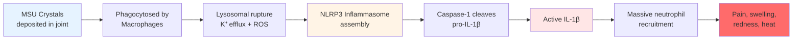
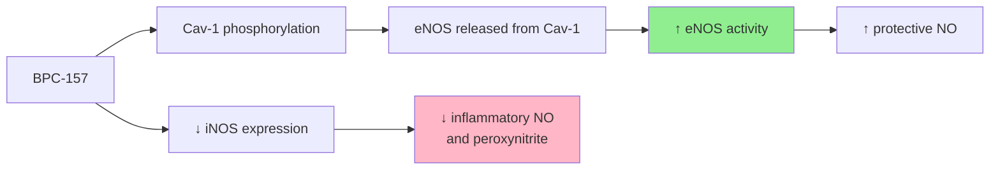
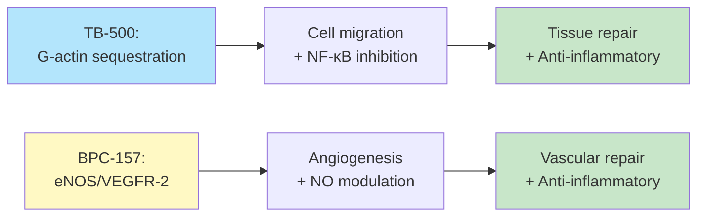
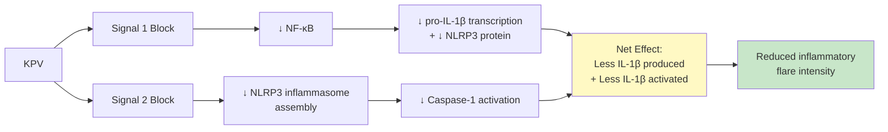
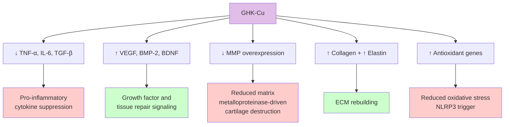

# Peptides & Gout Management

A deep dive into whether the peptides gaining traction in the biohacking world — BPC-157, TB-500, KPV, GHK-Cu, and others — have any real relevance to gout. What the science actually says, where it's speculative, and what's worth considering.

**April 2026** • ~25 min read • Addendum to the Gout Deep Dive

---

## Quick Primer: Why Gout Is an Inflammasome Disease

Before we get into peptides, a refresher on what's actually happening during a gout flare — because understanding the mechanism is what makes the peptide discussion interesting.

Gout isn't just "too much uric acid." It's a two-stage process. First, uric acid levels rise high enough to form monosodium urate (MSU) crystals in your joints. Second — and this is where the real pain comes from — your immune system goes absolutely nuclear in response to those crystals.

The key player is the **NLRP3 inflammasome**, a molecular alarm system inside your macrophages (immune cells). Here's the cascade:



This is why colchicine works — it disrupts microtubule assembly, preventing the NLRP3 inflammasome from properly activating. And it's why IL-1 inhibitors like anakinra and canakinumab work — they block the end product (IL-1β) directly.

The peptide question is simple: **can any of these compounds modulate this pathway?** Can they calm the NLRP3 inflammasome, reduce the IL-1β output, protect the joints from chronic crystal damage, or improve uric acid clearance through the gut or kidneys? Let's look at each one.

One more thing worth remembering: about one-third of uric acid is excreted through the gut (intestinal uricolysis via gut bacteria), and the remaining two-thirds through the kidneys. Anything that improves gut health or kidney function could theoretically improve uric acid clearance. Keep that in the back of your mind.

---

## BPC-157 (Body Protection Compound-157)

The one you're already using. A 15-amino-acid peptide derived from human gastric juice. Here's what it's actually doing and whether it matters for gout.

**BPC-157** • Pentadecapeptide • 15 amino acids • Sequence: Gly-Glu-Pro-Pro-Pro-Gly-Lys-Pro-Ala-Asp-Asp-Ala-Gly-Leu-Val

**[Mostly Preclinical]**

### Mechanism of Action

BPC-157 operates through at least four major molecular systems. It's not a single-pathway drug — it's more like a systems-level modulator, which is part of why it's hard to study cleanly and also why it shows effects across so many different injury types.

#### 1. Nitric Oxide System — The Big One

BPC-157 modulates the nitric oxide (NO) system in a nuanced way that's genuinely interesting. It **stabilizes endothelial nitric oxide synthase (eNOS)** — the "good" version that promotes vasodilation, blood flow, and tissue healing — while **suppressing inducible NOS (iNOS)**, the version that ramps up during inflammation and produces toxic levels of NO that contribute to tissue damage.

Mechanistically, BPC-157 stimulates Caveolin-1 (Cav-1) phosphorylation, which releases eNOS from its inhibitory binding to Cav-1. This activates the Src-Caveolin-1-eNOS pathway, increasing protective NO production. The downstream effect: better blood flow to injured tissue, reduced edema, and an environment that favors repair over destruction.



**Gout relevance:** During a flare, iNOS goes through the roof in the affected joint. The toxic NO and peroxynitrite it generates cause oxidative damage and amplify inflammation. An agent that can selectively suppress iNOS while maintaining eNOS-dependent blood flow is doing something colchicine doesn't do. That said — this is mechanistic reasoning from animal models, not gout-specific clinical evidence.

#### 2. Growth Factor Modulation & Angiogenesis

BPC-157 upregulates VEGFR-2 (vascular endothelial growth factor receptor 2), which doesn't mean it makes tumors grow — it means it promotes the formation of new blood vessels in injured tissue. It increases receptor density rather than flooding the system with VEGF itself, which is a more controlled form of angiogenic signaling.

It also upregulates growth hormone receptor expression, activates the FAK-paxillin pathway (critical for cell migration and adhesion), and promotes the Akt-eNOS phosphorylation cascade. All of these converge on tissue repair.

**Gout relevance:** Chronic gout causes real structural damage — cartilage erosion, bone damage from tophi, and synovial tissue destruction. A compound that accelerates vascularization and tissue repair could help with recovery between flares, but this is speculative extrapolation, not demonstrated in gouty joints.

#### 3. Anti-Inflammatory Pathways

BPC-157 reduces pro-inflammatory cytokines (TNF-α, IL-6, IL-1β) in various animal models of inflammation and injury. Multiple studies show reduced inflammatory cell infiltration, lower myeloperoxidase (MPO) activity (a marker of neutrophil involvement — exactly what drives gout pain), and reduced oxidative stress markers.

> **Key Insight:** The NLRP3 Question
> 
> Here's where we need to be honest. There is no published study that directly tests BPC-157's effect on NLRP3 inflammasome activation, either generally or in the context of MSU crystal-induced inflammation specifically. The anti-inflammatory effects are well-documented in animal models, and they *indirectly* suggest NLRP3 involvement (because reducing IL-1β and neutrophil recruitment are downstream of NLRP3), but nobody has put BPC-157 in a dish with macrophages and MSU crystals and measured inflammasome assembly. That study hasn't been done.
>
> What we can say: BPC-157 reduces the same cytokines (IL-1β, TNF-α) that NLRP3 activation produces. It reduces oxidative stress (ROS are a key NLRP3 trigger). And it suppresses iNOS, whose products can activate NLRP3. So the mechanistic argument is reasonable — but it's an inference, not a proven pathway.

#### 4. Gut Healing — The Indirect Gout Connection

This is actually where BPC-157 might matter most for gout, and most people miss it entirely.

BPC-157 was originally studied for its gastroprotective effects — it's literally derived from a protein found in human gastric juice. In animal models, it repairs gastric ulcers, heals NSAID-induced gut damage, restores intestinal tight junctions (the "leaky gut" connection), reduces mucosal inflammation, and protects against alcohol-induced intestinal damage.

Why does this matter for gout? Because approximately **one-third of uric acid excretion happens through the gut** via intestinal uricolysis. Gut bacteria (particularly those expressing uricase-like enzymes) break down uric acid in the intestinal lumen. If your gut barrier is compromised, if mucosal inflammation is reducing bacterial diversity, or if the intestinal epithelium isn't functioning well — you're potentially impairing a significant excretion pathway.

BPC-157's ability to restore gut barrier integrity, reduce intestinal inflammation, and protect the gut lining could theoretically support the gut's contribution to uric acid elimination. No one has studied this directly (BPC-157's effect on intestinal uric acid handling), but the logic chain is sound: healthier gut → healthier microbiome → better intestinal uricolysis → lower serum uric acid.

### Delivery Routes: Nasal Spray vs. The Alternatives

Since you're using nasal spray, here's the bioavailability picture:

| Route | Bioavailability | Details |
|-------|-----------------|---------|
| **Subcutaneous Injection** | >80% | Gold standard. Peak plasma in 15-30 min. Bypasses all degradation barriers. Best for systemic effects and musculoskeletal targets. |
| **Nasal Spray** | 30-50% | Avoids first-pass liver metabolism. Good systemic delivery without needles. May need higher doses to match injection levels. Good balance of convenience and efficacy. |
| **Oral (Standard)** | ~3% | Most gets destroyed by stomach acid and enzymes. BUT — for gut-specific effects (healing, barrier repair), this is actually ideal. The peptide acts locally before it's degraded. |

> **Route Strategy for Gout Specifically**
>
> Your nasal spray is giving you decent systemic anti-inflammatory coverage. But if the gut-uric acid excretion angle interests you, there's an argument for *also* taking oral BPC-157 — not for systemic bioavailability (which is terrible orally) but for direct local action on the gut lining. Some protocols run nasal/injectable for systemic + oral for gut simultaneously.

### Safety Profile

A 2025 pilot study (Lee & Burgess) gave two healthy adults IV BPC-157 infusions up to 20mg — well tolerated, no adverse events. But that's literally two people. The animal safety data is extensive and reassuring — no toxicity, no organ damage, no mutagenicity in standard panels across hundreds of rodent studies. But the human data is razor-thin.

Known considerations: BPC-157 is pro-angiogenic (promotes blood vessel growth), which raises theoretical concerns for anyone with active cancer or a history of certain cancers. It may affect blood pressure through NO modulation. And because it promotes growth factor signaling, some clinicians caution against use during active infections where you don't want to "feed" the proliferative environment.

For gout specifically, one concern worth noting: BPC-157's growth-promoting properties are generally seen as beneficial, but if there's active tophaceous gout with significant crystal deposits, we genuinely don't know whether promoting tissue remodeling around tophi is helpful or neutral. Nobody's studied it.

---

## TB-500 (Thymosin Beta-4)

The tissue repair peptide. A 43-amino-acid synthetic fragment of thymosin beta-4, one of the most abundant intracellular proteins in mammalian cells.

**TB-500** • 43 amino acids • Synthetic fragment of Thymosin Beta-4 (Tβ4)

**[Preclinical]**

### Mechanism — How It Differs from BPC-157

Where BPC-157 is primarily about vascular repair and NO modulation, TB-500's core mechanism is fundamentally different: **actin regulation**. TB-500 binds to G-actin (globular actin) and sequesters it, which regulates the actin cytoskeleton — the internal scaffolding that cells use to move, divide, and change shape.

This isn't abstract biochemistry. When tissue is damaged, cells need to migrate to the wound site. Keratinocytes, fibroblasts, endothelial cells — they all need to physically move, and movement requires constant actin remodeling. TB-500 facilitates this by maintaining a pool of available G-actin and promoting cell migration.



### Anti-Inflammatory Action

TB-500 (Tβ4) has a direct and well-characterized anti-inflammatory mechanism: it **blocks NF-κB nuclear translocation**. Specifically, it prevents the RelA/p65 subunit of NF-κB from entering the nucleus, which means it blocks the transcription of a huge array of pro-inflammatory genes — TNF-α, IL-6, IL-8, COX-2, iNOS, and others.

This is significant for gout because NF-κB is the master transcription factor that sits upstream of the entire inflammatory cascade. It's "signal 1" (the priming signal) for NLRP3 inflammasome activation. Without NF-κB-driven transcription of pro-IL-1β and NLRP3 itself, the inflammasome can't fire. So TB-500's NF-κB inhibition could theoretically attenuate the priming step of the gout flare cascade.

### Relevance to Gout

#### Inflammation Modulation

TB-500 dampens inflammation without shutting it down completely — it's modulatory rather than suppressive. In wound healing studies, it reduces excess inflammatory signaling while still allowing the necessary immune response. For gout, where the problem is an *overreaction* to crystals (your immune system treating MSU like a bacterial invasion), a modulator that dials back the response without eliminating it is theoretically ideal.

#### Tissue Repair After Tophaceous Damage

This is TB-500's strongest potential gout application. Chronic gout causes real structural damage: cartilage erosion, bone lesions, and synovial proliferation from tophi. Animal studies show TB-500 accelerates wound healing by 42-61%, increases collagen deposition, reduces scar tissue formation (by decreasing myofibroblasts), and promotes organized vascular networks in healing tissue.

For someone recovering from chronic gout damage, or dealing with joint tissue that's been degraded by repeated flares, TB-500's tissue repair capabilities are at least theoretically relevant. But — no one has studied it in gouty joints.

#### Anti-Fibrotic Properties

In kidney models, Tβ4 fragments inhibit TGF-β pathways and reduce collagen deposition. Chronic gout can lead to kidney damage (urate nephropathy), and tophi in joints involve fibrotic tissue encapsulation of crystal deposits. TB-500's anti-fibrotic action could theoretically help with both, though this is entirely speculative.

### BPC-157 + TB-500 Synergy

The combination — sometimes called the "Wolverine Stack" in biohacking circles (eyeroll, but the name stuck) — has a reasonable mechanistic basis for synergy. BPC-157 drives vascularization and NO-mediated healing; TB-500 drives cell migration and NF-κB suppression. They work through completely different primary pathways, so combining them covers more of the healing cascade than either alone.

Rodent studies using both compounds together show collagen organization and vascularization metrics that exceed either compound alone. But there are no human synergy studies — the "stack" concept comes from mechanistic reasoning and anecdotal reports, not controlled trials.

> **The Practical Reality**
>
> Neither BPC-157 nor TB-500 is FDA-approved for any indication. Both are banned by WADA. The quality of commercially available peptides varies wildly — purity, contamination, and actual peptide content are real concerns when you're sourcing from research chemical suppliers. If you're running both, source matters enormously.

---

## KPV (Lys-Pro-Val)

A tripeptide fragment of alpha-MSH. Three amino acids. Possibly the most targeted anti-inflammatory peptide in this entire list for gout specifically.

**KPV** • Tripeptide • C-terminal fragment (residues 11-13) of α-MSH • Lys-Pro-Val

**[Preclinical + Mechanistic]**

### Why This One Is Interesting for Gout

KPV hits both of the key inflammatory pathways in gout — and it hits them hard. Let me explain.

Alpha-melanocyte-stimulating hormone (α-MSH) is one of the body's own anti-inflammatory neuropeptides. It's powerfully anti-inflammatory, but it also causes skin darkening (melanogenesis) and activates multiple melanocortin receptors with various side effects. KPV isolates the anti-inflammatory activity of α-MSH's C-terminal tripeptide *without* the melanocortin receptor activation. It's a cleaner signal.

### Dual Pathway Inhibition

#### 1. NF-κB Pathway — The Priming Signal

Nanomolar concentrations of KPV inhibit NF-κB activation. This is "signal 1" in NLRP3 inflammasome priming — without NF-κB-driven transcription, cells produce less pro-IL-1β and less NLRP3 protein. KPV also inhibits MAP kinase inflammatory signaling and reduces pro-inflammatory cytokine secretion broadly.

#### 2. NLRP3 Inflammasome — The Trigger

KPV has been shown to directly inhibit NLRP3 inflammasome activation in immune cells. This means it's not just reducing the fuel (pro-IL-1β) — it's interfering with the ignition system itself.



This dual-block mechanism is genuinely compelling for gout. The entire gout flare cascade runs through NLRP3 → Caspase-1 → IL-1β → neutrophil recruitment. KPV attacks both the priming step (NF-κB) and the activation step (NLRP3 assembly). That's the same general strategy as colchicine (disrupts inflammasome assembly) combined with anakinra (blocks IL-1), in a single molecule.

### Gut Anti-Inflammatory Effects

Here's the second reason KPV is interesting for gout. In animal models of colitis (DSS-induced and TNBS-induced), orally administered KPV significantly reduced intestinal inflammation: reduced weight loss, decreased colonic myeloperoxidase activity, and markedly decreased histological signs of inflammation and pro-inflammatory cytokine mRNA levels.

KPV enters intestinal epithelial cells and immune cells via the PepT1 transporter — the same peptide transporter that handles dietary di- and tripeptides. This gives it direct access to the gut immune system.

**The gout connection:** Remember the gut-uric acid axis. If KPV reduces intestinal inflammation and supports a healthier gut environment, it could improve the conditions for intestinal uricolysis — the gut's contribution to uric acid excretion. Combined with its systemic NLRP3 inhibition, KPV potentially addresses both the flare mechanism *and* one of the excretion pathways.

> **Could KPV Be More Targeted for Gout Than BPC-157?**
>
> Arguably, yes. BPC-157 is a broad-spectrum tissue repair compound that happens to have anti-inflammatory properties. KPV is a *targeted anti-inflammatory* that hits the exact pathways driving gout flares (NLRP3 + NF-κB) and also has gut anti-inflammatory effects relevant to uric acid excretion. If you had to pick one peptide specifically for gout, the mechanistic case for KPV is stronger. BPC-157's advantage is its broader tissue repair properties — useful for recovering from gout damage, but not as directly aimed at the flare itself.

> **Cross-Reference: NLRP3 Chokepoint Mapping**
>
> KPV's dual NF-κB + NLRP3 mechanism maps precisely to **Chokepoints 1 and 2** in the [NLRP3 Exploit Map](nlrp3-exploit-map.md), which systematically catalogs six intervention points in the gout flare cascade. That analysis also identified a potentially more impactful compound: **beta-hydroxybutyrate (BHB)** — the ketone body produced during fasting — which hits *three* chokepoints (1, 2, and 4). BHB is endogenous, well-studied, and levels can be raised through intermittent fasting, ketogenic diet, or exogenous ketone supplements. It may be more impactful than any single peptide on this list.

### Gut Health, SIBO, and the Shared Inflammatory Pathway

KPV's gut anti-inflammatory properties are especially relevant beyond gout. The same NLRP3 inflammasome pathway that drives gout flares is a central driver of intestinal inflammation — including the chronic low-grade inflammation associated with **SIBO (Small Intestinal Bacterial Overgrowth)**. This creates a direct connection to Lynn's digestive situation (see [The Enzyme Deficit Connection](enzyme-deficit-deep-dive.md)): SIBO damages the brush-border enzymes, worsens enzyme insufficiency, and drives the same inflammatory pathways that KPV targets. A compound that calms intestinal NLRP3 activation could theoretically help both gout (by supporting intestinal uric acid excretion) and digestive insufficiency (by reducing the inflammation that damages enzyme-producing tissue).

### Delivery & Dosing Considerations

KPV is typically administered orally (for gut effects) or subcutaneously (for systemic anti-inflammatory effects). Its small size (just 3 amino acids) gives it an advantage over larger peptides for oral absorption — it's transported by PepT1 and is resistant to significant enzymatic degradation. Some protocols use both routes simultaneously: oral for gut healing and sub-Q for systemic NLRP3 suppression.

---

## GHK-Cu (Copper Peptide)

The tissue remodeling peptide. A naturally occurring tripeptide-copper complex that declines with age and has a remarkable ability to reprogram gene expression.

**GHK-Cu** • Tripeptide-copper complex • Gly-His-Lys + Cu²⁺ • Naturally present in plasma, saliva, urine

**[Preclinical + In Vitro]**

### The Gene Expression Story

GHK-Cu's most fascinating property is its scale of gene modulation. Studies using the Broad Institute's Connectivity Map show that GHK-Cu can up- or downregulate **over 4,000 human genes** — roughly 31% of the human genome. That sounds too good to be true, and it should make you appropriately skeptical. But the gene expression data is real, published, and reproducible.

The relevant gene expression changes for gout include:



### Joint Tissue Repair Relevance

GHK-Cu's strongest suit for gout is connective tissue repair. It promotes collagen and elastin synthesis, supports cartilage extracellular matrix (ECM) remodeling, and regulates matrix metalloproteinases (MMPs) — the enzymes that break down cartilage. In chronic gout, repeated flares cause cartilage erosion and joint damage. An agent that promotes ECM rebuilding while restraining destructive enzymes addresses the structural damage side of gout.

Animal models show improved healing in ligaments, tendons, bone, liver, and stomach lining. The ECM modulation effects have been demonstrated in connective tissue repair models, though not specifically in crystal-damaged joints.

### Topical Application Over Affected Joints?

GHK-Cu is widely used topically for skin rejuvenation (it's in a lot of high-end skincare). The question of whether topical application over a gouty joint could deliver meaningful local effects is interesting but largely unanswered.

GHK-Cu penetrates skin reasonably well (it's a small molecule), and there's a logical case for local anti-inflammatory and tissue-remodeling effects if it reaches the periarticular tissue. Some practitioners suggest applying GHK-Cu cream or serum over affected joints. But there's no clinical evidence this works for gout specifically — it's entirely theoretical.

For systemic effects (gene expression changes, systemic anti-inflammatory action), subcutaneous injection is the standard route.

> **GHK-Cu's Role in a Gout Context**
>
> Think of GHK-Cu as the "recovery and rebuilding" peptide rather than the "flare fighter." It's probably not your first line during an acute flare. But for ongoing joint protection, reducing chronic low-grade inflammation, and supporting cartilage repair between flares — the gene expression data is intriguing. The anti-inflammatory cytokine suppression and antioxidant upregulation are relevant to NLRP3 modulation (reducing ROS, one of the activation triggers), but it's an indirect connection.

---

## Other Peptides & Compounds of Interest

The extended roster — pentosan polysulfate, SS-31, ANP, and emerging NLRP3-targeted compounds.

### Pentosan Polysulfate (PPS)

**PPS** • Semi-synthetic polysaccharide • Heparin analogue • FDA-approved for interstitial cystitis (Elmiron®)

**[Human Data (OA)]**

PPS is interesting because it's one of the few compounds in this list with actual human clinical data — though for osteoarthritis, not gout. In open clinical trials for knee OA, subcutaneous PPS resulted in cartilage improvement, reduced pain, and improved function.

Its mechanisms include: inhibiting degradative enzymes that damage cartilage, stimulating proteoglycan synthesis by chondrocytes (even in the presence of IL-1), stimulating hyaluronic acid production by synoviocytes, and anti-lipemic effects.

**The gout caveat:** Gout was listed as an *exclusion criterion* in at least one major PPS clinical trial for knee OA. This doesn't necessarily mean PPS is contraindicated in gout — it may simply mean they wanted a clean OA population. But it means there's no clinical data on PPS in crystal arthropathy specifically, and the exclusion warrants caution.

One potentially relevant property: PPS inhibits calcium oxalate crystallization in vitro and in vivo. Whether this generalizes to MSU crystal formation or deposition is unknown, but the anti-crystallization mechanism is at least conceptually interesting.

**Safety note:** Long-term oral PPS (Elmiron) has been associated with a unique pigmentary maculopathy in some patients. This appears to be dose- and duration-dependent and is specific to chronic oral use. Subcutaneous injection protocols for joint health use different dosing.

### SS-31 (Elamipretide / Bendavia)

**SS-31** • Mitochondria-targeted peptide • D-Arg-Dmt-Lys-Phe-NH₂

**[Preclinical + Phase II]**

SS-31 is a mitochondria-targeted antioxidant that concentrates in the inner mitochondrial membrane and reduces mitochondrial ROS production. This is directly relevant to gout for two reasons:

First, mitochondrial ROS is one of the key activation signals for NLRP3 inflammasome assembly. MSU crystal phagocytosis causes mitochondrial damage and ROS release, which triggers NLRP3 oligomerization via the TXNIP-TRX pathway. By reducing mitochondrial ROS at the source, SS-31 could theoretically attenuate this activation signal.

Second, SS-31 has demonstrated **renal protective effects** in multiple models of kidney injury. Since the kidneys handle two-thirds of uric acid excretion, protecting renal function is directly relevant to gout management. Chronic hyperuricemia damages kidneys; kidney damage reduces uric acid clearance; reduced clearance raises uric acid further. It's a vicious cycle, and SS-31's nephroprotective properties could help break it.

SS-31 has been in Phase II clinical trials (primarily for heart failure and mitochondrial myopathy), so there's more human safety data than most peptides on this list.

### Atrial Natriuretic Peptide (ANP)

**ANP** • Endogenous hormone • 28 amino acids • Produced by cardiac atria

**[Theoretical for Gout]**

ANP is your body's own peptide for regulating blood volume and blood pressure, but it has an underappreciated role in kidney function. It exerts nephroprotective effects through antioxidant and anti-inflammatory mechanisms, and it stimulates diuresis and natriuresis — the excretion of sodium — through direct glomerular effects.

The gout relevance is indirect but real: ANP increases renal blood flow and glomerular filtration rate, which could enhance uric acid clearance. It also has anti-inflammatory properties that could protect against urate-induced kidney damage. However, exogenous ANP administration is not practical outside of hospital settings (it's given as IV infusion), so its relevance is more about understanding the biology than about practical supplementation.

### Dapansutrile (OLT1177)

**Dapansutrile** • Small molecule NLRP3 inhibitor • Not a peptide • Oral β-sulfonyl nitrile

**[Phase II Data]**

Technically not a peptide, but worth including because it's the most advanced *direct* NLRP3 inflammasome inhibitor in clinical development for gout. Dapansutrile selectively inhibits the NLRP3 inflammasome and has shown a ~35% reduction in activated caspase-1 levels in studies.

This is what a purpose-built gout anti-inflammatory looks like — it goes directly after the molecular target (NLRP3) rather than working through upstream or parallel pathways like the peptides discussed above. Phase II trials are underway. If it works as hoped, it could eventually complement or replace colchicine for flare prevention.

Worth keeping on your radar not as something you'd take now, but as context for where the field is heading. The fact that pharma is investing in direct NLRP3 inhibitors for gout validates the entire thesis that the inflammasome is *the* target.

---

## Practical Considerations: Stacking for Gout

What you could consider adding to your existing BPC-157 routine, specifically for gout management. Starting from where you are now.

> **The Necessary Disclaimer**
>
> None of this is medical advice. These are research peptides without FDA approval for gout or any other condition (except PPS for interstitial cystitis). Discuss any protocol with your physician. The information below is a synthesis of the available research and mechanistic reasoning — not a prescription.

### Your Current Setup

You're running BPC-157 nasal spray for post-workout inflammation. That's giving you systemic anti-inflammatory coverage at roughly 30-50% bioavailability. Based on the research above, here's what could be layered in for gout specifically, ordered by strength of the mechanistic case:

### Tier 1 — Strongest Mechanistic Case for Gout

**Add: KPV (Oral + Subcutaneous)**

- **Why:** KPV directly inhibits both NF-κB (NLRP3 priming) and NLRP3 inflammasome assembly (NLRP3 activation) — the exact two-step process driving gout flares. Also reduces gut inflammation, potentially supporting intestinal uric acid excretion.
- **Route:** Oral for gut-specific effects; sub-Q for systemic NLRP3 suppression. Some protocols use both.
- **Timing:** Daily for prophylaxis. Some practitioners suggest increasing dose at the very first sign of a flare, though this is anecdotal.
- **Stacks well with BPC-157** — different mechanisms, complementary targets. KPV goes after the inflammasome; BPC-157 supports tissue repair and gut health.

**Add: Oral BPC-157 (In Addition to Nasal)**

- **Why:** Your nasal spray handles systemic delivery. Adding oral BPC-157 targets the gut lining directly — repairing tight junctions, reducing mucosal inflammation, supporting the gut barrier. This optimizes the gut's role in uric acid excretion.
- **Route:** Oral, taken on an empty stomach.
- **This is the cheapest add** — you're already sourcing BPC-157. Just adding an oral dose to complement the nasal.

### Tier 2 — Good Mechanistic Support, Broader Benefits

**Consider: TB-500 (Subcutaneous)**

- **Why:** NF-κB inhibition (complements KPV), plus strong tissue repair for joints damaged by chronic gout. Anti-fibrotic properties relevant to both joint and kidney protection.
- **Synergy:** With BPC-157, covers both vascular repair (BPC) and cellular migration/structural repair (TB-500).
- **Protocol:** Typically run in loading/maintenance cycles. Common loading: 2x/week for 4-6 weeks, then maintenance 1x/week or as needed.
- **Best for:** If you have joint damage from chronic gout or want ongoing structural protection between flares.

**Consider: GHK-Cu (Subcutaneous or Topical)**

- **Why:** Gene expression changes favoring anti-inflammation, antioxidant defense (reduces ROS → reduces NLRP3 trigger), and cartilage/ECM repair. The MMP regulation is relevant to preventing cartilage erosion.
- **Route:** Sub-Q for systemic gene modulation; topical over affected joints is theoretical but low-risk.
- **Best for:** Long-term joint protection and recovery between flares rather than acute flare management.

### Timing Around Flares

One practical question: how do you use these when a flare hits?

| Phase | What's Happening | Peptide Strategy |
|-------|------------------|------------------|
| **Prophylactic** (No flare) | Maintaining low inflammation, supporting uric acid excretion, protecting joints | Daily BPC-157 (nasal + oral), daily KPV (oral). TB-500 maintenance if running. GHK-Cu as tolerated. |
| **Prodromal** (Flare coming) | You feel the first tingle/warmth in a joint — the NLRP3 cascade is starting to prime | This is when NLRP3 inhibition matters most. KPV is the key player here (sub-Q if using). Continue BPC-157. Some would add TB-500 if not already running. Don't stop your conventional gout meds. |
| **Acute Flare** | Full inflammatory cascade, neutrophil infiltration, severe pain | Peptides are not a replacement for colchicine, NSAIDs, or corticosteroids during an acute flare. Use your standard treatment. Continue peptides as adjunct — KPV for ongoing NLRP3 suppression, BPC-157 for tissue protection. |
| **Recovery** (Flare resolving) | Inflammation subsiding, tissue damage present, repair beginning | This is where BPC-157 + TB-500 shine — promoting tissue repair, reducing scarring, restoring vascular supply. GHK-Cu for ECM rebuilding. Continue KPV to prevent rebound. |

### What the Full Stack Could Look Like

If you went all-in (which is aggressive and entirely your call):

```
Morning (daily):
  BPC-157 nasal spray — systemic anti-inflammatory (your current routine)
  BPC-157 oral — gut barrier support / intestinal uric acid excretion
  KPV oral — gut anti-inflammatory + systemic NLRP3 suppression

Evening or as scheduled:
  TB-500 sub-Q — 2x/week loading, then 1x/week maintenance (tissue repair, NF-κB)
  GHK-Cu sub-Q — 2-3x/week (gene expression modulation, ECM repair)

Topical (optional, low-risk):
  GHK-Cu cream over affected joints
```

> **The Sane Approach**
>
> You don't need to run everything at once. If I were prioritizing for gout specifically, I'd start with adding KPV (for the NLRP3/NF-κB dual inhibition) and oral BPC-157 (for gut support) to your existing nasal BPC-157 routine. Run that for 8-12 weeks and see if flare frequency or intensity changes. Then consider TB-500 if you're dealing with joint damage that needs repair support. GHK-Cu is the "nice to have" tier for long-term maintenance.

---

## The Honest Assessment

Where the evidence is strong, where it's speculative, and where we're basically flying blind.

This section is the most important one. Peptides generate enormous enthusiasm in biohacking circles, and the mechanistic arguments are often genuinely compelling. But there's a massive gap between "this pathway is relevant to gout" and "this peptide treats gout." Let's be precise about where each peptide stands.

### Evidence Tiers — What's Actually Proven

| Peptide | Gout Mechanism | Evidence Level | Honest Take |
|---------|---|---|---|
| **BPC-157** | Anti-inflammatory (broad), gut repair, NO modulation | Animal models only. No gout-specific studies. No completed human RCTs for any indication. One 2-person pilot. | Strong animal data for tissue repair and gut healing. The gout application is mechanistic extrapolation. The gut-uric acid connection is the strongest indirect argument. |
| **TB-500** | NF-κB inhibition, tissue repair, anti-fibrotic | Animal models. No gout studies. Limited human data. | Solid mechanistic case for NF-κB-mediated NLRP3 priming inhibition. Best argument is for tissue repair after gout damage, not flare prevention. |
| **KPV** | NLRP3 + NF-κB dual inhibition, gut anti-inflammatory | Cell and animal studies. NLRP3 inhibition demonstrated in immune cells. Gut effects in colitis models. No gout-specific studies. No human trials. | Strongest mechanistic case for gout of any peptide here. Hits the exact pathways. But zero gout-specific testing — the connection is entirely via shared mechanisms. |
| **GHK-Cu** | Gene expression changes (anti-inflammatory, antioxidant, ECM repair) | Gene expression data is solid (Broad Institute). Tissue repair in animal models. No gout studies. | Best suited for long-term joint protection rather than flare management. Gene expression breadth is impressive but non-specific. |
| **PPS** | Cartilage protection, enzyme inhibition, anti-crystallization | Human OA trials. Gout excluded from trials. No crystal arthropathy data. | Has human data — but for the wrong disease. Gout exclusion from trials is a yellow flag. The anti-crystallization property is interesting but unstudied for MSU. |
| **SS-31** | Mitochondrial ROS reduction (NLRP3 trigger), renal protection | Phase II for heart failure. Preclinical for kidney protection. No gout studies. | Most directly targets an NLRP3 activation signal (mitochondrial ROS). Renal protection is a meaningful bonus. More human safety data than most on this list. |

### The Hard Truths

> **What's Actually Been Proven in Humans for Gout**
>
> **Zero.** Not one peptide on this list has been tested in a human clinical trial for gout. Not BPC-157, not KPV, not TB-500, not any of them. Every single claim about peptides and gout is based on one of three things: (1) animal models of inflammation that aren't gout-specific, (2) in vitro studies showing pathway modulation that's relevant to gout mechanisms, or (3) logical extrapolation from known mechanisms. All three can be valid reasoning — but none is proof.

### Where the Logic Is Strongest

The NLRP3 inflammasome is *definitively* the driver of gout flares. This isn't disputed — it's textbook immunology at this point. And the pharmaceutical industry agrees: dapansutrile (a direct NLRP3 inhibitor) is in Phase II trials specifically for gout, and IL-1 inhibitors (canakinumab, anakinra) are already used for refractory gout.

So when KPV shows NLRP3 inflammasome inhibition in immune cells, that's not a stretch — it's targeting a validated pathway. The gap is: does it work at physiological concentrations in a human joint during an actual flare? We don't know. But the target is right.

Similarly, the gut-uric acid connection is well-established science. About 30% of uric acid excretion is intestinal, mediated by gut bacteria. BPC-157 and KPV both improve gut health in animal models. The chain of reasoning — healthier gut → better uric acid elimination — is sound. But nobody has measured serum uric acid levels before and after BPC-157 administration. The dots connect logically but haven't been connected experimentally.

### Where It's Speculative

Most of the "synergy" claims (BPC-157 + TB-500, or any multi-peptide stack) are based on complementary mechanisms, not synergy studies. "They work through different pathways" is a reason to *hypothesize* synergy, not evidence of it.

Topical GHK-Cu over gouty joints is entirely theoretical. The peptide penetrates skin, and it has anti-inflammatory gene effects, but whether it reaches the synovial space in meaningful concentrations through topical application is unknown.

The idea that any peptide could affect MSU crystal formation or dissolution is unsupported. These peptides may modulate the *response* to crystals, but they don't address crystal burden. You still need urate-lowering therapy (allopurinol, febuxostat) to actually reduce crystals.

### The Quality Problem

Even if every mechanism described above works exactly as theorized, you're still facing a supply chain problem. Research peptides are unregulated. Independent testing has found significant variability in purity, actual peptide content, and contamination across suppliers. Some "BPC-157" products have tested at less than 50% of claimed peptide content. Others have contained bacterial endotoxins.

This matters more for injectable and nasal peptides than oral ones (your gut acid will sterilize most contaminants, but your nasal mucosa won't). Source from suppliers that provide third-party certificates of analysis (CoA) with HPLC purity data and mass spectrometry confirmation.

### The Bottom Line

| Category | Winner | Notes |
|----------|--------|-------|
| Strongest Case for Gout | **KPV** | NLRP3 + NF-κB dual inhibition |
| Best Tissue Repair | **BPC-157 + TB-500** | Complementary repair mechanisms |
| Best for Gut-UA Axis | **BPC-157 + KPV** | Oral delivery, gut repair |
| Human Evidence | **Basically None** | For gout specifically |

The peptide approach to gout management is, at this point, an educated bet. The mechanisms are plausible. The pathways are validated (the pharmaceutical industry is targeting the same ones). But the specific peptides haven't been tested for gout in humans, and "mechanistically reasonable" is a lower bar than "clinically proven."

If you're already running BPC-157 for workout recovery and it's well-tolerated, adding an oral dose for gut support is low-risk and addresses a real (if unproven) connection to uric acid excretion. Adding KPV for targeted NLRP3/NF-κB modulation is the strongest mechanistic play for gout flare prevention. And continuing to use evidence-based gout management (urate-lowering therapy, colchicine for flare prophylaxis, dietary modifications) as your foundation — with peptides as a potential adjunct, not a replacement — is the sane path.

Don't let the elegance of the mechanism convince you the outcome is guaranteed. Biology is messier than pathway diagrams. But if you're someone who's comfortable operating at the frontier of the evidence — and you're keeping your conventional treatment as the baseline — the peptide angle is at least worth exploring with your eyes open.

---

## Open Enzyme Research Library

This document is part of the [Open Enzyme](open-enzyme-vision.md) project — an open-source therapeutic enzyme platform.

- [Founding Vision](open-enzyme-vision.md)
- [Gout: A Deep Dive](gout-deep-dive.md)
- [Peptides & Gout Addendum](peptide-gout-addendum.md)
- [The Enzyme Deficit Connection](enzyme-deficit-deep-dive.md)
- [Pen-Testing the Gut-Blood Barrier](blood-barrier-exploits.md)
- [NLRP3 Exploit Map](nlrp3-exploit-map.md)
- [Engineered Koji Protocol](engineered-koji-protocol.md)
- [Engineered Yeast Uricase Proposal](engineered-yeast-uricase-proposal.md)

---

Peptide & Gout Research Addendum • Compiled April 2026

*This document is for informational purposes only and does not constitute medical advice. Discuss any supplement or peptide protocol with your physician.*
