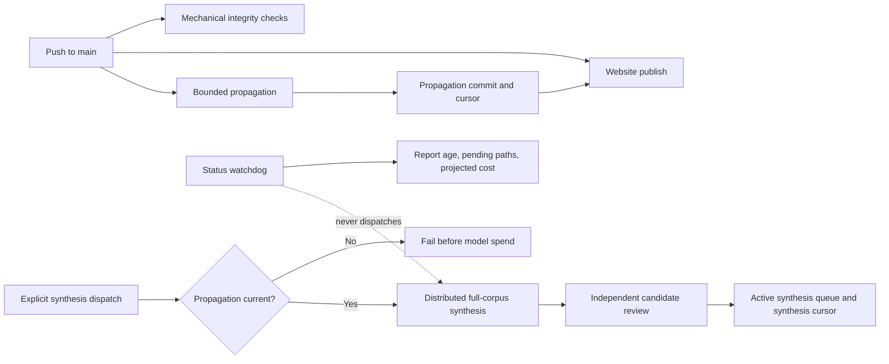

# Mission-Aligned Knowledge System and Synthesis Redesign

## 0. Executive decision

Open Enzyme's knowledge system will be rebuilt around one stable mission:

> **Use red-teaming techniques to identify exploitable weaknesses in gout, then use creative engineering to exploit them.** Each proposed intervention, delivery system, organism, or product is a falsifiable track within that mission. Koji is one promising track. If it works, develop it. If it fails, document why it fails and move to the next exploit; the project does not fail with it.

The operating model becomes:

1. **Push freely.** Every push publishes the website and, when current research changes, runs bounded propagation.
2. **Synthesize deliberately.** Full-corpus synthesis runs only by explicit request at a logical batch boundary. No push or watchdog may silently spend the full-synthesis budget.
3. **Read the current corpus in full.** Synthesis may distribute the work across bounded contexts, but it may not substitute summaries or short versions for the source corpus.
4. **Preserve detail, remove repetition.** Unique scientific detail, negative results, constraints, and uncertainty stay. Duplicate prose, superseded conclusions, narrative scaffolding, and historical snapshots leave the live tree; Git is the history.
5. **Make creativity auditable.** Candidate connections must be traceable to exact source passages, re-opened against those passages, and independently challenged before they become queue items or wiki changes.

This is a coordinated mission, content, workflow, and synthesis redesign. Implementing only the workflow split would leave the public corpus misframed. Rewriting the pages without changing the authoring and synthesis machinery would allow the same drift to recur.

## 1. Why this is necessary

### 1.1 Mission drift is visible on the public site

The current corpus sometimes describes an engineered-koji product concept as though it were the Open Enzyme mission itself. Examples include:

- `README.md`, `index.md`, `wiki/index.md`, and `wiki/etc/open-enzyme-vision.md` calling koji the primary or highest-priority platform/chassis in mission-defining passages.
- `wiki/cross-validation.md` presenting a single uricase/fermentation concept as "the Open Enzyme thesis," assigning it an overall feasibility score, and devoting an entire section to an alleged "As Easy as Sourdough" claim.
- downstream hypothesis and strategy pages repeating that invented claim until it became treated as a load-bearing project commitment.

Brian did not make the sourdough claim. The page appears to have invented a claim so it could rebut it. That failure is larger than one phrase: it demonstrates that the system can manufacture a project premise, propagate it, and then synthesize against it as though it were evidence.

### 1.2 The live tree retains too much historical and generated material

Git already records prior states, but the repository also keeps parallel history surfaces. As measured on 2026-07-16:

| Material | Files | Approximate token proxy |
|---|---:|---:|
| Current synthesis corpus | 130 | 985,461 |
| `synthesis/done/` | 299 | 467,582 |
| `synthesis/history/` | 21 | 44,177 |
| committed raw/normalized synthesis logs | 52 | 278,145 |
| wiki files named as archives/history | 37 | 152,952 |

Not all of this enters the current Pass 2 prompt, but it increases navigation cost, creates stale surfaces that can be cited later, and encourages the project to preserve generated prose rather than maintain one current state.

### 1.3 The current synthesis call is cheap when lucky and fragile when it loops

The current corpus is approximately one million input tokens. Recent Grok Pass 2 runs cost approximately:

| Behavior | Input tokens | Cost | Run |
|---|---:|---:|---|
| One full-corpus turn | 964,494 | $1.21 | [29433436091](https://github.com/brianpabent/open-enzyme/actions/runs/29433436091) |
| Roughly two full-corpus turns | 1,936,021 | $2.45 | [29428509323](https://github.com/brianpabent/open-enzyme/actions/runs/29428509323) |
| Roughly three full-corpus turns | 2,862,350 | $3.59 | [29284127272](https://github.com/brianpabent/open-enzyme/actions/runs/29284127272) |

The single-call path is inexpensive but gives no reliable proof that details throughout the corpus received useful attention. Agentic follow-up resends the enormous accumulated prompt and makes both cost and context behavior unstable.

### 1.4 Push, propagation, synthesis, review, and publishing are unnecessarily coupled

Today a qualifying wiki push starts the three-pass sweep. The daily watchdog can also dispatch a full sweep. Publishing already runs independently on every main push, but propagation is embedded inside the full-sweep workflow and shares the synthesis cursor.

The desired cadences are different:

- publishing should happen on every push;
- propagation should happen after every relevant research push;
- full-corpus synthesis should happen at deliberate batch boundaries;
- adversarial review should happen only on synthesis candidates;
- status monitoring should report pending work, never authorize model spend.

## 2. Goals

1. Make the red-team-gout mission canonical and prevent any track from silently becoming the project definition.
2. Correct the public cross-validation page and every propagated instance of the invented sourdough claim.
3. Separate publishing, propagation, and full synthesis into independently triggered workflows.
4. Give propagation and synthesis separate, exact coverage cursors.
5. Run bounded propagation on each relevant push without rereading the entire unsynthesized backlog.
6. Run full synthesis only by explicit dispatch, against the full current corpus.
7. Improve long-context recall through distributed full-text reading, structured atomic extraction, exhaustive cross-domain comparison, source rehydration, and independent review.
8. Keep default full-synthesis spend near $4 and refuse to exceed $5 without an explicit override.
9. Build token efficiency into authoring: one canonical home per claim, link rather than copy, current-state-only prose, and no archive-for-posterity surfaces in `HEAD`.
10. Preserve exact scientific provenance and evidence-level discipline while removing redundancy.

## 3. Non-goals

- Do not decide whether the koji track is scientifically viable. This architecture must make a positive or negative result equally useful.
- Do not replace the corpus with summaries, embeddings, retrieval-only selection, or short versions.
- Do not claim that every possible connection can be found. The target is measurable coverage and materially better recall, not a false completeness guarantee.
- Do not rewrite every scientific page for style in one unreviewable operation. Corpus cleanup is staged and provenance-preserving.
- Do not delete canonical primary sources under `reference/` or reproducible comp-NNN inputs and outputs.
- Do not change the GitHub Pages host or the evidence-level taxonomy.
- Do not automatically turn synthesis candidates into scientific claims. They remain proposals until verified and actioned.

## 4. System invariants

### 4.1 Mission before modality

Every project-level surface and every authoring/synthesis prompt must preserve this hierarchy:

```
Mission: red-team gout and engineer exploits
  -> weakness/chokepoint
    -> exploit hypothesis
      -> intervention or delivery track
        -> chassis/product implementation, if needed
```

No organism, chassis, compound, modality, or product format is allowed to occupy the mission node. A track may be described as active, promising, cheap to test, or currently prioritized. It may not be described as the project thesis without an explicit, current decision by Brian.

### 4.2 Falsification is progress

Each active track must state:

- the gout weakness it proposes to exploit;
- the engineered or repurposed exploit;
- the evidence supporting the mechanism;
- the assumptions that could kill it;
- the cheapest discriminating test;
- the pass, revise, pause, or kill criteria;
- what the project learns and does next if the track fails.

Track failure must not be narrated as platform failure unless the failed assumption truly applies to every track.

### 4.3 Challenge only real claims

Any document that stress-tests, cross-validates, or rebuts a project claim must identify the claim's source with a current file and section, hypothesis ID, decision record, or commit. If no source exists, the text must be framed as a new question or proposed assumption—not as something Brian or Open Enzyme previously claimed.

### 4.4 Current corpus means full current text

For a full synthesis, every file in the declared scientific corpus must be read in full at least once during that run. Narrative summaries and atomic ledgers are intermediate coordination artifacts, not substitutes for source ingestion.

The corpus manifest must be deterministic, committed in code, and printed before spend. The default scientific corpus remains all current `wiki/*.md` and `wiki/hypotheses/*.md`. Exclusions must be explicit and justified by content class, never by size alone. Operational files, generated history, queue items, and raw logs are context, not scientific corpus.

### 4.5 Git is the archive

`HEAD` contains the current knowledge system and active work, not historical copies of it. Superseded prose is deleted. Closed queue items are deleted after action. Generated run histories and successful raw synthesis logs do not remain in the live tree. Recovery artifacts may exist temporarily while a run is unresolved.

## 5. Target workflow architecture



### 5.1 Lane A — publish on every push

`deploy-docs.yml` continues to run on every push to `main`, whether or not propagation or synthesis runs.

Add deployment concurrency with `cancel-in-progress: true` so a propagation-generated follow-up commit supersedes an in-flight deployment of the pre-propagation snapshot. The final published site should converge on the newest `main` commit without serially deploying every intermediate commit.

### 5.2 Lane B — bounded propagation on every relevant push

Create a dedicated propagation workflow triggered by changes to current research pages. It must:

1. Compute changed research files since the **propagation cursor**, not the synthesis cursor.
2. Build an affected-page list mechanically from links, frontmatter relationships, exact concept/entity search, and canonical ownership metadata.
3. Give the model only the changed files, affected pages, the compact mission/authoring contract, and precise edit tools.
4. Propagate by link plus the minimal local delta. Full copied exposition remains exceptional.
5. Stage edits atomically; partial propagation never lands.
6. Advance the propagation cursor even when no content edit was needed.
7. Push a propagation commit that cannot recursively propagate itself.
8. Record actual provider-returned cost and stop before the configured cap.

Default limits:

- target cost: <= $0.20 per push;
- hard cost cap: $0.50 per push;
- bounded model iterations: initially 12, configurable after measurement;
- affected-file and input-token ceilings set before the first model call;
- overflow behavior: publish the user's push, leave propagation pending, and report exactly what exceeded the bound. Do not silently truncate the affected set.

### 5.3 Lane C — deliberate full synthesis

The full synthesis workflow is `workflow_dispatch` only. Remove its `push` trigger. A dispatch with no explicit paths uses every scientific change since the synthesis cursor as the semantic trigger set, while still reading the complete current corpus.

Before model spend, it must verify:

- `HEAD` includes the latest successful propagation cursor;
- no propagation job is running or pending for the corpus snapshot;
- the corpus manifest and hash are stable;
- the projected cost by stage is below the hard cap;
- every selected provider can accept its assigned shard and output allowance;
- no unresolved prior synthesis artifact requires exact-artifact recovery.

### 5.4 Lane D — monitoring without spending

Replace the watchdog's automatic sweep dispatch with a notification-only status check. It reports:

- time and commits since last successful propagation;
- time and commits since last successful synthesis;
- pending propagation and synthesis paths;
- current corpus size;
- projected next synthesis cost;
- unresolved failures or recovery artifacts.

The watchdog may open or update an issue after a configured age/size threshold. It must never launch full synthesis.

## 6. State model: two independent cursors

Extend `logs/sweep-state.json` to schema version 2 rather than creating a second competing registry.

Illustrative shape:

```json
{
  "schema_version": 2,
  "last_successful_propagation": {
    "coverage_commit": "<sha>",
    "result_commit": "<sha>",
    "timestamp": "<iso8601>",
    "changed_paths": [],
    "affected_paths": [],
    "cost_usd": 0.0
  },
  "last_successful_synthesis": {
    "coverage_commit": "<exact-corpus-snapshot-sha>",
    "corpus_sha256": "<hash>",
    "timestamp": "<iso8601>",
    "trigger_paths": [],
    "coverage_receipt_sha256": "<hash>",
    "queue_items_emitted": 0,
    "cost_usd": 0.0
  },
  "unresolved_failures": []
}
```

Rules:

- The propagation cursor advances after each relevant push is fully evaluated.
- The synthesis cursor advances only after source coverage, candidate review, deterministic emission, and state commit all succeed.
- Both cursors bind to the exact snapshot actually read, not a later rebased review commit.
- A later propagation never advances or implies synthesis coverage.
- State retains only current cursors and unresolved failures. Long run histories live in GitHub Actions and Git history, not a growing JSON ledger.
- Migration from schema v1 must be deterministic and tested against the current registry.

## 7. Distributed full-corpus synthesis protocol

The design goal is grounded creativity: preserve source detail while giving models bounded contexts in which they can actually compare it.

### Stage 0 — deterministic inventory and cost preflight

1. Build the exact corpus manifest with path, byte count, section offsets, content hash, domain tags, and current commit.
2. Fail on duplicate path IDs, missing files, or unclassified corpus exclusions.
3. Partition by coherent domains with a maximum raw-token size per shard. Partitioning must not split a paragraph or table row; section boundaries are preferred.
4. Calculate projected input/output and dollar cost for every stage using current provider pricing.
5. Print the plan and stop without spend if the default hard cap would be exceeded.

### Stage 1 — full-text atomic extraction, pass A

Each raw shard is read in full. The extractor emits atomic records rather than narrative summaries. Record types include:

- scientific claim;
- quantitative result;
- mechanism or causal edge;
- intervention and target;
- assumption;
- constraint or failure mode;
- negative result;
- contradiction;
- open question;
- experimental gate or decision rule;
- track status;
- project claim or decision.

Every atom contains exact provenance: file, section, line/span or stable section ID, evidence level if applicable, and a short source excerpt sufficient to re-find it. The extractor may not improve, reconcile, or creatively reinterpret the source while atomizing it.

### Stage 2 — independent residue audit, pass B

A second independent pass reads every raw shard in full and asks a different question: what scientifically meaningful detail, exception, qualifier, number, relationship, or uncertainty did pass A fail to capture?

The second pass must differ materially in model vendor or extraction lens. It emits additions and disputes, not a second long narrative. Disagreements remain explicit until resolved against the source.

This second full read is the default high-recall mode. A cheaper single-extractor mode may exist for evaluation, but it is not the default production synthesis.

### Stage 3 — deterministic ledger merge

Merge exact duplicates without collapsing distinct qualifiers or evidence tiers. Preserve:

- both sides of contradictions;
- numeric differences;
- population, compartment, dose, timing, organism, and assay distinctions;
- negative evidence;
- model/extractor disagreement annotations.

The merged ledger is an ephemeral routing structure. It is not published as a substitute wiki and does not remain in `HEAD` after successful synthesis.

### Stage 4 — exhaustive cross-domain bridge search

Partition the atomic ledger into a stable set of domain shards. Compare every unordered domain pair. With eight domains, all 28 pairs must run or the synthesis is incomplete.

Each bridge worker receives:

- the two complete atomic domain shards;
- the mission contract;
- current trigger paths as attention hints, never as scope filters;
- existing active queue fingerprints to suppress restatements;
- explicit instructions to seek connections, contradictions, transferable engineering patterns, and shared constraints.

Bridge workers may propose candidates but may not promote them. A candidate must name the atoms and source spans that generated it.

Raw-text all-pairs comparison is prohibited because it rereads the million-token corpus approximately `domain_count - 1` times. The raw corpus is read in full during extraction; the atomic ledger is reused for breadth; raw sources are reopened for depth.

### Stage 5 — source rehydration and constraint closure

For each candidate above the minimum novelty/relevance threshold:

1. Reopen every cited source section from the raw corpus.
2. Reconstruct the candidate using the original wording, numbers, qualifiers, and evidence levels.
3. Search the current corpus for contrary evidence and prior art.
4. Test compartment, dose, timing, topology, host, assay, population, and regulatory constraints.
5. Classify the candidate as supported, partial, contradicted, restatement, speculative-but-testable, or rejected.
6. Attach the cheapest discriminating next step when the candidate is genuinely new and actionable.

No candidate may reach review solely from ledger text.

### Stage 6 — independent adversarial review

A different-vendor reviewer receives the candidate plus its rehydrated source packet, not the entire corpus again. The reviewer checks:

- source support and evidence-tier accuracy;
- whether the project claim being challenged actually exists;
- novelty versus active queue and current pages;
- hidden assumptions and missing constraints;
- whether a negative result kills one track or truly affects the mission;
- whether the proposed experiment discriminates between plausible explanations.

Only reviewed candidates enter deterministic normalization and queue emission.

### Stage 7 — coverage receipt

The run is successful only if its machine-readable receipt proves:

- every corpus file and section was presented to extraction pass A;
- every corpus file and section was presented to residue pass B;
- every domain pair was compared;
- every promoted candidate was rehydrated from raw source spans;
- every promoted candidate received independent review;
- per-stage model, input, output, cache, latency, and actual cost;
- corpus hash and exact coverage commit.

The detailed receipt and intermediate ledger are recovery artifacts, not permanent live content. On success, retain their hashes and summary counts in state; on failure, retain the exact artifacts temporarily for recovery.

## 8. Cost controls

### 8.1 Production budget

- target full synthesis cost: <= $4.00;
- default hard cap: $5.00;
- any higher cap requires an explicit manual dispatch input and is recorded in the run summary;
- no automated workflow, retry, or watchdog may raise the cap;
- a stage may not begin unless its remaining worst-case projection fits the remaining budget.

The expected production range is $3–$5 for two full-text extraction passes, cross-domain bridge generation, source rehydration, and independent review. That is higher than the current lucky one-turn cost ($1.21) but comparable to current multi-turn behavior ($2.45–$3.59), with explicit coverage and a smaller retry blast radius.

### 8.2 Cost accounting

Use provider-returned `usage.cost` as the authoritative actual cost. Hand-maintained price tables are preflight estimates only. Record cached and uncached tokens separately when available.

If the provider omits authoritative cost:

1. calculate a conservative estimate using current route pricing;
2. mark it as estimated;
3. do not treat cached tokens as discounted unless the route confirms the discount.

### 8.3 Retry discipline

- Transport failures may retry only while the projected total remains under cap.
- Context-length, invalid-request, normalization, or completeness failures are not transient and must not repay the full-corpus input.
- Downstream failure resumes from the exact retained artifact; it does not rerun stochastic extraction or synthesis.
- Each stage writes a hash-bound recovery artifact before the next stage begins.

## 9. Authoring and live-corpus policy

### 9.1 One claim, one canonical home

Detailed evidence and reasoning live once. Related pages contain a link and only the local implication needed for that page's reasoning. A copied load-bearing number is allowed when the local calculation depends on it, with provenance and a link to the canonical discussion.

### 9.2 Current state first; history in Git

Remove rather than preserve:

- inline revision histories;
- "formerly," "added on," or sweep-by-sweep narrative unless the chronology is scientifically causal;
- superseded conclusions kept beside their replacements;
- archive pages whose sole purpose is preserving old wording;
- closed synthesis items and per-sweep narrative histories;
- raw successful synthesis logs in the live tree.

Historical scientific data are not "history" in this sense. A negative result, earlier experimental condition, or superseded model remains if it is evidence needed to understand the current conclusion.

### 9.3 Information-density standard

Every paragraph in a current research page should add at least one of:

- evidence;
- mechanism;
- quantitative result;
- constraint;
- decision rule;
- uncertainty;
- local implication;
- necessary orientation or provenance.

Delete rhetorical restatement, repeated conclusions, generic enthusiasm, and prose that exists only to transition between generated sections. There is no arbitrary per-page word limit: unique detail is valuable. The constraint is duplication and non-information-bearing prose, not length by itself.

### 9.4 Automated hygiene checks

Add push-time checks that:

- fail on exact cross-page paragraph duplication above a configurable length, with explicit allow-list support for definitions and required notices;
- report high-similarity cross-page blocks for review without automatically deleting them;
- fail on inline revision-history headings or links to retired archive surfaces;
- report per-push corpus token delta and the largest changed pages;
- verify project claims under adversarial headings carry a source anchor;
- preserve the existing link and privacy checks.

Semantic overlap remains a review signal, not an automatic deletion rule.

## 10. Public content correction

### 10.1 Canonical mission surface

Rewrite `wiki/etc/open-enzyme-vision.md` as the canonical, concise mission and operating-principles page. It should lead with the red-team mission, describe the exploit pipeline, and present koji as one falsifiable track. The current long chassis-first product narrative is either relocated to track-specific pages or removed when duplicated there.

The exact short mission statement from §0 is repeated only where a front door or agent instruction genuinely needs it:

- `README.md`;
- `index.md`;
- `wiki/index.md`;
- `AGENTS.md`;
- `CLAUDE.md`;
- synthesis and propagation prompts.

All longer elaboration links to the canonical mission page.

### 10.2 Replace the current cross-validation page

`wiki/cross-validation.md` must no longer claim to rate "the Open Enzyme thesis" as one product chain.

Replace it with one of these equivalent structures, choosing the smaller implementation that preserves discoverability:

- a concise adversarial-method page plus separate track threat models; or
- a track-index page whose sections each use the same threat-model template.

Required behavior:

- remove the invented "As Easy as Sourdough" project claim and the rebuttal built around it;
- remove the aggregate 5.8/10 platform feasibility score;
- retain valid scientific questions about fermentation reproducibility, contamination, dose consistency, GI survival, and strain stability, but attach them specifically to the relevant koji/community-fermentation track;
- source every challenged project claim;
- distinguish track-local failure from mission-level failure;
- show kill criteria and next-track behavior;
- preserve unique scientific evidence after verification, moving it to the correct canonical track page rather than discarding it with the bad framing.

The root index may continue pointing to `/cross-validation/` only after the replacement accurately represents the project.

### 10.3 Corpus-wide drift audit

Audit every current file that repeats any of the following patterns:

- "as easy as sourdough" or "grow it at home like sourdough" as a project claim;
- H09 or community fermentation described as platform-load-bearing;
- koji described as the project/platform rather than a track;
- "one strain" described as a mission requirement;
- failure of a particular chassis described as failure of Open Enzyme;
- "highest-priority" language copied into stable mission prose rather than current portfolio status.

For each occurrence, choose one action: correct in place, narrow to the track, link to the canonical track page, or delete. Do not create an archive of the removed framing.

### 10.4 Track template

Create a reusable track template with:

1. gout weakness;
2. exploit hypothesis;
3. proposed engineering;
4. evidence by level;
5. key assumptions;
6. failure modes and safety constraints;
7. cheapest discriminating experiment;
8. pass/revise/kill criteria;
9. status and next move;
10. what remains true if this track fails.

Migrate the koji track first as the reference implementation. Do not force every exploratory page into the template immediately; apply it when a concept becomes an active track.

## 11. Live artifact lifecycle

After migration, the live tree keeps:

- current scientific pages;
- reproducible primary/reference artifacts;
- active `synthesis/queue/` items;
- current mission/strategy documents;
- the compact state registry;
- unresolved recovery artifacts only.

The live tree does not keep:

- `synthesis/done/` as a permanent archive;
- `synthesis/history/` per-run narratives;
- successful raw `logs/v4-synthesis-*` artifacts;
- normalized manifests from completed runs;
- stale strategic reflections that have already been incorporated;
- duplicate wiki archive pages kept solely for posterity.

Queue closure becomes: apply the action, cite the queue item in the commit message, and delete the queue file in the same commit. The deleted file and action diff remain recoverable through Git.

During synthesis, exact intermediate artifacts are uploaded with bounded retention. If a downstream stage fails, recovery resumes from those hash-bound artifacts. After success, only active queue items, state hashes, counts, and actual cost land in `HEAD`.

Existing `done/`, `history/`, and successful synthesis-log files are removed from `HEAD` in a dedicated mechanical cleanup commit after inbound links are corrected. No content is copied into a new archive first.

## 12. Implementation surface

### 12.1 Workflows

- **New:** `.github/workflows/wiki-propagate.yml` — push-triggered bounded propagation and propagation-cursor advancement.
- **Refactor:** `.github/workflows/wiki-sweep.yml` — manual-only distributed synthesis and review; remove push trigger and Pass 1 job.
- **Refactor:** `.github/workflows/deploy-docs.yml` — preserve every-push behavior; add newest-commit-wins concurrency.
- **Refactor:** `.github/workflows/sweep-watchdog.yml` — notification/status only; remove `gh workflow run wiki-sweep.yml` authority.
- **Extend:** `.github/workflows/corpus-integrity.yml` — corpus-hygiene checks and mission-claim regression checks.

### 12.2 State and orchestration

- `scripts/sweep-state.py` — schema v2, two cursors, pending propagation paths, pending synthesis paths, migration command, unresolved-failure lifecycle.
- `logs/sweep-state.json` — migrate current state without losing the current synthesis coverage commit.
- `scripts/sweep-1-propagate.py` — bounded inputs, cost cap, provider-reported cost, atomic edits, independent cursor.
- `scripts/synthesize.py` — become the staged synthesis orchestrator or be replaced by a small orchestrator plus stage modules.
- `scripts/synthesis_normalize.py`, `scripts/sweep-3-review.py`, and `scripts/synthesis-emit-files.py` — consume rehydrated candidate packets and emit only reviewed active items.

Recommended logical modules, whether separate files or not:

- corpus manifest/partition;
- atomic extraction;
- residue audit and ledger merge;
- domain-pair bridge generation;
- source rehydration and constraint audit;
- coverage receipt and cost ledger.

### 12.3 Prompts and agent instructions

- `scripts/sweep-prompt-1-propagate.md` — compact mission contract, current-state-only authoring, real-claim provenance, strict link-not-copy rules.
- `scripts/sweep-prompt-2-synthesize.md` — replace monolithic long-context instructions with stage-specific prompts.
- Pass 3 prompts — review rehydrated candidates and explicitly reject invented project claims.
- `AGENTS.md` and `CLAUDE.md` — correct project context and workflow rules.
- sweep status/catch-up/walkthrough skills — understand two cursors, manual synthesis, active-queue deletion, and no history/done archive.

### 12.4 Content and navigation

- Rewrite `wiki/etc/open-enzyme-vision.md`.
- Replace `wiki/cross-validation.md` while preserving verified unique science in canonical homes.
- Correct `README.md`, `index.md`, `wiki/index.md`, and related mission surfaces.
- Audit H09, `open-questions.md`, koji protocol/endgame pages, and every grep hit described in §10.3.
- Update `mkdocs.yml` descriptions/navigation only as required by moved or renamed pages.
- Update `synthesis/README.md` for active-queue-only semantics.

### 12.5 Tests

Extend `tests/test_sweep_pipeline.py` and add focused tests where separation is clearer. Required fixtures include:

- multiple human pushes before propagation finishes;
- a propagation commit that touches wiki files but does not recurse;
- propagation no-op with cursor advancement;
- manual synthesis attempted while propagation is pending;
- two synthesis runs separated by several unsynthesized pushes;
- exact-artifact recovery after a downstream failure;
- cost-cap refusal before a model call;
- missing extractor coverage for one section;
- missing domain-pair comparison;
- candidate without raw-source rehydration;
- invented project claim without a source anchor;
- duplicate paragraph and historical-heading hygiene failures;
- schema-v1 to schema-v2 state migration.

## 13. Migration sequence

### Phase 1 — stop automatic full synthesis

1. Remove the full sweep's push trigger.
2. Disable watchdog dispatch authority.
3. Confirm website publishing still runs on pushes.
4. Ship this phase before large content edits so migration pushes cannot trigger repeated full sweeps.

### Phase 2 — split state and propagation

1. Migrate state to two cursors.
2. Extract propagation into its own workflow.
3. Add bounded impact discovery, actual-cost reporting, and caps.
4. Test rapid pushes, no-op propagation, recursion prevention, and failure recovery.
5. During the one-time mission rewrite, allow an explicit propagation-skip marker and run one cumulative propagation at the end; ordinary post-migration pushes propagate by default.

### Phase 3 — repair mission and public content

1. Rewrite the canonical mission surface and front doors.
2. Replace cross-validation.
3. Audit and correct propagated sourdough/koji-platform framing.
4. Run link, privacy, duplication, and evidence-preservation checks.
5. Publish and visually inspect the affected site pages.

### Phase 4 — build distributed synthesis in shadow mode

1. Implement deterministic corpus inventory and partitioning.
2. Implement dual full-text extraction and atomic merge.
3. Implement exhaustive domain-pair bridge search.
4. Implement source rehydration, constraint closure, adversarial review, and receipt validation.
5. Run it against the same corpus snapshot as the current synthesizer without advancing the production cursor.

Promotion criteria for the shadow run:

- 100% file/section extraction coverage in both passes;
- 100% configured domain-pair coverage;
- zero emitted candidates without raw-source support;
- zero invented project claims;
- no worse factual error rate than the current reviewed pipeline;
- fewer restatements of existing queue/wiki content;
- at least comparable Brian-rated connection usefulness;
- total cost <= $5 without override.

### Phase 5 — switch production synthesis

1. Replace the monolithic Pass 2 path.
2. Preserve exact-artifact recovery and strict normalization.
3. Run one explicitly dispatched production synthesis.
4. Advance the synthesis cursor only after receipt validation and reviewed emission.

### Phase 6 — remove live-history surfaces

1. Fix inbound references to `synthesis/done/`, `synthesis/history/`, and raw logs.
2. Delete closed/history/generated-success artifacts from `HEAD`.
3. Change walkthrough closure from `git mv` to action-plus-delete.
4. Audit wiki archive pages and delete those whose only purpose is preserving old prose.
5. Confirm Git can recover representative deleted items and prior page versions.

## 14. Acceptance criteria

### Mission and content

- [ ] The canonical mission matches §0 and appears consistently on all front doors and agent instructions.
- [ ] Koji is presented as a falsifiable track, not the definition of Open Enzyme.
- [ ] `wiki/cross-validation.md` no longer invents or rebuts an "As Easy as Sourdough" project claim.
- [ ] No current page treats H09/community fermentation as mission- or platform-load-bearing.
- [ ] The aggregate 5.8/10 platform feasibility score is gone.
- [ ] Every adversarially tested project claim has a source anchor.
- [ ] Unique scientific evidence removed from the old cross-validation page survives in an appropriate canonical current page or is explicitly rejected after verification.

### Workflow behavior

- [ ] A qualifying wiki push triggers integrity checks, publishing, and propagation—but no full synthesis.
- [ ] A propagation-generated wiki commit does not create a propagation loop.
- [ ] Publishing converges on the post-propagation commit.
- [ ] Propagation uses its own cursor and never replays the full unsynthesized backlog.
- [ ] Full synthesis starts only through explicit dispatch.
- [ ] The watchdog cannot dispatch synthesis.
- [ ] Synthesis refuses to start while propagation is pending.
- [ ] Several pushes can accumulate into one synthesis batch without any change being lost.

### Synthesis quality and coverage

- [ ] Every declared corpus file and section is read in full by both extraction passes.
- [ ] Every configured domain pair is processed.
- [ ] Every emitted item is traceable to raw source spans and independent review.
- [ ] Trigger files influence attention but do not limit corpus coverage.
- [ ] No summary-only or retrieval-only fallback can silently satisfy the full-synthesis success condition.
- [ ] Missing coverage, malformed model output, or downstream failure cannot advance the cursor.

### Cost and reliability

- [ ] Default full synthesis projects and completes at <= $5.
- [ ] Propagation enforces its $0.50 hard cap.
- [ ] Actual costs come from provider usage data when available and are reported by stage.
- [ ] A downstream retry resumes from the exact prior artifact without repaying completed full-text stages.
- [ ] Cost-cap and context-cap failures occur before the relevant API call.

### Corpus hygiene

- [ ] `HEAD` has no permanent synthesis `done/` or per-run `history/` archive.
- [ ] Successful raw synthesis logs and normalized manifests do not remain in the live tree.
- [ ] Closed queue items are deleted in their action commits.
- [ ] Exact duplicate prose above the configured threshold is blocked unless allow-listed.
- [ ] No inline revision-history sections remain on current research pages unless chronology is scientifically necessary.
- [ ] Representative removed material is recoverable with Git.

## 15. Risks and mitigations

| Risk | Mitigation |
|---|---|
| Atomic extraction drops the obscure detail needed for a connection | Two independent full-text passes, explicit residue audit, source excerpts, complete coverage receipt |
| The ledger becomes a lossy replacement for the corpus | Raw corpus is mandatory input; ledger is only routing; every candidate reopens raw sources |
| Pairwise comparison becomes combinatorially expensive | Stable domain count, atomic ledger reuse, hard preflight budget; never raw-text all-pairs |
| Propagation misses a semantically affected page | Deterministic link/entity impact map plus later full-corpus synthesis; overflow is reported, not truncated |
| Propagation replays weeks of unsynthesized work | Independent propagation cursor |
| Manual synthesis is forgotten | Notification-only watchdog reports age, backlog, and projected cost without spending |
| A public page briefly publishes before propagation lands | Newest-commit-wins deployment concurrency; propagation follow-up push republishes |
| Model output invents another project claim | Claim-source invariant in authoring, synthesis, review, and CI regression checks |
| Cleanup deletes unique scientific detail | Canonical-owner audit, evidence/number preservation checks, staged diffs, independent review before deletion |
| Removing live artifacts weakens failure recovery | Hash-bound temporary workflow artifacts retained until resolution; state records unresolved failures |
| Provider pricing changes | Live preflight pricing where available, conservative fallback, provider-returned actual cost, hard dollar caps |

## 16. Independent review checklist

Before implementation begins, a reviewer should challenge:

1. Whether the declared corpus includes every current scientific surface that Brian intends synthesis to consider.
2. Whether dual extraction plus source rehydration adequately addresses the lossiness objection, and where it still can fail.
3. Whether the domain partition creates blind spots or forces misleading pair boundaries.
4. Whether $5 is a realistic hard cap using a production-sized shadow run.
5. Whether propagation can land atomically under concurrent pushes.
6. Whether exact-artifact recovery remains possible without permanent raw logs in `HEAD`.
7. Whether any historical-looking page actually contains current negative evidence that must remain.
8. Whether the mission rewrite accidentally deprioritizes koji rather than correctly placing it as one active track.
9. Whether the cross-validation replacement preserves valid scientific criticism while removing the fabricated premise.
10. Whether the acceptance tests make it impossible for partial coverage to masquerade as success.

## 17. Definition of done

This redesign is done only when all of the following are true together:

- the public site states the correct mission;
- the sourdough fiction and its propagated consequences are gone;
- ordinary pushes publish and propagate without launching synthesis;
- full synthesis is deliberate, full-corpus, distributed, source-grounded, independently reviewed, and cost-capped;
- propagation and synthesis maintain independent coverage cursors;
- the live corpus contains current unique knowledge and active work, while Git carries history;
- a production run has demonstrated the workflow and passed the acceptance criteria on the real corpus.
