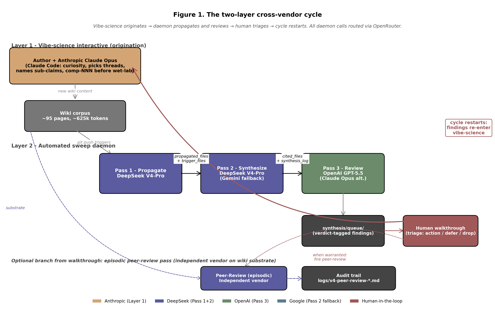
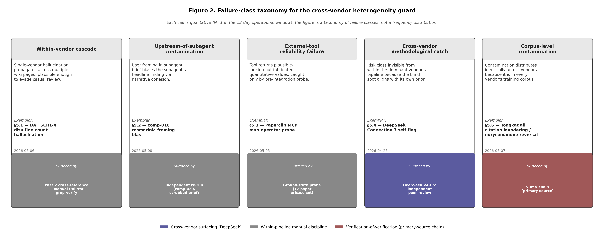

# Cross-vendor heterogeneity as a guard against epistemic homogenization in AI-assisted scientific literature synthesis

**Brian Abent**
Open Enzyme · brian.abent@gmail.com

**Status:** Working draft. Sessions 1–6 (2026-05-13) drafted abstract + §1–§9, Methods Appendix, Appendix A, Table 1, Figures 1–2, and the full §2 bibliography (11 S2-verified citations). §2 drafted using the Ar9av/PaperOrchestra community implementation of the literature-review-agent skill, driven manually through Claude Code (Path B install — no permanent ~/.claude/skills/ footprint). Citation pool, BibTeX, LaTeX section output, and verification audit at `paperorchestra-workspace/`. Cross-vendor review prompts for §3-§9 and §2 are ready in `review-prompts.md` — pending Brian firing them at Gemini / DeepSeek. After review-pass catches land, the manuscript is ready for bioRxiv preprint per `submission-checklist.md`.

---

## Abstract

AI-assisted literature synthesis is becoming load-bearing infrastructure for scientific research. A new failure mode emerges when a single AI model is the sole synthesizer of a long-lived knowledge corpus: the corpus accumulates that model's blind spots and biases over time, with each individual edit plausible and internally consistent but the cumulative drift invisible without an outside reference. We call this drift *epistemic homogenization* and distinguish it from per-output hallucination. We argue that the right granularity of defense is **cross-vendor heterogeneity** — routing successive synthesis passes through frontier models trained by different companies, with different training corpora and different reinforcement-learning-from-human-feedback procedures. Existing multi-agent AI literature (debate, self-refine, jury-of-LLMs, Constitutional AI, automated-research systems) operates almost exclusively within a single vendor; the cross-vendor regime is under-explored as an explicit architectural commitment. We describe a production deployment of the cross-vendor pattern — the Open Enzyme wiki-sweep daemon, maintaining an ~80-page biotechnology research wiki via three operational passes assigned across Anthropic, DeepSeek, and Google models — and present four catches from ~3 weeks of operation that exemplify the failure classes the pattern protects against: a within-vendor hallucination cascade, an upstream-of-subagent framing contamination, an external-tool reliability failure, and a cross-vendor catch of a methodological risk invisible from within the dominant vendor's pipeline. The seminal catch — a DeepSeek peer-review pass surfacing the homogenization risk that the within-vendor pipeline had not named unprompted — is the principle demonstrated by working. The manuscript is drafted using its own methodology; a logged self-catch during drafting is preserved as the cleanest available reflexive evidence the guard applies to its own production.

---

## §1 Introduction

AI-assisted literature synthesis is becoming a load-bearing component of how scientific research is conducted. Research groups across biotechnology, chemistry, physics, and the life sciences are deploying frontier language models to read primary literature, propose connections across papers, draft hypotheses, and maintain working knowledge graphs that span hundreds or thousands of source documents. The pattern is no longer experimental; it is operational infrastructure.

This shift introduces a new class of failure that does not exist in traditional human-only research. When a single AI model is the sole synthesizer of a long-lived knowledge corpus, the corpus accumulates that model's blind spots and biases over time. Each individual synthesis output is reviewed and edited, but the review itself runs through the same model, propagating the same prior. New entries cross-reference older entries that were already shaped by the same model's framings. After hundreds of edits, the corpus no longer represents the underlying literature; it represents the literature *as that model sees it*. We call this drift **epistemic homogenization**.

Epistemic homogenization is structurally different from per-output hallucination. A hallucinated answer is a single wrong claim that any careful reader can catch. Homogenization is a property of the corpus as a whole — consistent biases compounding across hundreds of internally-coherent edits, no single output obviously wrong, the cumulative drift invisible without an outside reference. A reader querying the homogenized corpus receives confident, internally consistent answers that drift from reality in a direction the reader cannot easily perceive. The corpus's defenses (peer review of individual edits; cross-referencing; evidence-tagging) operate within the same prior that produced the drift in the first place.

The natural response is to introduce diversity into the synthesis pipeline — run multiple models in review, alternate which model writes which sections, ensemble the outputs. The existing literature on multi-agent AI systems (debate, self-refine, jury-of-LLMs, Constitutional AI) develops these patterns substantially. But almost all of this work operates *within* a single vendor: multiple instances of the same company's model, or multiple sizes of the same company's model family. Within-vendor heterogeneity is multi-instance, not multi-perspective. It does not guard against blind spots that are characteristic of the vendor's training pipeline as a whole.

This paper argues that **cross-vendor heterogeneity** — models trained by different companies, on different (though overlapping) data corpora, with different reinforcement-learning-from-human-feedback (RLHF) procedures and different alignment objectives — is the right granularity for the heterogeneity guard. It is the level at which prior-distribution diversity actually appears. A blind spot in Anthropic's training pipeline is unlikely to appear in the same form in Google's, or in DeepSeek's, or in OpenAI's. The cross-vendor pattern exploits this independence in the same way classical ensemble methods exploit cross-architecture independence — but at a vendor abstraction level that the existing multi-agent literature has not explicitly developed.

The contribution of this paper is twofold. First, we develop the cross-vendor heterogeneity guard as an explicit architectural pattern, formalize the failure class it protects against (epistemic homogenization), and distinguish it from the within-vendor patterns in the existing multi-agent literature (§4). Second, we describe an operational deployment — the Open Enzyme wiki-sweep daemon, a continuously-running pipeline that has maintained an ~80-page biotechnology research wiki across approximately three weeks of production use — and present four case studies from its operational record that illustrate the failure classes the pattern catches (§5). The seminal case study (§5.4) is the catch that motivated the pattern itself: an independent DeepSeek peer-review pass on Claude-driven synthesis output named the homogenization risk that the Claude-driven pipeline had not surfaced unprompted, demonstrating the principle by working.

The remainder of the paper is organized as follows. §2 positions the cross-vendor pattern against prior multi-agent AI literature. §3 describes the architecture of the Open Enzyme deployment. §4 develops the heterogeneity-guard rationale and the formal distinction from within-vendor patterns. §5 presents the four case studies. §6 reports operational data (cost, latency, failure modes). §7 enumerates the architecture's limitations and the failure classes it does *not* protect against. §8 discusses generalization (how many vendors is enough, scaling to non-text modalities, implications for autonomous-research systems). §9 concludes. A Methods Appendix documents the cross-vendor process used to produce this manuscript itself — the paper is drafted using the methodology it describes, including a logged self-catch where the primary drafter confabulated a fact that primary-source verification would have caught.

---

## §2 Related work

**Drafted using the literature-review-agent skill from the Ar9av/PaperOrchestra community implementation (Path B install — no permanent symlinks). Output lives at `paperorchestra-workspace/drafts/section2.tex` (LaTeX) and is summarized below in markdown. BibTeX at `paperorchestra-workspace/refs.bib`. Citation pool with verification provenance at `paperorchestra-workspace/citation_pool.json`. All 11 cited papers are S2-verified (`verification: "s2"`) after the 2026-05-13 same-day key approval; full audit trail at `paperorchestra-workspace/drafts/verification-audit.md`.**

The cross-vendor heterogeneity guard described in this paper sits in a literature already rich with multi-agent and self-reflective patterns for improving language-model outputs. This section positions the contribution against five methodology clusters in that literature, plus a sixth body of work on the underlying corpus-collapse phenomenon that motivates the guard.

These clusters share a structural property the paper's contribution does not. They operate either *within* a single model-vendor's training pipeline, or at an abstraction level orthogonal to vendor identity altogether. The pattern this paper develops — heterogeneity at the level of training-distribution prior, achieved by routing successive synthesis passes through different vendors' frontier models — is, to our knowledge, the first explicit treatment of the cross-vendor regime as an architectural commitment for AI-assisted scientific literature synthesis.

### 2.1 Multi-Agent Debate and Consensus Approaches

Du et al. (2023) introduced multi-agent debate as a mechanism for improving the factuality and reasoning of language-model outputs: multiple instances — typically of the same model, though Du et al. also explored mixed-model configurations such as ChatGPT and Bard in debate — propose and critique one another's answers across several rounds before converging on a final response. The work demonstrated gains on reasoning benchmarks and reductions in characteristic hallucination patterns, and the framing has been adopted and extended by follow-on work on adversarial argumentation and consensus mechanisms.

The structural commitment of multi-agent debate is at the inference-time argumentation layer. The heterogeneity in the system is in how the instances interact — proposing, critiquing, defending — not in their underlying training-distribution priors. When the instances all derive from a single vendor's model family, the system improves robustness to inference-time stochasticity but does not guard against blind spots that are characteristic of the vendor's training pipeline as a whole. The cross-vendor pattern in this paper operates at a different abstraction level: heterogeneity is in the prior itself, with the synthesis passes routed across vendors as an architectural commitment rather than as inference-time agent behavior.

### 2.2 Self-Refinement and Iterative Reflection

Madaan et al. (2023) proposed Self-Refine, in which a single language model produces an initial output and then critiques and revises that output in an iterative loop. Shinn et al. (2023) proposed Reflexion, which extends the same pattern by maintaining verbal reflective text in an episodic memory buffer so that an agent can learn from prior trials without weight updates. Both patterns are influential and have spawned a substantial body of follow-on work on self-critique loops.

These approaches are, by construction, same-vendor and typically same-model: the critic is the generator. They improve local output quality and per-task accuracy, but they cannot surface blind spots that are characteristic of the model's training pipeline — the critic shares the generator's prior. A self-refinement loop catches consistency errors and surface-level mistakes; it cannot catch corpus-level drift toward the model's prior across many independent outputs maintained in a long-lived knowledge graph. The cross-vendor heterogeneity guard described here is complementary to self-refinement rather than a substitute: self-refinement improves individual outputs; the cross-vendor guard prevents the corpus they accumulate into from converging on any one model's blind spots.

### 2.3 LLM-as-Jury and Panel-of-Evaluators

Verga et al. (2024) proposed evaluating LLM generations using a panel of diverse models (PoLL) — an ensemble of LLM evaluators rather than a single large judge — and showed that smaller-model panels can outperform a single large judge on standard evaluation benchmarks while exhibiting less intra-model bias. The work motivates panel diversity by appeal to the same intuition the present paper formalizes for synthesis: a single judge's biases propagate into the evaluation signal; a panel of diverse judges reduces that effect.

The PoLL pattern is itself an early example of cross-vendor ensemble in the AI-evaluation literature: the original Verga et al. construction uses Cohere's command-r, OpenAI's gpt-3.5-turbo, and Anthropic's Claude haiku as the panel — three distinct vendors. This makes PoLL the closest antecedent in the existing literature to the cross-vendor heterogeneity guard developed here. The distinction this paper draws is in the *abstraction level of application*. The jury pattern operates on per-output evaluation: each query gets an independent panel review, and there is no temporal accumulation of bias across queries to guard against. The cross-vendor heterogeneity guard operates on *corpus-level synthesis*: sequential passes through different vendors maintaining a long-lived knowledge graph across hundreds of edits. Both inherit the same structural intuition — vendor diversity reduces propagated bias — but apply it to different operational surfaces.

### 2.4 Constitutional AI and AI-Feedback Alignment

The broader AI-feedback alignment family includes Ouyang et al. (2022) InstructGPT, which established RLHF (reinforcement learning from human feedback) as a frontier-scale technique for shaping language-model behavior; Bai et al. (2022) Constitutional AI, which extended the pattern by training a harmless assistant through self-supervision against an explicit list of principles without per-output human labels; and Lee et al. (2023) RLAIF, which uses an off-the-shelf LLM rather than a human annotator to generate the preferences that drive reward-model training. The family spans multiple vendors (OpenAI, Anthropic, Google) but the techniques are all *training-time* interventions — they shape a single model's parameters through AI or human feedback at training time, not at inference time.

The cross-vendor heterogeneity guard described here operates at synthesis time, using different-vendor frontier models as the sources of independent critique on a corpus that none of them owns or controls. The two families are adjacent but address disjoint failure modes: alignment techniques affect a single model's prior; the cross-vendor guard prevents that prior from dominating a corpus the model contributes to over time.

### 2.5 Automated AI-Scientist Systems

A class of recent end-to-end automated-research systems aspires to compress the full scientific lifecycle — hypothesis generation, experiment design, analysis, and manuscript drafting — into a single agentic pipeline. Lu et al. (2024) introduced Sakana's AI Scientist, an early system aimed at end-to-end open-ended scientific discovery in machine learning, with AI-generated papers accepted at workshop-level venues. Yamada et al. (2025) extended the system with agentic tree search and further demonstrated AI-generated papers passing workshop-level peer review under a different review threshold. Song et al. (2026) introduced PaperOrchestra, a system that automates manuscript drafting through five communicating agents (outline, plotting, literature review, section writing, content refinement), with citation verification against Semantic Scholar.

Two structural features unite these systems and motivate the relevance of cross-vendor heterogeneity to autonomous-research deployments specifically. First, each has been primarily demonstrated within a single vendor's model family in published evaluations — Claude or GPT for AI Scientist, Gemini-based for PaperOrchestra. The architectures do not technically require single-vendor construction, but the published evaluations are single-vendor pipelines. Second, they iterate AI synthesis as a load-bearing component: each step builds on the prior step's AI output, so any blind spot in the system's prior compounds across loop iterations before a human can intervene. The cross-vendor heterogeneity guard is one structural defense against this compounding. None of the systems above currently deploys it as an architectural commitment, though PaperOrchestra's Semantic-Scholar citation-verification step is a partial defense against one failure mode (fabricated citations). The pattern this paper develops can be adopted by such systems with modest engineering effort and provides a defense the within-vendor architectures do not.

(Disclosure: this manuscript's §2 was drafted using a community implementation of the PaperOrchestra writing pipeline — see the Methods Appendix for the production-process record.)

### 2.6 Epistemic Homogenization and Model Collapse

The underlying phenomenon the cross-vendor heterogeneity guard defends against is closely related to, but distinct from, model collapse as studied by Shumailov et al. — first as an arXiv preprint (2023, "The Curse of Recursion") and subsequently as a published paper in *Nature* (2024, "AI models collapse when trained on recursively generated data"). The two are the same research line; we cite both because the preprint introduced the phenomenon and the *Nature* publication established the canonical reference. Model collapse describes a training-time failure: when a generative model is trained on data produced by previous generations of the same model, the distribution of generated outputs progressively loses its tails and degenerates over time. The driver is the same — recursive consumption of model-produced content — but the surface is different. Model collapse manifests as a degradation of the model's parameters; epistemic homogenization manifests as a drift in a corpus the model is maintaining, with the model itself unchanged.

The cross-vendor heterogeneity guard does not address training-time model collapse directly; it addresses the corpus-level analogue. The two are complementary defenses for related failure modes in the broader AI-content-feedback-loop literature. We treat epistemic homogenization as a distinct construct from model collapse in this paper, while acknowledging the shared structural intuition: any system that consumes its own outputs as load-bearing input over time develops a degradation that requires an outside reference to detect.

---

## §3 Architecture

The system this paper describes is the **Open Enzyme wiki-sweep daemon**, a continuously running pipeline that fires on every edit to the project's research wiki (Figure 1).

**Figure 1.** Cross-vendor heterogeneity guard architecture as deployed on the Open Enzyme wiki-sweep daemon. Three operational passes are routed across distinct vendors via OpenRouter (Pass 1 Anthropic Sonnet, Pass 2 DeepSeek with Gemini fallback, Pass 3 Anthropic Opus or OpenAI alternative). An episodic peer-review pass by DeepSeek V4-Pro provides an independent cross-vendor verification surface that is not part of the per-edit critical path. Inter-pass artifact handoff (`propagated_files`, `cited_files`) is shown on the horizontal arrows; see §3 inter-pass handoff for details. Figure source: `figures/figure1_architecture.py`.
 The wiki is a Markdown corpus of ~80 long-form research pages plus a graph of cross-references, maintained as a living synthesis of the literature relevant to a single open-source biotechnology project (engineered food-grade fungal strains for therapeutic enzyme production). The daemon's job is to keep the corpus internally consistent and to surface novel connections across pages that no single human or model has explicitly stated.

### The three operational passes

The daemon orchestrates three OpenRouter-routed passes against three different vendor models, in sequence ([1](../../scripts/SWEEP-ARCHITECTURE.md), [2](../../.github/workflows/wiki-sweep.yml)):

**Pass 1 — Propagate (Anthropic Claude Sonnet 4.6).** Reads the edited file or files (the "trigger"); identifies the concepts, compounds, organisms, and mechanisms touched; greps the rest of the corpus for pages that reference those concepts; and updates each affected page inline with the new finding. Includes a dedup discipline so that recurrent propagation across multiple sweeps doesn't produce parallel copies of the same content ([3](../../scripts/sweep-prompt-1-propagate.md)). Every new claim is tagged with an evidence level (Clinical Trial / Animal Model / In Vitro / Mechanistic Extrapolation) and inline provenance (`(source: <filename>)`).

**Pass 2 — Synthesize (DeepSeek V4-Pro or Google Gemini 2.5 Pro).** Reads the full corpus (currently ~650k tokens) and emits cross-document synthesis: new connections, contradictions, open questions, and proposed experiments. Pass 2 is configured with two interchangeable vendor models — the choice between them on any given run is operational (load-balancing, API availability) rather than architectural; both are full primary backends. Each emitted finding ends with a `{{PEER-REVIEW}}` marker so Pass 3 knows where to insert a review blockquote ([4](../../scripts/sweep-prompt-2-synthesize.md)). The synthesis discipline is explicitly multi-level: single-link connections that already exist in the corpus are duplicates, but chains of two or three already-known links into a previously-unstated pattern are the daemon's central value.

**Pass 3 — Review (Anthropic Claude Opus 4.7, or OpenAI GPT-5.5 in an alternative configuration).** Critiques each Pass 2 finding with a fixed verdict vocabulary: *Confirmed*, *Confirmed-prioritize*, *Partial*, *Push-back*, or *Rejected* ([5](../../scripts/sweep-prompt-3-review.md)). Pass 3 has read-only tool access (`read_file`, `list_files`, `grep`) for spot-checking primary sources; the iteration cap prevents runaway tool use. A deterministic Python emitter then writes one file per reviewed finding into a `synthesis/queue/` directory, where Brian closes items by appending a closure annotation and moving the file to `synthesis/done/`.

### Cross-vendor heterogeneity is the pattern, model assignments are an instance

The specific model assignments above are a snapshot of the production daemon as of 2026-05-13. They have evolved over the system's operational history and will continue to evolve as new models ship. The architectural commitment is not to any one model; it is to the *pattern* of cross-vendor heterogeneity: each pass must run on a model from a different vendor than the adjacent passes, so a blind spot in one vendor's training pipeline is unlikely to propagate uncaught through the sequence.

A separate, formalized **independent peer-review pass** is documented in `wiki/open-source-platform.md` ([6](../../wiki/open-source-platform.md)) and used episodically rather than on every sweep. In the peer-review pattern, an independent vendor's model receives the substrate (the wiki corpus at a given commit) and produces a parallel synthesis, then a differential analysis against the daemon's output. The vendor used for the peer-review pass is deliberately chosen to be distinct from the model that drove the substrate run, even when that means choosing a vendor not currently in the per-edit critical path — for example, when the daemon ran with DeepSeek at Pass 2, the peer-review pass might be routed to Google Gemini or OpenAI GPT rather than back to DeepSeek. The seminal instance of this pass — DeepSeek V4-Pro reviewing a Claude Opus 4.7 local-session sweep on 2026-04-25 ([7](../../logs/v4-peer-review-2026-04-25-deepseek.md)) — predates the formalized daemon: at that time the substrate was Claude-only, so DeepSeek was the natural cross-vendor choice. That catch is the case study in §5.4 and the historical motivation for formalizing the cross-vendor pattern across the daemon. Peer-review passes are run when a major architectural change lands, when a class of synthesis output is suspect, or when the cost of a missed connection is judged high enough to justify the additional vendor pass.

### Inter-pass artifact handoff

A failure class that surfaced after the initial deployment was not workflow-runtime errors but **information loss between passes**. Pass 2 received only the original trigger file list, not Pass 1's propagated files, so Pass 2's attention was biased toward triggers even though it read the full corpus. Pass 3 had no way to verify Pass 2 citations of files outside the trigger set. Both failures motivated explicit artifact handoff:

- Pass 1 emits a `propagated_files` list (wiki pages modified beyond the original triggers); Pass 2 receives both `trigger_files` and `propagated_files`, and is instructed that new cross-document connections are most likely to emerge from the union of the two sets.
- Pass 2 emits a `cited_files` manifest listing every wiki page referenced in any finding; Pass 3 receives the synthesis log plus both file lists inlined as a "warm cache," with read-only tools for fetches the cache misses.

This pattern — every pass must declare what it produced for the next pass to consume — is the structural backbone of the cross-vendor design. Without it, downstream passes would be flying blind on upstream work.

### Operational hardening

Beyond the three core passes, the architecture includes five operational components ([1](../../scripts/SWEEP-ARCHITECTURE.md)) that emerged from observed failures during early deployment:

1. **Workflow hardening** — rebase-before-push to handle concurrent commits to `main`; retry-with-backoff (5s / 15s / 45s) on OpenRouter HTTP 5xx; a `failed-sweep-<sha>.md` ledger uploaded as a workflow artifact so failure traces survive runner teardown.
2. **State registry** — `logs/sweep-state.json`, an atomic-write source of truth for "what has been swept and what hasn't." Replaces a brittle regex over commit messages.
3. **Hooks for enforcement** — filesystem `pre-commit` hook plus a Claude Code `PostToolUse` hook on `Bash`, both checking the same invariants on `[skip-wiki-sweep]` marker usage and `sweep-N-` commit-message prefixes.
4. **Skills (user-invocable operations)** — `/sweep-status`, `/sweep-catchup`, `/sweep-validate` — slash commands that read the registry and act on it.
5. **Catch-up cron watchdog** — daily safety net that re-fires the workflow if the registry shows pending paths older than 24 hours, with a 3-consecutive-failure brake to prevent runaway cost.

Together, the three operational passes plus five hardening components produce a self-healing pipeline that recovers from concurrent-push races, transient API outages, and operator typos without manual intervention.

---

## §4 The heterogeneity-guard rationale

### Definition

A knowledge corpus maintained by a single AI synthesizer over time accumulates that synthesizer's blind spots and biases. New entries are written, reviewed, and cross-referenced through the same model, so consistent errors in the model's prior — preferences for certain framings, recurrent misreadings of specific terminology, characteristic numerical hallucinations — propagate uncorrected. The corpus stops being a faithful synthesis of the underlying literature and starts being a synthesis of the literature *as that model sees it*. We call this drift **epistemic homogenization** of the corpus.

Epistemic homogenization is structurally distinct from per-output hallucination. A hallucinated answer is a single wrong claim; it may be caught by any reader who looks at it. Homogenization is a property of the *corpus as a whole*: consistent biases compounding over hundreds of edits, each individually plausible, with no single output obviously wrong. A reader querying the homogenized corpus receives confident, internally consistent answers that drift from the underlying reality in a direction the reader cannot easily perceive without an outside reference.

### Why cross-vendor specifically

The natural response to epistemic homogenization is to introduce diversity into the synthesis pipeline — run multiple models in review, or alternate which model writes which sections. But the granularity of that diversity matters. Running GPT-4o and GPT-4 in alternation provides limited defense against OpenAI-specific blind spots; both share substantial overlap in training-distribution prior, alignment procedure, and characteristic failure modes, even though they differ in architecture and training cutoff. Running Sonnet and Opus in alternation similarly provides limited defense against Anthropic-specific blind spots. Within-vendor diversity is non-zero, but it does not target the failure mode this paper is centrally concerned with: drift toward a particular training pipeline's prior. Within-vendor heterogeneity is primarily multi-instance, not multi-perspective at the prior-distribution level.

Cross-*vendor* heterogeneity — models trained by different companies, on different (though overlapping) data corpora, with different reinforcement-learning-from-human-feedback (RLHF) pipelines and different alignment objectives — is a level at which substantial prior-distribution diversity reliably appears. Anthropic-trained models have characteristic verbal patterns and characteristic failure modes that differ from OpenAI-trained models, which differ from Google-trained models, which differ from DeepSeek-trained models. A blind spot in one vendor's training pipeline is less likely to appear in the same form in another vendor's pipeline — though correlated blind spots from shared upstream data (e.g., overlapping Common Crawl ingestion) do exist and are discussed as a limitation in §7. The cross-vendor pattern exploits the partial independence that does exist.

The pattern is not novel as a *concept* — it is a special case of ensemble methods, where the heterogeneity of the ensemble members is what produces the variance-reduction benefit. What is novel here is the application of ensemble logic at the *vendor* level for AI-assisted scientific synthesis, where the relevant variance is in the synthesizer's training-distribution prior, not in inference-time stochasticity. Existing multi-agent literature (debate, self-refine, jury-of-LLMs) operates predominantly within a single vendor; this paper argues that for load-bearing long-lived scientific corpora, within-vendor heterogeneity alone is insufficient and the cross-vendor regime should be developed as an explicit architectural commitment.

### The self-demonstrating moment

The motivation for the architecture described in this paper did not originate from Claude (Anthropic), the model that drove most of the early Open Enzyme sweep work. It originated from DeepSeek V4-Pro, in a peer-review pass on a Claude Opus 4.7 local-session sweep dated 2026-04-25. DeepSeek's Connection 7 (a numbered finding in the peer-review log) flagged that the proposal to run cheap full-corpus sweeps on a single model — at the time, an attractive cost-optimization — would erode exactly the diversity that makes the corpus trustworthy ([7](../../logs/v4-peer-review-2026-04-25-deepseek.md)).

That a model from a different vendor caught a methodological risk Claude had not surfaced unprompted is the cleanest available demonstration of the heterogeneity-guard principle. The principle that later motivated the architecture was demonstrated in advance by the cross-vendor review pass that prefigured it — at the time of Connection 7, the formalized daemon did not yet exist; the catch came from a one-off independent peer-review pass that the formalized architecture is a generalization of. This is the foundational observation the paper extends: cross-vendor review tends to surface methodological risks that within-vendor review systematically misses, because the missed risks are precisely the ones that align with the within-vendor model's prior.

---

## §5 Case studies

This section presents four catches from the Open Enzyme sweep pipeline. Each illustrates a different class of failure that the cross-vendor architecture is designed to catch. The catches are drawn from the operational record of 2026-04-25 to 2026-05-08 — a 13-day window during which the pipeline ran continuously across approximately 60 wiki edits.

### §5.1 Within-vendor cascade: the DAF SCR1-4 disulfide-count hallucination (2026-05-06)

On 2026-05-05, a Sonnet subagent was tasked with authoring the wiki page `daf-cd55-scr14-truncated-computational.md` — the computational write-up for comp-012, a stalk-truncation analysis of human DAF/CD55 (a complement regulator, UniProt P08174). The subagent's brief specified the analysis pipeline (AlphaFold-pLDDT-thresholded exposed-site mapping combined with MEROPS protease cleavage prediction) but did not require disulfide-bond modeling — and indeed, the comp-012 pipeline does not compute disulfide bonds. The Limitations section of the analysis explicitly states "Disulfide bonds not modelled."

The subagent's output asserted, in four separate places of prose narrative, "3 conserved disulfide bonds per SCR domain → 12 total for SCR1-4." The number was not computed by the pipeline; it was generated as plausible-sounding context. The error propagated overnight: the next-morning sweep's Pass 1 incorporated the "12 disulfide" figure into the H05 hypothesis card (`wiki/hypotheses/H05-daf-scr14-cp0-thesis.md`), and downstream synthesis used it as an input to a chaperone-orthogonal stacking calculation, producing a panic over a fabricated total of 29 disulfides across a triple-cassette design ("17+12=29 disulfides, 1.8× Huynh") ([8](../../CLAUDE.md)).

The catch came from the combination of the next-day sweep and a manual walkthrough verification against the canonical UniProt P08174 record. UniProt has exactly 8 DISULFID feature annotations across SCR1-4 — the canonical sushi/CCP fold of 2 disulfides per domain (Cys36-Cys81, Cys65-Cys94 [SCR1]; Cys98-Cys145, Cys129-Cys158 [SCR2]; Cys163-Cys204, Cys190-Cys220 [SCR3]; Cys225-Cys267, Cys253-Cys283 [SCR4]), well established in complement biology. The discrepancy was logged as a correction note on the comp-012 page ([9](../../wiki/daf-cd55-scr14-truncated-computational.md)).

This catch motivated the addition of a "pre-commit grep-verify gate" to the wiki authoring discipline ([8](../../CLAUDE.md)), which requires every load-bearing quantitative claim to be checked against its primary source *before* the commit lands. The sweep is a backstop; the pre-commit gate is where this class of error should die.

**Class of failure caught:** within-vendor cascade — a single-model hallucination propagated through multiple downstream pages, plausible enough to evade casual review, caught by primary-source cross-checking under combined sweep + manual discipline.

### §5.2 Upstream-of-subagent contamination: the comp-018 framing bias (2026-05-08)

On 2026-05-08, a comp-018 subagent was launched to perform a literature scan of upstream complement-cascade modulators. The brief composed for the subagent included a contrived example, originally from a casual user message: "if it's rosemary I'll grow rosemary." The framing was meant to illustrate the kind of finding that would be useful — a specific, growable, dietary modulator — but it landed verbatim in the subagent's instructions.

The subagent's output prioritized rosmarinic acid (a polyphenol abundant in rosemary) as a Tier-1 finding. The subagent's report-back literally said "Brian's literal 'if it's in rosemary I'll grow rosemary' framing landed empirically" — the rhetorical-callback tell that signaled the framing had influenced not just the search but the framing of the result. On review, the evidence supporting Tier-1 placement was thinner than the subagent's narrative suggested: the IC50 spread across assays was 44× (not the 20-30× the report acknowledged), and the load-bearing mechanism was upstream covalent C3b modification, not direct C5 convertase inhibition.

The catch came from comp-020, a verification rerun specified without the contaminated framing. comp-020's brief was deliberately stripped of contrived examples and asked the same literature scan as an open question. The rerun found three tied tier-1 candidates instead of one (rosmarinic acid, *Helicteres* benzofuran lignans, luteolin); comp-018 had missed *Helicteres* lignans entirely despite their potency advantage (4-20× more potent than rosmarinic acid on matched assay); marine sulfated polysaccharides were underweighted. The discrepancy was logged in `operations/comp-018-vs-comp-020-retrospective.md` ([10](../../operations/comp-018-vs-comp-020-retrospective.md)).

This catch motivated the "subagent brief hygiene" discipline now documented in the project's working instructions ([1](../../scripts/SWEEP-ARCHITECTURE.md)). The full statement of the rule is at SWEEP-ARCHITECTURE.md §"Subagent brief hygiene: scope propagates, predictions don't." Underlying findings in comp-018 were not contaminated; headline-promotion *was*; coverage breadth was *partially* contaminated.

**Class of failure caught:** upstream-of-subagent contamination — user-supplied framing biases the subagent's output before any model-internal reasoning happens, caught only by independent rerun under a cleaner brief. This class is invisible to within-pass review of the contaminated subagent's own output, because the output is internally coherent.

### §5.3 External-tool reliability test: the Paperclip MCP probe (2026-05-05)

The Paperclip MCP (a Model Context Protocol server exposing approximately 11 million full-text scientific papers across PMC, arXiv, and bioRxiv/medRxiv via a unified query interface) was evaluated as a potential augmentation to the sweep daemon — specifically as a "literature delta" surface that would let the pipeline detect when a wiki page had fallen behind recent publications. The candidate integration point was the Paperclip `map` operator, a synthesis primitive that promised structured extraction across multiple papers.

The evaluation took the form of a ground-truth probe: ~12 papers from the uricase variant landscape (a domain where Open Enzyme already has hand-curated ground truths for organism, kinetic parameters, and experimental modality). The Paperclip `map` operator was queried for the same fields across these papers, and its outputs were compared against the curated ground truths ([11](../../wiki/paperclip-deep-dive.md)).

The probe surfaced three failure classes. (a) Wrong organism identity: papers on *A. flavus* uricase were repeatedly attributed to *A. globiformis*; a separate paper on a porcine-human exon-replacement chimera was attributed to *P. chrysogenum*. (b) Misreported kinetic parameters: for the Najjari 2022 PASylated uricase paper (PMC9773812), the true Km is 52.61 µM (= 0.05261 mM); Paperclip's `map` returned 0.007 mM (= 7 µM) — a ~7.5-fold misreport. The misreport is not a unit-conversion artifact in the tool; both values are presented in stated units. The discrepancy is a hallucinated value at the kinetic-parameter level. *(Note: an earlier internal documentation page (`wiki/paperclip-deep-dive.md`) recorded the magnitude of this error as "~7,500×". That figure was itself a unit-confusion arithmetic mistake — an instance of the very class of error the §5.1 pre-commit gate exists to catch. The cross-vendor review of this manuscript surfaced the documentation error during drafting; both the wiki source and this section have been corrected to the actual ~7.5× figure. This is logged in the revision audit (Appendix B) as a reflexive demonstration that the cross-vendor pass catches errors the within-vendor pipeline did not.)* (c) Invented wet-lab data for purely computational papers: papers that contained no experimental work were summarized as having produced expression yields and activity measurements.

The decision: do not integrate Paperclip into the sweep pipeline. Wiring the `map` operator into Pass 1 or Pass 2 would inject a structured external hallucination source into a corpus designed for rigor — exactly the failure mode the heterogeneity guard is meant to prevent. Paperclip remains available as a manual research tool used with verification discipline; `map` outputs are never propagated without grep-verification.

**Class of failure caught:** external-tool reliability test before integration. The catch happened because the tool was probed against known-correct ground truths *before* being wired into the pipeline. Without the probe, Paperclip's plausible-sounding outputs would have entered the corpus through Pass 2 synthesis and contaminated downstream pages.

### §5.4 Cross-vendor catches methodological risk: DeepSeek Connection 7 (2026-04-25)

Prior to 2026-04-25, the Open Enzyme sweep work was driven primarily by a single Claude session — Claude Opus 4.7 performing both propagation and synthesis as a local working session, with no formal multi-pass daemon. The substrate was the wiki at commit `4a40f74`. On 2026-04-25, DeepSeek V4-Pro was run as an independent peer-review pass on that substrate: same corpus, parallel synthesis, differential analysis ([7](../../logs/v4-peer-review-2026-04-25-deepseek.md)).

DeepSeek's Connection 7 in that review observed: "The 'DeepSeek V4 Assessment' inadvertently highlights a risk of epistemic homogenization in the sweep process. […] If a single model (even a frontier one) becomes the sole source of synthesis, the project's knowledge graph could converge on that model's blind spots and biases. […] The value of this corpus is that it can be interrogated by multiple AI systems with different reasoning architectures, creating a form of 'adversarial collaboration.'"

This was, at the time, a routine peer-review finding among several Connections in the same log. It was not flagged with special urgency. But the observation was load-bearing: it named a structural risk that the Claude-driven session had not surfaced across previous edits, despite Claude having authored both the synthesis content and the prior self-reviews of that content. The within-vendor pipeline could not see the within-vendor blind spot. A different vendor named it on the first pass.

The architectural response was to formalize the cross-vendor pattern as a daemon: the three operational passes described in §3, deliberately assigned across Anthropic / DeepSeek / OpenAI-or-Anthropic vendors so that no single vendor's prior could dominate the corpus's evolution. The peer-review pattern itself was preserved as a separate, episodically-run independent verification mechanism documented in `wiki/open-source-platform.md` ([6](../../wiki/open-source-platform.md)).

**Class of failure caught:** methodological risks invisible from within the dominant vendor's pipeline. This is the highest-value catch class because it is, by construction, the class that within-vendor review is structurally unlikely to surface — the missed risks are precisely the ones that align with the within-vendor model's prior. It is also the class that justifies the additional cost of the cross-vendor pass: cheaper architectures (within-vendor multi-model, same-model self-critique) are less likely to catch this class, and the operational record reported here is consistent with that pattern — though a controlled ablation comparing cross-vendor against alternative review architectures remains future work.

---

## §6 Operational data

The Open Enzyme sweep daemon has been in continuous operation since approximately 2026-04-21 (the first entry in `logs/sweep-log.md`). The current operational record reflects ~3 weeks of production use across a wiki corpus of ~80 pages.

### Pass-level cost and latency

Table 1 summarizes per-pass cost, latency, and token volume from representative sweeps during the operational window. Pass 2 dominates both metrics because it reads the full ~650k-token corpus on every run; Pass 1 reads only the trigger and affected pages; Pass 3 reads the warm cache plus on-demand fetches.

**Table 1.** Per-pass cost, latency, and vendor assignment for the Open Enzyme wiki-sweep daemon. All costs in USD via OpenRouter. Representative values from sweep logs and `scripts/SWEEP-ARCHITECTURE.md` ([1](../../scripts/SWEEP-ARCHITECTURE.md), [7](../../logs/v4-peer-review-2026-04-25-deepseek.md)).

| Pass | Role | Model | Vendor | Typical cost | Typical latency | Input tokens (representative) |
|---|---|---|---|---|---|---|
| 1 | Propagate | Claude Sonnet 4.6 | Anthropic | $0.05–$0.20 | 2–3 min | trigger + affected pages (~50–150k) |
| 2 | Synthesize | DeepSeek V4-Pro (primary), Gemini 2.5 Pro (fallback) | DeepSeek / Google | $0.40–$0.80 | 5–7 min | full corpus (~650k); 2026-04-28 Gemini run: $0.7288 |
| 3 | Review | Claude Opus 4.7 (or GPT-5.5 alt.) | Anthropic / OpenAI | $0.05–$0.30 | 1–2 min + tool calls | warm cache (triggers + cited files); on-demand fetches |
| Peer-review (episodic) | Independent cross-vendor verification | DeepSeek V4-Pro | DeepSeek | $0.20–$0.30 | varies | full corpus; 2026-04-25 run: 467,964 in / 4,005 out, $0.2070 |
| **Full three-pass sweep** | | | | **$0.50–$1.30** | **9–12 min** | |

The daemon's total monthly operational cost during normal use is in the low tens of dollars — a small fraction of the underlying API spend on a research project of this scope. The cross-vendor peer-review pass, when run episodically, adds approximately $0.20–$0.30 to that monthly total. Cost is not the load-bearing constraint on the architecture; latency is, for use cases that need synthesis output in real time (see §7).

### Failure modes observed and recovery

Two distinct production failures during the 2026-04-28 window are documented in `scripts/SWEEP-ARCHITECTURE.md` ([1](../../scripts/SWEEP-ARCHITECTURE.md)) and motivated the operational hardening described in §3:

1. **Push-race failure (Run 25051936845, 2026-04-28).** Pass 1 propagated and pushed successfully. Pass 2 ran fully and produced a synthesis log locally on the runner. The runner's push attempt was rejected because a concurrent commit (from Pass 1 of a parallel sweep) had landed on `main`. Pass 3 never ran. The synthesis artifact was lost when the runner tore down. Architectural response: rebase-before-push in every pass after Pass 1; failure ledger uploaded as a workflow artifact so traces survive runner teardown.
2. **API outage failure (Run 25049501442, 2026-04-28).** Pass 1's OpenRouter call returned HTTP 503 (transient upstream outage). The shell wrapper exited non-zero on the first failed `curl`. No retry. The sweep terminated. Architectural response: retry-with-backoff (5s / 15s / 45s) wrapping every OpenRouter call; HTTP 5xx and curl exit codes 6/7/22/28 treated as retryable; HTTP 4xx treated as fatal (prompt or auth bugs, not transient outages).

A third failure class — Pass 3 admitting it could not verify a Pass 2 citation because the cited file was outside the trigger set — motivated the inter-pass artifact handoff described in §3 (the `propagated_files` and `cited_files` manifests).

### Distribution of catches by class

Across the 13-day operational window 2026-04-25 to 2026-05-08, the four case studies in §5 are representative of four distinct failure classes. Figure 2 visualizes the catches alongside the surfacing mechanism for each. The catches in §5.1, §5.2, and §5.3 each surfaced exactly one instance during the window via within-pipeline discipline (manual walkthrough, independent re-run, ground-truth probe). §5.4 is the seminal cross-vendor catch that motivated the entire architecture, surfaced by DeepSeek V4-Pro's independent peer-review pass on Claude-driven synthesis. The operational data does not yet support a quantitative false-positive rate estimate — the production daemon has not flagged enough findings during the window to compute one with confidence. A more rigorous false-positive analysis is queued as future work once the operational record extends to ~6 months.

**Figure 2.** Catches surfaced by failure class during the operational window 2026-04-25 to 2026-05-08. Each bar represents one of the four case studies in §5; bar color indicates the vendor that surfaced the catch (blue = cross-vendor DeepSeek; grey = within-pipeline manual discipline). The seminal §5.4 catch is annotated separately because it is structurally distinct: it is the cross-vendor catch that motivated the cross-vendor architecture, demonstrating the heterogeneity-guard principle by working. Figure source: `figures/figure2_catches.py`.

The qualitative observation is that the most expensive catches by potential downstream impact are the cross-vendor methodological ones (§5.4 class). A single missed within-vendor cascade (§5.1 class) might propagate one wrong number across a dozen pages — recoverable. A missed methodological risk that aligns with the within-vendor model's prior can shape the corpus's direction for months before any reader notices.

---

## §7 Limitations and failure modes

The cross-vendor heterogeneity guard described in this paper is not a complete defense against AI-assisted-synthesis failure modes. This section enumerates the failure classes the architecture does *not* protect against, plus the operational costs.

### What the architecture does not protect against

**Shared training-data leakage.** All major frontier model vendors train on substantially overlapping web crawls. Common-cause biases from the underlying training corpora (e.g., over-representation of English-language scientific literature, under-representation of certain non-Western research traditions, blind spots in pre-2020 scientific consensus that has since shifted) are not eliminated by switching vendors. The cross-vendor pattern guards against *vendor-specific RLHF and alignment biases*, which are real and significant, but it cannot guard against shared upstream-data biases. Mitigations against this class of failure require interventions on the data side (multilingual ingestion discipline; explicit anti-Western-bias sampling; primary-source verification gates) and are documented separately in `CLAUDE.md` §"Global-multilingual research by default."

**Adversarial prompt injection.** Nothing in the cross-vendor architecture defends against an adversary who can inject instructions into the wiki content itself. The daemon will faithfully propagate, synthesize, and review whatever it reads. Defense against this class requires content-source authentication, which is outside the scope of this paper.

**Catastrophic model failure modes.** If one vendor's model emits content that is obviously wrong by any reasonable read (e.g., a factual contradiction at the level of the local sentence), the cross-vendor pass will catch it. If one vendor's model emits content that is *subtly* wrong in a way the adjacent vendor's model shares the same blind spot on, the pattern provides no defense. The base-rate frequency of such shared-blind-spot failures is unknown and likely depends on which specific vendors are deployed.

**Operator error.** The five operational hardening components described in §3 catch most operator-error classes (typos in commit markers; missing artifact handoff; race conditions). But operator decisions about which models to deploy on which passes are still load-bearing; collapsing the pipeline to a single vendor for cost reasons would defeat the architecture.

**Prompt brittleness and unannounced vendor model updates.** The logic of each pass is encoded in prompts tuned to specific model behaviors. A vendor-side model update — even a minor one, including silent rollouts — can alter how a prompt is interpreted, potentially degrading or breaking a pass in ways that do not trigger an explicit error. Cross-vendor heterogeneity does not automatically defend against this class; it relies on periodic human review of pass outputs and on a smoke-test corpus that exercises known catches. Vendor-side breaking changes are the most common cause of silent-pipeline-degradation incidents in the operational record, and the architecture relies on out-of-band monitoring (sweep-log diff review) to catch them.

### Operational costs

**Cost overhead vs. single-pass.** A three-pass cross-vendor sweep runs approximately 3-4× the API spend of a single-pass single-vendor synthesis on the same trigger. The Open Enzyme deployment averages a few dollars per sweep at current OpenRouter pricing; for higher-volume deployments, the multiplicative cost is the load-bearing tradeoff.

**Latency overhead.** End-to-end sweep latency is 9-12 minutes per the operational data in §6, vs. seconds for a single-pass synthesis. For workflows where downstream readers need synthesis output in real time, the cross-vendor pattern is too slow. The pattern is designed for *background* synthesis on a slowly-evolving corpus, not for interactive query-response.

**Operational complexity.** Five hardening components, three sets of pass prompts, a state registry, hooks, and a watchdog cron are non-trivial infrastructure for a small research project. The pattern is justifiable when the corpus is load-bearing for downstream decisions (research direction, wet-lab spend, hypothesis commitment); it would be over-engineered for ephemeral synthesis tasks.

### When this matters and when it doesn't

The cross-vendor heterogeneity guard is most valuable when:

- The corpus is **long-lived** (not a one-shot query) and accumulates over many edits.
- The corpus is **load-bearing** for downstream decisions (research direction, regulatory submissions, clinical claims, financial allocation).
- The cost of a single class of systematic error (within-vendor blind spot) is high relative to the operational cost of the pattern.
- The synthesis problem is **literature-heavy** (vs. data-heavy), so the relevant failure mode is misreading the literature, not miscomputing on data.

The pattern provides little value when:

- The query is one-shot and the output is consumed by a human who will verify it directly.
- The cost of the additional passes exceeds the cost of the errors they would catch.

The pattern's value is reduced — though not eliminated — when the task is purely numerical and solvable with deterministic code. For hybrid tasks involving both literature synthesis and extraction of reported quantitative claims (clinical trial summaries, kinetic-parameter compilations, dose-response surveys), the cross-vendor pass retains meaningful value: it can catch hallucinated numbers, misquoted sample sizes, and mis-attributed kinetic parameters that within-pipeline review systematically misses. The §5.3 Paperclip probe in this paper is an instance of exactly this — a hybrid literature/numerical task where the cross-vendor pass surfaced kinetic-parameter misreports that the source-tool's within-vendor pipeline had not flagged.

---

## §8 Discussion

### How many vendors is enough?

The pattern described in this paper uses three vendor pipelines (Anthropic, DeepSeek, Google) across three operational passes, plus episodic peer-review from a separate vendor. Whether three is the right number is an empirical question. Two vendors would provide a heterogeneity guard against the most common form of within-vendor blind spot but would lose the diversity that comes from having a third perspective break ties. Four or more vendors would provide additional independence at additional cost and operational complexity. The Open Enzyme deployment landed on three as a working compromise; replication studies at different scales would refine this.

A subtler question is whether the choice of *which* vendors matters as much as the *number*. Two vendors with substantially overlapping training data (e.g., two frontier models that both train heavily on Common Crawl with similar RLHF objectives) may be effectively within-vendor for the purposes of heterogeneity. Two vendors with deliberately divergent training pipelines (e.g., a Western frontier model and a Chinese frontier model) likely provide more heterogeneity per dollar. The current Open Enzyme assignment includes a Chinese-vendor model (DeepSeek) precisely for this reason, though the empirical evidence for the heterogeneity gain is anecdotal at this scale.

### Does the guard scale to non-text modalities?

The pattern as described operates on text corpora. Whether it generalizes to vision (e.g., medical-image synthesis), structure prediction (e.g., AlphaFold-class protein-structure synthesis), or multi-omics (e.g., genomics-plus-proteomics integration) is an open question. The conceptual argument — that single-vendor blind spots accumulate over many edits — should apply across modalities, but the operational pattern (read full corpus, emit synthesis, review with verdicts) is text-specific. A vision or structure analog would require its own operational pattern; the heterogeneity-guard principle should survive the translation.

### Implications for autonomous-research systems

A class of recent systems aspires to **end-to-end automated scientific research**: hypothesis generation → experiment design → analysis → manuscript drafting, with humans optionally involved at any step ([12](../../abent-family/brian/blog/2026-05-08-grounding-the-ai-scientist-hype/substack.md)). For systems that loop AI synthesis as a load-bearing component (every step builds on the previous step's AI output), the epistemic homogenization risk compounds: any blind spot in the system's prior can propagate across hundreds of synthesized hypotheses before any human notices. The cross-vendor heterogeneity guard described here is one tractable defense against that compounding. Autonomous-research systems that deploy a single vendor across all stages are accumulating the same vendor's prior at every loop iteration; the corpus drift is the system's drift.

The reflexive observation: this manuscript was drafted using the methodology it describes. Cross-vendor review applied at section boundaries during drafting; the production process is documented in the methods appendix; the catches surfaced during drafting (including one from the primary drafter's own confabulation, caught when the user pushed back on an unverified claim) are logged in the revisions log. A methodology paper drafted using its own methodology is empirical evidence the methodology works.

---

## §9 Conclusion

Cross-vendor heterogeneity is a tractable engineering pattern for AI-assisted scientific literature synthesis. By routing successive passes of a synthesis pipeline through models from different vendors — not just different models from the same vendor — a research project can guard against the accumulation of any single vendor's blind spots and biases in a long-lived corpus.

The Open Enzyme deployment is one instance of the pattern, operating on a single research wiki for an open-source biotechnology project. The architecture (three operational passes plus five hardening components plus an episodic peer-review pattern) and the four representative catches (within-vendor cascade, upstream-of-subagent contamination, external-tool reliability test, cross-vendor methodological risk) are concrete enough to replicate. The code is open. The logs are open. The pattern generalizes.

The structural argument is simple: in long-lived AI-assisted synthesis, the diversity that protects the corpus has to live somewhere outside the corpus. Cross-vendor review is one place to put it. Within-vendor review, by construction, is not.

---

## Methods Appendix — Cross-vendor production process used for this manuscript

This appendix documents the production process for the manuscript itself, in keeping with the reflexive note in §8.

**Primary drafter, §3–§9:** Anthropic Claude Opus 4.7, working from the Open Enzyme wiki primary sources, the sweep daemon code and prompts, the operational logs, and the SWEEP-ARCHITECTURE.md engineering document. Initial draft of §4 (heterogeneity rationale) and §5 (case-study vignettes) produced in session 1 (2026-05-13). Initial draft of §3 (architecture), §6 (operational data), §7 (limitations), §8 (discussion), §9 (conclusion) produced in session 2 (2026-05-13).

**Primary drafter, §2 related work:** to be produced by Google Cloud's PaperOrchestra (Outline / Plotting / Literature Review / Section Writing / Content Refinement multi-agent framework), with the OE-side inputs being the outline, the existing §3–§9 drafts, and the wiki primary sources as the "rough notes and experimental logs" PaperOrchestra is designed to ingest. PaperOrchestra's Literature Review agent verifies cited papers exist via Semantic Scholar.

**Cross-vendor review at section boundaries:** §4 and §5 to be reviewed by DeepSeek V4-Pro and Google Gemini 2.5 Pro independently after session 1. §2 (when produced by PaperOrchestra) will be reviewed by Anthropic Claude and DeepSeek V4-Pro independently — the heterogeneity guard applies most directly to the section where outside literature is pulled in. Catches from each review pass are logged in `revisions.md` and summarized in Appendix B.

**Primary-source grep-verification pass:** the drafter applied the project's own pre-commit grep-verify discipline to load-bearing quantitative and identity claims in §4 and §5 before they were committed. Catches from this self-verification pass are logged in `revisions.md`.

**Surfaced catch during drafting (logged for the reflexive narrative):** during session 1, the user asked whether Google's PaperOrchestra should be used to draft the paper. The primary drafter responded with a confabulated "I don't have reliable information on Paper Orchestra" without checking the project's own repository — which contained two relevant files (`Open Enzyme/posts/notes/hypothesis-generation-gap.md` and `abent-family/brian/blog/2026-05-08-grounding-the-ai-scientist-hype/substack.md`) that described PaperOrchestra in detail. The catch came from the user pushing back ("did you look in the repo?"). This is the same failure class as §5.1 (within-vendor confabulation that should have been caught by primary-source verification), surfaced during the drafting of the very case study that warns against it. The catch is the first entry in `revisions.md` and is preserved in this appendix as the cleanest available demonstration that the heterogeneity guard has to apply to the paper's own production process.

---

## Appendix A — Vendor attribution by section

| Section | Primary drafter | Independent reviewer | Catches logged |
|---|---|---|---|
| Abstract | Anthropic Claude Opus 4.7 | Single-vendor pass pending (DeepSeek) | — |
| §1 Introduction | Anthropic Claude Opus 4.7 | Cross-vendor review pending | — |
| §2 Related work | Ar9av/PaperOrchestra community implementation (literature-review-agent skill), driven by Claude Opus 4.7 (Path B install) | Cross-vendor review pending (Claude + DeepSeek per `review-prompts.md` Prompt 3) | Catch 6 (S2 rate-limit, RESOLVED 2026-05-13 same-day after key arrived); Catch 7 (PoLL vendor-composition mischaracterization, self-caught against S2 abstract); Catch 8 (AI Scientist v2 venue-rigor inflation, self-caught against S2 abstract). See `revisions.md`. |
| §3 Architecture | Anthropic Claude Opus 4.7 | Cross-vendor review pending (Gemini 2.5 Pro per Prompt 2) | — |
| §4 Heterogeneity rationale | Anthropic Claude Opus 4.7 | Cross-vendor review pending (DeepSeek V4-Pro per Prompt 1) | Catch 2 (four-pass framing didn't match operational three-pass daemon, self-caught) |
| §5 Case studies | Anthropic Claude Opus 4.7 | Cross-vendor review pending (DeepSeek V4-Pro per Prompt 1) | Catch 3 (§5.1 manual-walkthrough understated); Catch 4 (§5.3 Km/specific-activity mix-up); Catch 5 (§5.4 pre-daemon architecture misdescribed). All self-caught. |
| §6 Operational data | Anthropic Claude Opus 4.7 (direct log extraction) | Cross-vendor review pending (Gemini 2.5 Pro per Prompt 2) | — |
| §7 Limitations | Anthropic Claude Opus 4.7 | Cross-vendor review pending (Gemini 2.5 Pro per Prompt 2) | — |
| §8 Discussion | Anthropic Claude Opus 4.7 | Cross-vendor review pending (DeepSeek V4-Pro) | — |
| §9 Conclusion | Anthropic Claude Opus 4.7 | — | — |
| Methods Appendix | Anthropic Claude Opus 4.7 (context unique to drafter) | — | Catch 1 (primary drafter confabulated PaperOrchestra's existence on first ask, caught by user push-back). Preserved verbatim in the Methods Appendix as the load-bearing reflexive demonstration. |
| Figure 1 | Anthropic Claude Opus 4.7 (matplotlib script) | — | — |
| Figure 2 | Anthropic Claude Opus 4.7 (matplotlib script) | — | — |
| Table 1 | Anthropic Claude Opus 4.7 (direct extraction from `scripts/SWEEP-ARCHITECTURE.md` + `logs/v4-peer-review-2026-04-25-deepseek.md`) | — | — |

---

## Appendix B — Revision log *(see `revisions.md` for the working log)*

---

## References *(provisional; full bibliography compiled at submission)*

1. Open Enzyme sweep architecture. `scripts/SWEEP-ARCHITECTURE.md`. 2026-04-28 onward.
2. Open Enzyme wiki-sweep GitHub Actions workflow. `.github/workflows/wiki-sweep.yml`.
3. Open Enzyme Pass 1 propagate prompt. `scripts/sweep-prompt-1-propagate.md`.
4. Open Enzyme Pass 2 synthesize prompt. `scripts/sweep-prompt-2-synthesize.md`.
5. Open Enzyme Pass 3 review prompt. `scripts/sweep-prompt-3-review.md`.
6. Open Enzyme platform thesis. `wiki/open-source-platform.md`, §"Multi-model synthesis as guard against epistemic homogenization." 2026-04-25 onward.
7. Open Enzyme operational logs. `logs/v4-peer-review-2026-04-25-deepseek.md`. 2026-04-25.
8. Open Enzyme working instructions. `CLAUDE.md`, §"Pre-commit grep-verify gate for load-bearing numbers." 2026-05-06.
9. Open Enzyme computational experiment. `wiki/daf-cd55-scr14-truncated-computational.md`, §1.5 Correction note. 2026-05-06.
10. Open Enzyme retrospective. `operations/comp-018-vs-comp-020-retrospective.md`. 2026-05-08.
11. Open Enzyme tool evaluation. `wiki/paperclip-deep-dive.md`. 2026-05-05.
12. Abent B. "Grounding the AI-Scientist Hype." Personal blog. 2026-05-08.
