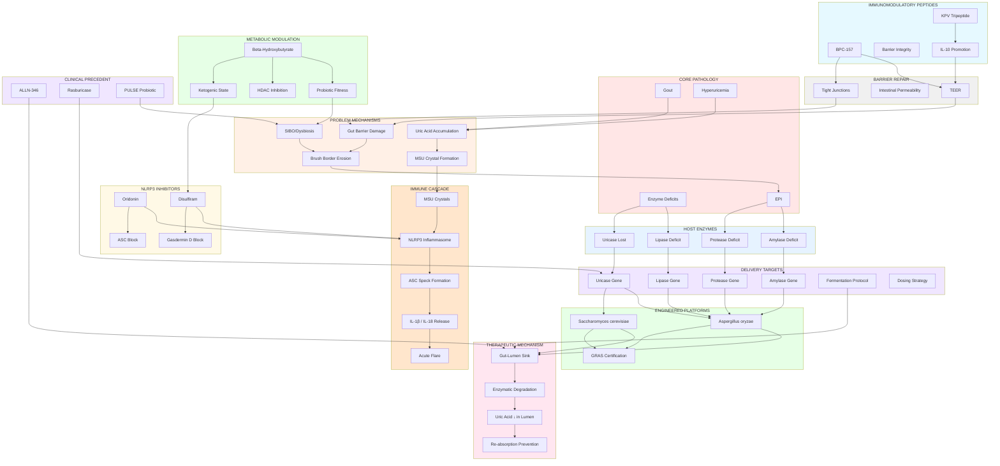

# Open Enzyme Concept Graph

A visual map of how all Open Enzyme research domains relate to each other. Use the interactive diagram below to understand dependencies, synergies, and the full therapeutic stack.

## Interactive Concept Map



## Key Pathway Descriptions

### 1. **Pathology → Immune Activation Loop**
- Hyperuricemia → MSU crystal formation → NLRP3 activation → IL-1β cascade → acute gout flare
- Enzyme deficits → poor luminal digestion → dysbiosis + barrier erosion → SIBO

### 2. **Uricase Platform Loop**
- Host loses uricase ~15M years ago → hyperuricemia endemic
- Engineer S. cerevisiae or A. oryzae with uricase gene
- Ferment at home → colonize gut lumen
- Degradation in situ → uric acid ↓ → MSU crystals prevented

### 3. **Barrier Repair + Immunomodulation**
- BPC-157 + KPV → tight-junction integrity
- Integrity → reduced inflammatory translocation
- Reduced NLRP3 priming + oridonin/disulfiram for inflammasome block = dual suppression

### 4. **Metabolic Synergy**
- BHB (ketones) → NLRP3 inhibition + probiotic fitness
- Engineered strains (engineered S. cerevisiae/A. oryzae) outcompete pathogens
- Prevents SIBO; supports barrier homeostasis

### 5. **Combinatorial Stack** (Full Gout Resolution)
```
Engineered Uricase (S. cerevisiae)
    ↓
Gut-Lumen Sink (enzymatic uric acid ↓)
    ↓
BPC-157 (barrier repair)
    ↓
Oridonin (NLRP3 direct inhibition)
    ↓
BHB (metabolic support + probiotic advantage)
    ↓
**Complete flare prevention + remission**
```

## Reading the Graph

- **Boxes** = Concepts (conditions, molecules, mechanisms, platforms)
- **Arrows** = Causal or mechanistic relationships
- **Colors** = Domains (pathology=red, immune=orange, platform=green, etc.)
- **Subgraphs** = Grouped by functional domain for easier navigation

### High-Level Dependencies

**Must-Have (Gout):**
- Uricase platform (S. cerevisiae or A. oryzae)
- Gut-lumen sink mechanism
- NLRP3 inhibition (any of: oridonin, disulfiram, or dietary BHB)

**Enhanced (Barrier + Metabolic):**
- BPC-157 or KPV (barrier repair)
- BHB (ketogenic state or supplementation)
- Probiotic advantage via metabolic modulation

**For EPI:**
- Engineered A. oryzae with multi-enzyme expression (lipase, protease, amylase)
- Same barrier repair stack (BPC-157 + BHB)
- SIBO prevention via microbiome management

---

## Related Documentation

See [wiki/INDEX.md](INDEX.md) for detailed concept pages.  
See `docs/` folder for full research citations and methodology.
