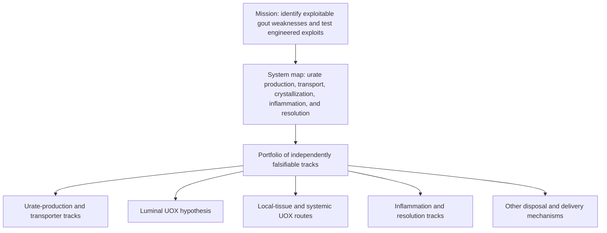
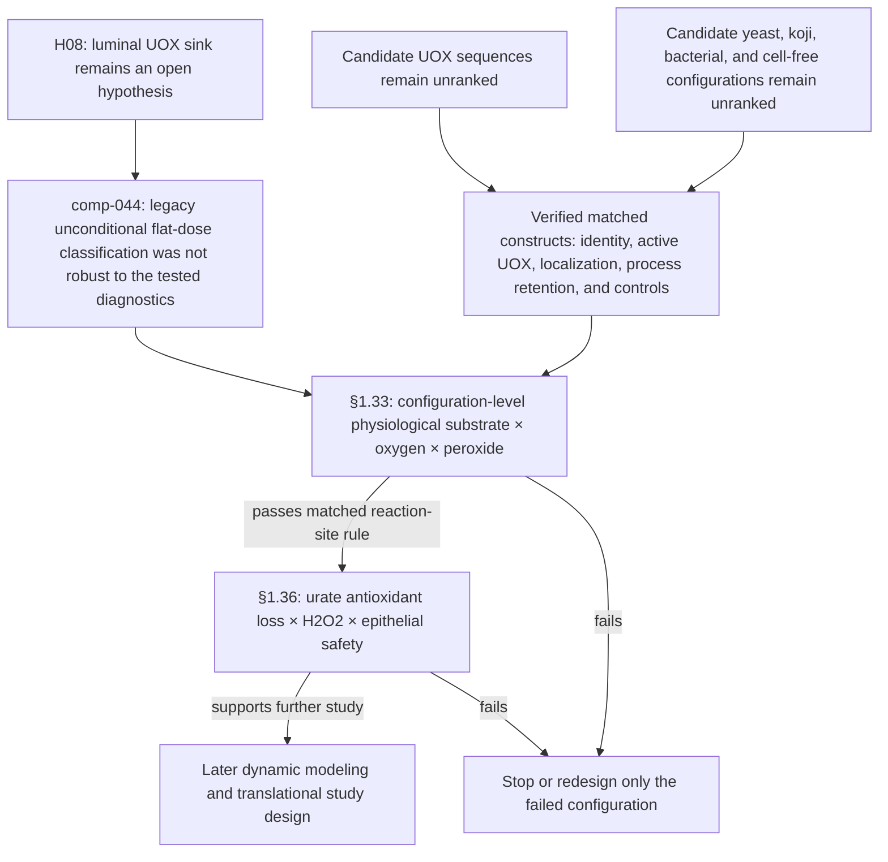

# Open Enzyme Dependency Graph

This graph is a compact routing surface for current decisions. It does not rank interventions, chassis, UOX sequences, topologies, or product formats. Scientific evidence and limitations live in the linked topic pages.

## Portfolio map

The system map routes questions to distinct tests. Evidence for one route does not transfer to another, and failure of one track does not stop the portfolio.

## Luminal UOX decision path

### What the edges mean

- **comp-044 → §1.33:** COMP-019's unconditional flat-dose classification is not robust to COMP-044's tested substrate-occupancy and finite-window diagnostics. The audit supplies no replacement ΔSUA, dose, genotype order, physiological regime, efficacy model, topology/chassis selection, production-sufficiency target, or safety conclusion. **Mechanistic Extrapolation.**
- **Construct build → §1.33:** protein mass, transcript, promoter strength, or activity at a high-substrate benchmark is insufficient. The decision variable is reproducible active UOX at the intended reaction site under the matched physiological test.
- **§1.33 → §1.36:** only an exact configuration with product formation at the human-baseline prior, without a prespecified extracellular-H2O2 or viability penalty relative to matched controls, advances to the dedicated epithelial-safety test. A topology conclusion is transferable only within a controlled host comparison.
- **§1.36 → later work:** lower H2O2 alone does not pass if barrier injury persists after urate removal. A pass supports designing the next study; it does not establish a human dose or serum-urate effect.
- **Failure → redirect:** a failed sequence, topology, chassis, or process updates only that tested configuration.

## Evidence and decision homes

- [Mission and operating principles](./open-enzyme-vision.md)
- [Gout system map](../gout-pathophysiology.md)
- [Modality × target matrix](../modality-chokepoint-matrix.md)
- [Delivery route × compound-class matrix](../delivery-route-matrix.md)
- [Chassis-pending interventions](../chassis-pending-interventions.md)
- [Gut-lumen UOX sink](../gut-lumen-sink.md)
- [Systemic UOX delivery attack surface](../blood-barrier-exploits.md)
- [UOX variant selection](../uricase-variant-selection.md)
- [Yeast UOX research plan](../engineered-yeast-uricase-proposal.md)
- [Koji UOX construct screen](../koji-construct-design.md)
- [comp-044 physiological-regime audit](../gut-lumen-uricase-physiologic-regime-computational.md)
- [comp-045 topology × oxygen × peroxide design](../uricase-topology-oxygen-peroxide-design-computational.md)
- [Validation experiments §§1.33 and 1.36](../validation-experiments.md#133-physiological-uox-topology--oxygen--peroxide-factorial)
- [Open Enzyme dashboard](../../index.md)
