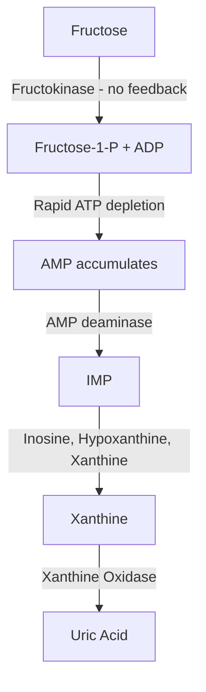

# Gout: A Deep Dive

State of the art, frontier research, AI-driven discovery, evolutionary biology, and unconventional intervention angles across the gout system.

## Contents

1. [The Biology of Gout — Why It Happens](#the-biology-of-gout--why-it-happens)
2. [Current Treatment Landscape](#current-treatment-landscape)
3. [The Clinical Pipeline](#the-clinical-pipeline)
4. [Genomics and GWAS — Who Gets Gout and Why](#genomics-and-gwas--who-gets-gout-and-why)
5. [AI and Computational Approaches](#ai-and-computational-approaches)
6. [Edited Human-Cell UOX Models](#edited-human-cell-uox-models)
7. [The Evolutionary Paradox — Why We Lost Uricase](#the-evolutionary-paradox--why-we-lost-uricase)
8. [The Gut Microbiome Angle](#the-gut-microbiome-angle)
9. [Fructose: The Hidden Accelerant](#fructose-the-hidden-accelerant)
10. [Targeting Inflammation Instead of Uric Acid](#targeting-inflammation-instead-of-uric-acid)
11. [Nanotechnology and Targeted Crystal Dissolution](#nanotechnology-and-targeted-crystal-dissolution)
12. [The Uric Acid Paradox — Why Lowering It Isn't Free](#the-uric-acid-paradox--why-lowering-it-isnt-free)
13. [Unconventional Angles and Cross-Disciplinary Connections](#unconventional-angles-and-cross-disciplinary-connections)
14. [Research Priorities](#research-priorities)
15. [Research Peptides](#research-peptides)
16. [Engineered Organisms — Koji, Yeast, and Living Factories](#engineered-organisms--koji-yeast-and-living-factories)
17. [The NLRP3 Chokepoint Framework](#the-nlrp3-chokepoint-framework)

---

## The Biology of Gout — Why It Happens

Gout is the clinical endpoint of a multi-step biochemical cascade. Understanding each step matters because each step is a potential therapeutic target.

Two broad intervention axes are serum/tissue urate control and modulation of the crystal-triggered inflammatory response. They address different parts of the causal chain and require separate outcome measures.

In brief, the chain runs: purines (from cell turnover or diet) are catabolized by **xanthine oxidase** to **uric acid**, which — because humans lost the uricase gene ~15–20 million years ago — accumulates rather than being converted to soluble allantoin. About 70% of urate is cleared renally and ~1/3 via the gut, governed by transporters (URAT1, GLUT9, ABCG2, OAT1/3); ~90% of gout patients are "under-excretors." When serum urate exceeds its ~6.8 mg/dL saturation point, **monosodium urate (MSU) crystals** deposit in joints. Macrophages phagocytose those crystals, triggering the **NLRP3 inflammasome** → caspase-1 → **IL-1β** release — the explosive inflammatory storm of a flare.

**Full mechanism cascade with evidence tags, transporter table, and chokepoint mapping:** [Gout Pathophysiology](./gout-pathophysiology.md).

---

## Current Treatment Landscape

### Acute Flare Management

**Colchicine** remains first-line for acute flares and prophylaxis when starting urate-lowering therapy (ULT). It works by inhibiting microtubule polymerization in neutrophils, reducing their ability to migrate to and function at inflamed sites. It also suppresses NLRP3 inflammasome activation. The problem: narrow therapeutic window, GI side effects, and it doesn't work well once a flare is established.

**NSAIDs** and **corticosteroids** are established acute-flare options. Their risk profiles differ: NSAIDs carry gastrointestinal, renal, and cardiovascular risks, while systemic corticosteroids can affect glucose regulation, bone, mood, sleep, and immune function. This page summarizes the evidence landscape and does not specify a treatment regimen.

**IL-1 inhibitors** were used off-label for refractory acute gout for years; **canakinumab (Ilaris) received formal FDA approval for gout in August 2023** — the first biologic ever indicated for gout in the US, 12 years after its 2011 rejection (Clinical Trial; *J Inflamm Res* 2026, PMID: 41867470. source: gout-clinical-pipeline.md). Anakinra remains off-label. Both are effective but expensive and immunosuppressive.

### Urate-Lowering Therapy (ULT)

**Allopurinol** (XO inhibitor, approved 1966) is the workhorse. Cheap, effective for many, but requires dose titration, has a rare but potentially fatal hypersensitivity reaction (allopurinol hypersensitivity syndrome, associated with HLA-B*5801), and many patients don't reach target urate levels.

**Febuxostat** (XO inhibitor, approved 2009) is more potent than allopurinol and doesn't require renal dose adjustment, but the CARES trial raised cardiovascular mortality concerns (somewhat controversial — the trial had high dropout rates and the signal may not be causal).

**Probenecid** (uricosuric, inhibits URAT1) increases renal uric acid excretion. Requires adequate kidney function, increases kidney stone risk, and has fallen out of favor.

**Lesinurad** (selective URAT1 inhibitor) was approved in 2015 but voluntarily withdrawn from the US market in 2019 due to commercial reasons. It required co-administration with a XO inhibitor.

**Pegloticase** is an intravenously delivered pegylated recombinant uricase indicated for refractory gout. It converts urate to allantoin and can produce substantial serum-urate and tophus responses. Anti-drug antibodies can neutralize the enzyme and increase infusion-reaction risk, making immunogenicity a central limitation.

### Disease-modifying boundaries

Current therapies can reduce urate production, increase urate excretion, replace UOX systemically, or suppress crystal-triggered inflammation. These mechanisms differ in persistence, tissue effects, safety, and whether their effect continues after exposure ends. Gene restoration, durable transporter modification, and immune-tolerance strategies remain research hypotheses rather than established cures.

---

## The Clinical Pipeline

The gout pipeline is more active now than it's been in decades. Here's what's in late-stage development or recently approved as of early 2026:

| Drug | Mechanism | Phase | Status / Key Data |
|---|---|---|---|
| **Pozdeutinurad (AR882)** Arthrosi → acquired by Sobi for $1.5B | Next-gen selective URAT1 inhibitor (uricosuric) | Phase 3 | Both pivotal trials (REDUCE 1 & REDUCE 2) fully enrolled with 750+ patients each. Data expected Q2–Q4 2026. NDA planned. Potentially best-in-class URAT1 inhibitor. Sobi's $1.5B acquisition signals high confidence. |
| **SEL-212 (Pegadricase + ImmTOR)** Sobi (formerly Selecta Biosciences) | Pegylated ***C. utilis* uricase** + rapamycin nanoparticles to prevent immunogenicity (Sands 2022 *Nat Commun* PMID 35022448) | Phase 3 | DISSOLVE I & II completed. High-dose response rates: 56% (DISSOLVE I), 46% (DISSOLVE II). Superior to pegloticase in COMPARE head-to-head. ImmTOR nanoparticles suppress anti-drug antibody formation — solves pegloticase's biggest problem. Monthly dosing vs. biweekly for pegloticase. |
| **Firsekibart (Genakumab)** | Anti-IL-1β monoclonal antibody | Phase 3 | Phase 3 in acute gout: reduced new flare risk by **90% at 12 weeks**, 87% at 24 weeks. Phase 2 head-to-head: outperformed colchicine for flare prophylaxis. Particularly important for patients who can't tolerate NSAIDs/colchicine (renal impairment, drug interactions). |
| **Dapansutrile (OLT1177)** Olatec Therapeutics | Oral selective NLRP3 inflammasome inhibitor | Phase 2a (no later trial in gout) | Phase 2a published 2020 (*Lancet Rheumatol*, PMID: 33005902): 52–68% pain reduction at day 3 across four dose levels (N=34). **No Phase 2b or 3 in gout registered as of April 2026** — Olatec's later development moved to heart failure (Phase 1b completed 2019) and COVID-19 (Phase 2 terminated 2022). Gout development appears stalled. (source: gout-clinical-pipeline.md) |
| **PRX-115** Protalix | Pegylated recombinant uricase ± methotrexate, IV | Phase 2 (RELEASE) | NCT07280156 started 2025-12-22, N=150, primary completion Dec 2027. Tests systemic UOX with and without immunomodulation in a treatment-naive population. (source: gout-clinical-pipeline.md) |
| **SSS11** Shenyang Sunshine | Pegylated *Candida utilis*-derived uricase, IV | Phase 1 | NCT06629376, planned N=60, single-center (Shanghai). Another systemic *C. utilis*-derived UOX program; it is not the first clinical use of this enzyme source. (source: gout-clinical-pipeline.md) |
| **Canakinumab (Ilaris)** Novartis | Anti-IL-1β monoclonal antibody | **FDA approved Aug 2023 for gout** | First biologic formally indicated for gout in the US; 12 years after initial 2011 rejection. (source: gout-clinical-pipeline.md) |
| **ALLN-346 Study 201** Allena Pharmaceuticals | Engineered oral *C. utilis* uricase (gut-lumen) | Phase 2a, completed | NCT04987242 completed with actual enrollment 16. The published abstract reports the first 11 participants, without concurrent urate-lowering therapy; it is not a 16-participant efficacy report. (Clinical Trial; source mapping: gout-clinical-pipeline.md) |
| **ALLN-346 Study 202** Allena Pharmaceuticals | Engineered oral *C. utilis* uricase (gut-lumen) | Phase 2a, terminated | NCT04987294 enrolled 19 and was terminated for company financing; no results are posted. Do not combine this record with Study 201. (ClinicalTrials.gov; source mapping: gout-clinical-pipeline.md) |
| **Dotinurad (URECE)** Fuji Yakuhin / Eisai | Selective URAT1 inhibitor | Approved (Asia) | Approved in Japan (2020), recently launched in China, Thailand, Philippines (2025). Highly selective for URAT1 with minimal OAT interaction, reducing kidney stone risk vs. older uricosurics. |
| **ABP-671 (Lingdolinurad)** Atom Therapeutics | URAT1 inhibitor | Phase 2b/3 | Global Phase 2b/3 trial hit primary efficacy endpoint — dose-dependent serum uric acid reduction with acceptable safety. Phase 3 likely. |
| **Epaminurad (URC102)** | URAT1 inhibitor | Phase 3 | Recruiting, head-to-head vs. febuxostat. |
| **SHR4640** | URAT1 inhibitor | Phase 3 | Recruiting, head-to-head vs. allopurinol. |
| **HNW005** | Dual NLRP3 + URAT1 inhibitor | Preclinical | A single molecule that inhibits both NLRP3 inflammasome activation AND URAT1-mediated urate reabsorption. IL-1β IC50 = 1.7 μM, URAT1 inhibition = 75.3%. First dual-target approach — hits both the inflammation and the uric acid in one compound. |

> **Evidence boundary:** Dual-target candidates test whether one configuration can affect urate handling and inflammatory signaling. A preclinical target profile does not establish useful exposure, selectivity, safety, or clinical benefit, and it does not make dual targeting superior to independently controllable interventions.

---

## Genomics and GWAS — Who Gets Gout and Why

Genome-wide association studies have dramatically expanded our understanding of gout susceptibility. A recent meta-analysis involving over **one million participants** identified **351 loci** associated with serum urate levels, 17 of which were previously unreported. A 2025 UK Biobank study (N=150,542) identified 13 loci associated with gout, including four novel loci, with notable sex-specific differences (16 loci in males, only 2 in females).

### The Big Three Transporter Genes

Three genes dominate the genetic architecture of hyperuricemia and gout, all encoding urate transporters in the kidney:

**ABCG2** (chromosome 4): The single strongest genetic association with gout. The common Q141K variant (rs2231142, found in ~10% of European and ~30% of East Asian populations) reduces ABCG2 transport function by ~50%. This means less uric acid is secreted into both the gut and kidney tubule. The 2025 UK Biobank GWAS found the most significant gout association at rs2199936 in ABCG2 (p = 1.75 × 10⁻⁹⁷).

**SLC2A9 / GLUT9** (chromosome 4): The second-strongest association
(rs58656183, p = 5.52 × 10⁻⁹⁰). SLC2A9 is a major renal urate-reabsorption
transporter. Rare loss-of-function variants cause renal hypouricemia rather
than hyperuricemia (**Human Observational + In Vitro**; PMID 19926891). Common
locus associations do not specify individual direction, fructose sensitivity,
or an intervention response.

**SLC22A12 / URAT1** (chromosome 11): Encodes the primary reabsorption transporter. Loss-of-function variants actually *protect* against gout (and cause renal hypouricemia). Gain-of-function or regulatory variants that increase URAT1 expression increase gout risk.

### Beyond Transporters: Surprising GWAS Hits

Several GWAS loci point to biology beyond kidney transport. Loci near genes involved in glycolysis, insulin signaling, and lipid metabolism suggest that gout risk is intertwined with broader metabolic syndrome pathways. Some hits implicate inflammatory and immune-regulatory genes, reinforcing the idea that susceptibility to gout isn't just about urate levels — it's also about how your immune system responds to crystals.

> **Research gap:** A gout polygenic-risk model would require prospective validation, calibration across ancestries, and evidence that risk stratification changes a clinical outcome. Association loci alone do not select an intervention or identify an ABCG2-rescue responder.

> **Candidate target:** ABCG2 Q141K trafficking rescue is a testable pharmacological-chaperone hypothesis. CFTR correctors provide a protein-trafficking precedent, not evidence that an ABCG2 rescue compound exists or will alter urate flux. Direct surface-expression and urate-transport assays are the next gate.

---

## AI and Computational Approaches

### AlphaFold and Protein Structure

The NLRP3 inflammasome has been one of the more challenging structural biology targets. It's a megadalton-scale complex that undergoes dramatic conformational changes during activation. Cryo-EM structures of inactive NLRP3 bound to inhibitors (like MCC950) have been solved, and recent work has leveraged **AlphaFold and RoseTTAFold** for structure prediction of the NLRP3 NACHT domain — the druggable core where most small-molecule inhibitors bind.

A 2022 assessment found that while AI-predicted NLRP3 structures are valuable for understanding general architecture, their utility for small-molecule drug design is mixed. The predicted structures lack the resolution needed for precise binding-pocket geometry — molecular dynamics simulations are needed as a refinement step. However, combining AlphaFold structures with MD simulations has shown promise as a starting point for virtual screening campaigns.

For urate transporters, the story is better. URAT1 and GLUT9 structures can now be predicted with reasonable confidence, enabling in-silico screening for novel inhibitors (URAT1) or, more interestingly, activators/stabilizers (ABCG2). AlphaFold's ability to predict transporter conformations — inward-facing vs. outward-facing states — is particularly relevant for designing drugs that lock transporters in the desired state.

### AI-Driven Drug Discovery for Gout

There isn't a publicly announced major AI drug discovery campaign specifically for gout from companies like Insilico Medicine, Recursion, or Isomorphic Labs. Gout remains somewhat under the radar for the big AI pharma platforms — they tend to focus on oncology, neurodegeneration, and fibrosis where the commercial opportunity is perceived as larger.

However, there are indirect applications. Researchers in China have used **computational dual-target pharmacophore models** to design molecules that simultaneously inhibit NLRP3 and lower uric acid. The HNW005 compound mentioned above was identified through a scaffold-hopping approach using structural modification of tranilast — this kind of medicinal chemistry optimization is exactly where AI tools excel.

Natural product screening has also benefited: a 2025 Nature Communications paper described the discovery of multi-target anti-gout agents from *Eurycoma longifolia* (tongkat ali) through phenotypic screening and structural optimization — a pipeline that AI-driven platforms could dramatically accelerate.

> **Computational questions worth testing**
>
> **1. Multi-target compound design.** Can a prespecified candidate panel retain direct activity at two gout-relevant targets without losing selectivity, exposure, or safety? Model-generated candidates remain gated by direct assays.
>
> **2. ABCG2 pharmacological chaperones.** Can computational triage enrich for compounds that rescue Q141K surface expression and urate transport? CFTR is a mechanistic precedent, not evidence of transfer.
>
> **3. Microbial metabolism.** Can a source-bound model identify configurations worth a matched reaction-site, fitness, containment, and safety assay without inferring a human effect?
>
> **4. Polygenic risk prediction.** Does a model add calibrated, ancestry-robust prediction beyond serum urate and clinical variables, and does a prespecified risk-stratified strategy improve an outcome prospectively?

---

## Edited Human-Cell UOX Models

A 2025 *Scientific Reports* study tested a reconstructed ancestral UOX construct in edited human hepatocyte cultures and 3D liver spheroids. The reported in-vitro results include lower intracellular urate under the study conditions and peroxisomal localization in the spheroid model. **In Vitro.** The construct also changed the fructose-associated lipid phenotype in the tested cell model; that is a model-specific observation, not evidence of a systemic metabolic effect.

The study does not establish somatic in-vivo delivery, durable expression, circulating-urate control, peroxide handling, off-target editing, immunogenicity, tissue safety, tophus outcomes, or a clinical-development timeline. It is an edited-cell proof of principle. Any therapeutic interpretation requires a specified delivery configuration followed by independent expression, localization, activity, coproduct, biodistribution, durability, and safety gates.

---

## The Evolutionary Paradox — Why We Lost Uricase

The inactivation of uricase didn't happen once — it occurred independently in at least two primate lineages (great apes and lesser apes/gibbons), suggesting it was *selected for*, not just random drift. Several hypotheses explain why:

### The Fructose-Fat Storage Hypothesis

The most compelling and well-supported theory, championed by researcher Richard Johnson, argues that losing uricase helped our Miocene-era ancestors survive a climate catastrophe. Around 15–20 million years ago, the warm, fruit-rich tropical forests of Europe and Asia were being replaced by temperate forests with seasonal fruit availability. Primates that could efficiently convert fructose into fat stores had a survival advantage during lean seasons.

One proposed mechanism links intracellular urate, fructokinase, AMPK, and de novo lipogenesis. The 2025 edited-hepatocyte experiment changed the fructose-associated lipid phenotype in that in-vitro system. It does not by itself confirm the evolutionary hypothesis or establish the direction and magnitude of the pathway in vivo.

### The Antioxidant Hypothesis

Uric acid accounts for roughly **50–60% of the antioxidant capacity** of human blood plasma. In the extracellular environment, it's a powerful scavenger of peroxynitrite, hydroxyl radicals, and singlet oxygen. The hypothesis: higher uric acid levels provided neuroprotection, supporting the evolution of larger, longer-lived brains. Humans and great apes have the highest serum urate levels and the largest brains (relative to body size) among primates.

### The Blood Pressure Hypothesis

Uric acid promotes sodium retention and stimulates the renin-angiotensin system, both of which raise blood pressure. In ancestral environments with very low dietary sodium, this may have been necessary to maintain adequate blood pressure. In the modern salt-rich diet, this ancient adaptation now contributes to hypertension.

### Why This Matters for Treatment Strategy

The evolutionary context tells us something important: uric acid isn't just waste. It was co-opted for at least three beneficial functions. This means that therapies aimed at dramatically lowering uric acid — especially systemic therapies — may have unintended consequences. The optimal strategy may not be "eliminate uric acid" but rather "keep it below crystallization threshold while preserving its beneficial antioxidant role" — a narrower target than most current approaches aim for.

---

## The Gut Microbiome Angle

About one-third of daily uric acid elimination happens through the gut, not the kidneys. This has been under-appreciated for decades, but recent research has blown the door open.

### Purine-Degrading Bacteria (PDB)

A landmark finding: researchers identified a class of gut bacteria — predominantly from the **Bacillota** (formerly Firmicutes) phylum — that actively degrade purines and uric acid in the gut. These "purine-degrading bacteria" (PDB) carry a conserved gene cluster that converts urate into lactate or anti-inflammatory short-chain fatty acids (SCFAs). The effect is substantial — much larger than previously assumed.

In gout patients and hyperuricemic individuals, the gut microbiome is consistently dysbiotic: there's a **reduction in obligate anaerobic SCFA-producing bacteria and an increase in facultative anaerobes**. This suggests a vicious cycle — gout may both cause and be worsened by gut dysbiosis.

### Specific Strains with Demonstrated Effects

**Lactiplantibacillus plantarum X7022** has been shown to degrade xanthine, guanine, and adenine via the purine assimilation pathway, inhibit xanthine oxidase activity, reduce serum uric acid, restore gut microbial balance, and increase SCFA levels. It works through multiple mechanisms simultaneously.

**Ligilactobacillus salivarius CECT 30632** was tested in a randomized pilot trial in hyperuricemic patients. Oral administration reduced gout episodes, though the trial was small.

### Engineered Probiotic Candidates

This is where it gets really interesting. Two cutting-edge approaches are in development:

**PULSE System** (published 2025 in *Cell Reports Medicine*): Researchers engineered *E. coli* Nissle 1917 with a local urate-responsive controller, multiple UOX topologies, and oxygen/peroxide-management components. Oral administration changed urate phenotypes in hyperuricemic mice and rats. **Animal Model.** The study does not establish which component or topology was sufficient, durable colonization, or activity and effect size in humans.

**YES301** (published 2024): Engineered *E. coli* Nissle 1917 overexpressing the xanthine transporter protein XanQ, achieving 8.6× increased xanthine uptake and 4.0× increased hypoxanthine transport. In hyperuricemic mice, it showed efficacy comparable to allopurinol with fewer adverse effects.

> **Evidence boundary**
>
> Engineered-probiotic urate disposal is one candidate route. PULSE and YES301 support testing controlled local metabolism in animal systems; they do not establish persistent colonization, continuous activity, a human dose, clinical benefit, or superiority to a drug or another delivery route.
>
> **The gap:** Human clinical data remain limited. PULSE and YES301 are preclinical, and each construct still requires reaction-site activity, containment, persistence, peroxide, epithelial-safety, and manufacturing gates before a clinical program is justified.

---

## Fructose: An Urate-Production Accelerator

Fructose-driven KHK activity is a direct urate-production mechanism and a
testable intervention point. This section defines the mechanism; it does not
provide dietary or treatment instructions.

### The Metabolic Mechanism

KHK-mediated fructose phosphorylation can consume ATP rapidly and increase
degradation of the existing adenine nucleotide pool to urate:

The key insight: fructokinase has **no negative feedback**. Unlike hexokinase
(which phosphorylates glucose), fructokinase does not slow down when ATP is low
or when downstream products accumulate. A large fructose load can therefore
drive rapid ATP consumption, AMP accumulation, and degradation of the
pre-existing adenine nucleotide pool to urate. This is purine catabolism, not
the creation of new purines through de-novo synthesis. Whether fructose also
changes PRPP-supply or de-novo flux enough to matter is a separate,
unresolved question.

### The SLC2A9 boundary

SLC2A9 genotype cannot be used as a proxy for KHK activity or fructose
sensitivity. Homozygous SLC2A9 loss-of-function impairs renal urate
reabsorption and causes renal hypouricemia, with possible nephrolithiasis and
exercise-induced acute kidney injury (**Human Observational + In Vitro**;
PMID 19926891). The old “dual vulnerability” direction was wrong.

### Research implications

> **Exposure-reduction hypothesis**
>
> Defined fructose exposure is a useful experimental variable because the
> KHK-to-AMP-catabolism mechanism is direct. Controlled studies must establish
> urate mass balance, whether KHK inhibition blocks the production arm, and
> whether a separate NOX/ABCG2 effect changes intestinal export. See
> [fructose-driven urate production](./fructose-connection.md).

---

## Targeting Inflammation Instead of Uric Acid

What if you didn't lower uric acid at all, but instead made the immune system stop reacting to the crystals? This is the logic behind NLRP3 inflammasome inhibition and IL-1β blockade.

### NLRP3 Inflammasome Inhibitors

**Dapansutrile** is the first oral selective NLRP3 inhibitor to publish a Phase 2a in gout. It directly prevents NLRP3 inflammasome assembly, blocking the entire downstream cascade (caspase-1 activation, IL-1β release, neutrophil recruitment). In the 2020 Phase 2a (N=34, *Lancet Rheumatol*, PMID: 33005902), oral dapansutrile reduced target joint pain 52–68% at day 3 across four dose levels. **However, as of April 2026 no Phase 2b or 3 in gout is registered on ClinicalTrials.gov** — Olatec's subsequent active programs moved to heart failure (Phase 1b completed 2019) and COVID-19 (Phase 2 terminated 2022). The "first oral NLRP3 inhibitor for gout" pivotal readout has not arrived. (source: gout-clinical-pipeline.md)

**MCC950 and derivatives:** MCC950 was the first potent, selective NLRP3 inhibitor discovered and has been the basis for a generation of follow-on compounds. It binds the NACHT domain and prevents the conformational change needed for inflammasome activation. Several optimized derivatives with improved solubility and pharmacokinetics are in preclinical development.

No FDA-approved NLRP3 inhibitor exists yet for any indication. Gout may be the disease where this class breaks through, because the crystal-NLRP3 mechanism is so direct and well-characterized.

### IL-1β Blockade

**Firsekibart** Phase 3 results reported a 90% reduction in new gout-flare risk at 12 weeks. Population, comparator, safety, and regulatory status determine the clinical scope; this page does not translate that result into treatment guidance.

The existing approved IL-1 blockers (anakinra, canakinumab) are used off-label for gout but weren't developed for it. Firsekibart is the first IL-1β antibody designed and tested specifically as a gout therapy.

### Autophagy and Resolution Biology

A fascinating emerging area: the body actually has mechanisms for *resolving* gout flares and clearing MSU crystals, centered on macrophage phenotype switching and autophagy. During flare resolution, monocytes differentiate into macrophages that produce TGF-β1 (anti-inflammatory), engulf neutrophil extracellular traps (NETs) through a process called efferocytosis, and can "safely dispose" of MSU crystals without triggering inflammation.

Autophagy — the cell's self-cleaning system — plays a dual role. MSU crystals simultaneously activate the NLRP3 inflammasome and upregulate autophagy. When autophagy dominates, it suppresses IL-1β production and promotes resolution. When inflammasome activation dominates, you get a flare. Pharmacologically tipping this balance toward autophagy (using mTOR inhibitors, autophagy enhancers) is being explored as a therapeutic strategy — and note that the ImmTOR nanoparticles in SEL-212 contain rapamycin, an mTOR inhibitor that promotes autophagy.

> **Cross-Disciplinary Connection**
>
> NLRP3 and autophagy are studied in several crystal- and aggregate-associated diseases. That shared pathway can generate gout candidates, but disease context, priming signal, tissue exposure, dosing, and safety prevent automatic transfer. A compound from another indication still requires MSU-relevant target-engagement and efficacy tests.

---

## Nanotechnology and Targeted Crystal Dissolution

Nanotechnology is opening approaches that would be impossible with conventional drug delivery. Several platforms published in 2024–2025 are worth tracking:

### Dual-Action Nanocarriers

Preclinical nanocarrier studies have combined UOX with anti-inflammatory payloads. A combined formulation must separately establish joint localization, active UOX, coproduct handling, release kinetics, inflammatory target engagement, and tissue safety; co-loading does not establish any of those properties or reduced systemic exposure.

### Biomimetic Nanoparticles

A preclinical configuration combines a neutrophil-membrane-like coating, UOX, and a Prussian-blue core intended to couple localization, urate oxidation, and peroxide handling. Each function, their colocalization, the active-enzyme lifetime, biodistribution, clearance, and tissue safety require direct measurement in the relevant model; the component rationale does not establish joint performance.

### Magnetically Switchable Nanoparticles

A preclinical Fe₃O₄/UOX nanohybrid uses an alternating magnetic field as an activity-control input. The engineering claim is limited to the tested model; field delivery, spatial control, reaction-site product formation, peroxide handling, biodistribution, and tissue safety remain separate gates.

> **Reality Check**
>
> These approaches are preclinical configurations, not evidence that local nanotechnology will replace systemic UOX. Exact formulation, active-enzyme recovery, biodistribution, coproduct control, clearance, immunogenicity, tissue safety, and comparative efficacy determine whether any configuration advances.

---

## The Uric Acid Paradox — Why Lowering It Isn't Free

Here's the uncomfortable truth that most gout literature glosses over: uric acid is one of the most important antioxidants in human blood. Accounting for up to **55% of extracellular free radical scavenging capacity**, it's not just metabolic waste — it's a critical part of our antioxidant defense system.

### Neuroprotective Effects

Multiple large epidemiological studies have found that **higher serum uric acid levels are associated with lower risk of Parkinson's disease** and slower disease progression. The association is strong and consistent across populations. Higher uric acid has also been linked to reduced risk of multiple sclerosis and possibly Alzheimer's disease. The proposed mechanism: uric acid scavenges peroxynitrite in the CNS, protecting dopaminergic neurons from oxidative damage.

However — and this is important — the clinical picture is complicated. A recent neuroprotection trial that raised uric acid in Parkinson's patients using inosine failed to show benefit. A similar trial in relapsing-remitting MS (inosine 3g/day) also showed no neuroprotective effect. This doesn't necessarily disprove the hypothesis — it may mean that exogenously raising uric acid doesn't replicate the protective effect of constitutively high levels — but it should temper enthusiasm.

### The Oxidant-Antioxidant Duality

Uric acid's behavior depends on context. In the extracellular space (blood plasma), it's antioxidant. Inside cells (intracellular), it can be pro-oxidant — generating reactive oxygen species and activating NF-κB. This dual nature means the same molecule can be protective (in the blood) and harmful (when crystallized in joints or internalized by cells).

### Implications for Treatment

The current therapeutic target for gout is serum urate below 6 mg/dL (below 5 mg/dL for tophaceous gout). But most normal adults walk around at 3.5–7 mg/dL. Driving urate down to very low levels (as pegloticase or future uricase gene therapy could do) might increase susceptibility to oxidative neurodegeneration. The ideal therapy might be one that keeps urate in a "Goldilocks zone" — below crystallization threshold but above levels where antioxidant protection is lost.

> **Feedback-control hypothesis**
>
> A urate-responsive controller could, in principle, reduce UOX activity when its local input falls. PULSE supplies an animal-model precedent for testing that control architecture, not evidence that it maintains human systemic urate in a target range. Constitutive systemic expression and controlled luminal expression are separate routes with different sensing, exposure, and safety questions.

---

## Unconventional Angles and Cross-Disciplinary Connections

This section identifies adjacent mechanisms that generate testable gout hypotheses.

> **Connection 1: Cystic Fibrosis Drug Design → ABCG2 Rescue for Gout**
>
> Q141K can reduce ABCG2 surface expression, making pharmacological rescue a testable hypothesis. CFTR correctors are a protein-trafficking precedent, not evidence of mechanistic identity or transfer. The gate is a direct Q141K surface-expression and urate-transport rescue assay with wild-type, allele-selectivity, cytotoxicity, and off-target-transporter controls.

> **Connection 2: mRNA Vaccine Technology → Periodic Uricase Delivery**
>
> An mRNA-UOX route is a distinct delivery hypothesis. It requires a specified sequence, carrier, target tissue, expression duration, active-enzyme localization, urate and peroxide kinetics, immunogenicity, repeat-dose safety, and biodistribution. Existing mRNA products do not supply a UOX dose, schedule, reduced-immunogenicity result, or near-term development path.

> **Connection 3: Metabolic Syndrome Research → Fructokinase (KHK) Inhibitors**
>
> PF-06835919 establishes that KHK can be pharmacologically engaged in humans
> studied for metabolic disease (**Clinical Trial**; PMCID PMC8050029 and DOI
> 10.1111/dom.14946). It does not establish gout efficacy or a gout-relevant
> serum-urate effect. The next question is whether verified KHK engagement
> changes isotope-resolved AMP catabolism and urate mass balance under a
> defined fructose exposure.

> **Connection 4: CAR-T / Immune Tolerance Engineering → Crystal Tolerance**
>
> The field of immune tolerance engineering (driven by autoimmune disease and transplant research) is developing ways to teach the immune system to ignore specific antigens. If you could engineer tolerance to MSU crystals — making macrophages and neutrophils simply ignore them — you would eliminate gout flares without touching uric acid levels. The ImmTOR nanoparticles in SEL-212 already demonstrate this principle (tolerizing to the pegloticase protein). Researchers working on antigen-specific tolerance for Type 1 diabetes and multiple sclerosis could apply similar approaches to MSU crystal tolerance.

> **Connection 5: Synthetic Biology → Self-Regulating Gut Factories**
>
> PULSE makes a narrower engineering question testable: does a local urate-responsive controller improve reaction-site UOX control under physiologic substrate and oxygen conditions without worsening peroxide, viability, containment, or persistence? Multi-payload circuits and inter-strain coordination add separate burdens and should not be assumed before the single-function configuration passes.

> **Connection 6: Kidney Organoid Research → Understanding Transporter Biology**
>
> Kidney organoid and proximal-tubule systems may support genotype-aware transporter assays. Before use, verify transporter expression, polarity, urate flux, maturity, donor/genotype effects, and concordance with human renal handling. An organoid screen is a model-specific assay, not a personalized treatment selector.

> **Connection 7: Crystal Dissolution Chemistry → Targeted Chelation**
>
> MSU crystals have specific surface chemistry. Researchers in materials science and biomineralization (fields that usually study bone, kidney stones, or dental enamel) are developing molecules that selectively bind to crystal surfaces and accelerate dissolution. A small molecule that binds MSU crystal surfaces and increases their solubility — without affecting uric acid in solution — would be an entirely new mechanism of action. This approach is being explored for kidney stone dissolution (calcium oxalate crystals) and could be directly adapted for MSU.

---

## Research Priorities

### Clinical readouts to track

**Pozdeutinurad.** Phase 3 efficacy and safety results will determine the product-specific URAT1 case; approval and adoption cannot be inferred from enrollment or acquisition activity.

**SEL-212.** Phase 3 results test whether its ImmTOR configuration reduces anti-drug-antibody limitations while maintaining urate control. The result does not establish a platform-wide solution to UOX immunogenicity.

**Canakinumab now formally approved (Aug 2023) for gout; firsekibart/genakumab also Phase 3 complete.** IL-1β blockade is now an *approved* gout indication in the US — not just off-label. Dapansutrile, by contrast, has **no Phase 2b/3 in gout registered as of April 2026** despite the 2020 Phase 2a signal — the oral NLRP3 inhibitor route to a pivotal gout readout is currently dormant. (source: gout-clinical-pipeline.md)

### Preclinical engineering gates

**CRISPR uricase gene therapy.** The published work supplies a preclinical engineering precedent, not a clinical-development forecast. The next gates are reproducible construct performance, delivery, off-target analysis, immunogenicity, durability, and efficacy in an appropriate animal model. Human translation remains contingent on those results.

**Engineered probiotic UOX.** PULSE provides a preclinical construct and control precedent, not a human formulation. The next decision is a matched physiological reaction-site and safety test; IND-enabling work follows only if a defined configuration clears those gates.

**ABCG2 pharmacological chaperones.** The CF precedent motivates a screen but does not establish transfer. Required gates are Q141K surface rescue, urate transport, allele selectivity, intestinal and renal tissue context, and off-target transporter effects.

### Longer-range hypotheses

**mRNA-encoded uricase.** This route would require an exact sequence, delivery target, expression kinetics, peroxide control, immunogenicity, repeat-dose safety, and a product-specific PK/PD model. Redosability and reduced immunogenicity are hypotheses, not established advantages.

**Crystal-tolerant immune programming.** Tolerance engineering in other fields provides methods, but MSU crystals are not conventional antigens and a selective, safe tolerance mechanism has not been demonstrated.

**Polygenic risk scores.** Test calibration, ancestry transfer, incremental value over serum urate and clinical variables, and whether a prespecified risk-stratified strategy improves outcomes in a prospective study.

### Near-term research and funding gates

Fructose exposure, HLA-B*58:01 pharmacogenetics, combination urate-lowering strategies, and microbiome effects are distinct evidence questions; this research page does not provide individual treatment instructions. Each candidate track should advance only through the cheapest study that can discriminate its live hypotheses.

---

## Research Peptides

Several peptides have been proposed against pathways adjacent to gout inflammation. The [Peptides & Gout Addendum](peptide-gout-addendum.md) separates direct evidence from mechanistic extrapolation; none is established as a gout intervention.

**KPV** (Lys-Pro-Val), a tripeptide fragment of alpha-MSH, is the strongest mechanistic candidate. It directly inhibits both NF-κB (the NLRP3 priming signal) and NLRP3 inflammasome assembly — the exact two-step process driving gout flares. It also has gut anti-inflammatory properties relevant to intestinal uric acid excretion. See the [NLRP3 Exploit Map](nlrp3-exploit-map.md) where KPV maps to Chokepoint 1 (NF-κB priming).

**BPC-157** (Body Protection Compound-157) modulates the nitric oxide system, suppresses iNOS, and has well-documented gut-healing properties. Its primary gout relevance is indirect — by repairing gut barrier integrity it could support the ~1/3 of uric acid excretion that happens through intestinal uricolysis. No gout-specific studies exist.

**TB-500** (Thymosin Beta-4) blocks NF-κB nuclear translocation and accelerates tissue repair. Best suited for recovery from chronic gout damage rather than acute flare prevention.

> **Evidence Level**
>
> Zero peptides on this list have been tested in a human clinical trial for gout. All claims are based on animal models and mechanistic extrapolation from shared inflammatory pathways. The pharmaceutical industry validates the targets — firsekibart (anti-IL-1β) is in Phase 3 for gout and dapansutrile (NLRP3 inhibitor) completed a Phase 2a gout trial — but the peptides themselves remain unproven for this indication.

---

## Engineered organisms — candidate delivery tracks

One portfolio question is whether an engineered organism can produce active UOX and place that activity in a useful reaction compartment. Yeast and koji are two candidate chassis, each independently falsifiable; neither organism's food-use history transfers to an engineered strain or establishes delivery, safety, or clinical effect.

### The Yeast Track: Engineered *S. cerevisiae*

Active *Aspergillus flavus* UOX has been expressed intracellularly in *S. cerevisiae*, and engineered *S. boulardii* has shown measurable urate-degrading activity under reported assay conditions. **In Vitro.** The [Engineered Yeast UOX Research Plan](engineered-yeast-uricase-proposal.md) converts those precedents into matched construct, topology, processing, reaction-site, and safety gates. They do not establish an oral dose, a systemic urate effect, or a product format.

**Uricase variant comparison:** Three of four cited non-rasburicase programs chose *Candida utilis* over *A. flavus*. Tang 2025 (PMID 39892538) shows a post-evolution specific-activity advantage for *A. flavus*, while program choices also reflect IP, tolerance, and disclosed mutations. Both remain candidates for the oral track. See [uricase-variant-selection.md](uricase-variant-selection.md). (In Vitro + Clinical Trial; source: uricase-variant-selection.md)

### The Koji Track: Engineered *A. oryzae*

The [Engineered Koji Protocol](engineered-koji-protocol.md) tests matched *A. oryzae* UOX constructs and process states. A dual-cassette configuration is conditional on each single-cassette arm and the joint build passing its own measurements; native digestive-enzyme production does not establish UOX expression or delivery.

### Gut-Lumen UOX Is a Separate, Falsifiable Route

The [gut-lumen UOX hypothesis](gut-lumen-sink.md) keeps the enzyme outside the bloodstream and asks whether consuming transporter-delivered urate in the intestine can alter whole-body urate handling. Animal studies support the mechanism, while limited human evidence has not established a transferable effect size, dose, topology, or formulation. **Animal Model + limited Clinical Trial evidence.**

This route avoids transporting an active UOX oligomer across epithelium. It does not remove the hard parts: substrate supply, reaction-site access, oxygen, peroxide, persistence, transit, epithelial safety, reabsorption, and systemic compensation remain open. [Validation §1.33](validation-experiments.md#133-physiological-uox-topology--oxygen--peroxide-factorial) tests matched topology × oxygen × peroxide configurations; [§1.36](validation-experiments.md#136-luminal-urate-antioxidant-loss--uox-h2o2-safety-assay) tests the coupled antioxidant-loss and epithelial-injury risk. Systemic and local-tissue UOX remain separate routes with different evidence and failure modes.

> **Decision boundary**
>
> These engineered-organism tracks test one urate-disposal strategy. Failure of a sequence, chassis, topology, or delivery route narrows only the tested configuration; it does not hold up the broader mission.

---

## The NLRP3 Chokepoint Framework

The [biology recap above](#the-biology-of-gout--why-it-happens) (full cascade: [Gout Pathophysiology](./gout-pathophysiology.md)) introduces the NLRP3 inflammasome as a driver of gout flares. The current model has **seven discrete chokepoints with labeled sub-branches**, each a potential intervention target. The complete analysis is in the [NLRP3 Exploit Map](nlrp3-exploit-map.md).

**Chokepoint 0:** Crystal-triggered priming via complement C5a; candidate blockade includes avacopan and other CP0 approaches. (source: complement-c5a-gout.md)
**Chokepoint 1:** NF-κB priming — split into **CP1a** (NF-κB transcriptional, including TNFSF14/LIGHT amplifier; blocked by KPV, oridonin, sulforaphane, BHB, EGCG) and **CP1b** (non-transcriptional C5a→ROS priming)
**Chokepoint 2:** NLRP3 conformational activation, P2X7/P2X2-mediated K⁺ efflux (blocked by dapansutrile, MCC950, BHB, colchicine via P2X7)
**Chokepoint 3:** ASC speck formation (blocked by colchicine, parthenolide)
**Chokepoint 4:** Caspase-1 activation (blocked by disulfiram *via GSDMD — now CP6b*, VX-765, BHB)
**Chokepoint 5:** IL-1β / IL-18 output — split into **CP5a** (receptor blockade: anakinra, canakinumab *FDA-approved for gout Aug 2023*, rilonacept) and **CP5b** (active resolution via ALX/FPR2: RvD1, RvD2, MaR1 — direct MSU gout animal data, Zaninelli 2022 PMID 35716378; Jiang 2023 PMID 37996809; lactoferrin as fermentable adjunct) (source: spm-resolution-pathway.md)
**Chokepoint 6:** Neutrophil amplification + pyroptotic exit — split into **CP6a** (5-LOX → LTB4 → neutrophil chemotaxis: quercetin 300 nM IC50, AKBA ~2.7 μM cellular, zileuton FDA-approved 5-LOX inhibitor never tested in gout [zero ClinicalTrials.gov entries as of 2026-05-05], EPA substrate competition) and **CP6b** (GSDMD pore formation: disulfiram, DMF, NSA — blocks pyroptotic IL-1β release) (source: zileuton.md, nlrp3-exploit-map.md)

> **Theaflavins:** Black-tea polyphenols hit CP2/CP3 via NLRP3-NEK7 interaction disruption and CP1a via TF3 TNFSF14/HVEM modulation, with animal evidence for MSU peritonitis and renal-transporter effects. See [theaflavins.md](./theaflavins.md). (In Vitro + Animal Model; source: theaflavins.md)

> **Key Insight**
>
> **Beta-hydroxybutyrate (BHB)** — the ketone body produced during fasting or ketosis — hits three chokepoints (CP1, CP2, CP3). Still multi-chokepoint, but the v1.2 expansion reveals that **lactoferrin** (a single, fermentable 80 kDa protein) now covers CP1a (LPS/CD14 + NF-κB suppression), CP4/CP6b (direct GSDMD suppression via mitophagy, Shan 2026 PMID 41524100), and partial CP5b (resolution). Single-protein four-chokepoint coverage via one engineerable A. oryzae target. See the [NLRP3 Exploit Map](nlrp3-exploit-map.md) and [lactoferrin.md](lactoferrin.md) for the full analysis.
>
> **Species-gap caveat:** Rodent cellular IC50 values for NLRP3 inhibitors can diverge from human cellular IC50 by up to three orders of magnitude. Every rodent-derived potency claim carries that translation uncertainty. (source: chembl-cross-check.md)

---

## Related research

Open Enzyme is a portfolio of falsifiable gout-intervention tracks; enzymes and engineered organisms are candidates within it.

- [Founding Vision](etc/open-enzyme-vision.md)
- [Gout: A Deep Dive](gout-deep-dive.md)
- [Peptides & Gout Addendum](peptide-gout-addendum.md)
- [The Enzyme Deficit Connection](enzyme-deficit-deep-dive.md)
- [Pen-Testing the Gut-Blood Barrier](blood-barrier-exploits.md)
- [NLRP3 Exploit Map](nlrp3-exploit-map.md)
- [Engineered Koji Protocol](engineered-koji-protocol.md)
- [Engineered Yeast Uricase Proposal](engineered-yeast-uricase-proposal.md)

---

Key sources: Nature Scientific Reports, Cell Reports Medicine, PNAS, NEJM, Arthritis & Rheumatology, Frontiers in Microbiology, Rheumatology (Oxford), UK Biobank, ClinicalTrials.gov, ACR Convergence 2025, and company press releases from Sobi/Arthrosi, Olatec, Selecta/Sobi, and Atom Therapeutics.
