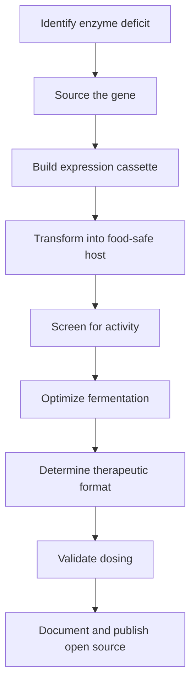

# Open Enzyme: Founding Vision

Two parallel outputs of one project:

- **A discovery engine** — a chokepoint-based methodology for mapping every vector that causes, treats, or mitigates a given disease, applied first to gout. Produces a structured cascade map plus a repurposing surface (FDA-approved drugs that hit relevant chokepoints but were never clinically tested for the target disease).
- **An open-source library of food-grade, engineered microbial strains** — each producing a therapeutic enzyme, each growable at home, each freely available to anyone. The library is one synthesis from the discovery engine; the engineered-koji platform converged from the gout vector mapping.

The library is the more visible artifact. 
The discovery engine is the more transferable contribution. 

**By:** Brian Abent  
**Date:** April 2026  
**Document Type:** North Star Document

---

## 1. The Problem

Hundreds of millions of people worldwide suffer from enzyme deficits. Not rare genetic anomalies — common, often debilitating conditions where the body either lost the ability to produce an enzyme (like uricase, silenced in all humans ~15 million years ago) or can't produce enough of one (like the lipases, proteases, and amylases needed to digest food).

| Statistic | Value |
|-----------|-------|
| Americans with gout (uricase deficit) | 9.2M |
| Global population with lactose malabsorption | ~65% |
| Americans with exocrine pancreatic insufficiency | ~90K |
| Annual cost of IV enzyme replacement therapies | $50K+ |

The list goes on: phenylketonuria (PKU), oxalate kidney stones, histamine intolerance, sucrase-isomaltase deficiency. Each is an enzyme deficit. Each leaves patients caught between pharmaceutical interventions that are staggeringly expensive ($50,000+ per year for IV enzyme replacement, $30–100/month for daily supplements forever) or simply suffering.

These aren't problems of understanding. The enzymes are well-characterized. The genes are sequenced. The biology is solved. What's missing is **accessibility** — a way to bridge the gap between what science knows how to make and what patients can actually get.

---

## 2. The Discovery Methodology

The project began not as a koji proposal but as a question: *what are all the vectors that cause, treat, or mitigate gout?* Applied systematically — across causation upstream of urate, urate flow itself, deposition, immune recognition, NLRP3 priming and activation, downstream amplification, and resolution — the question produced two artifacts that the rest of this document depends on.

### 2.1 The chokepoint structure

Gout pathophysiology resolves into a sequence of named chokepoints, each with characterized inputs and downstream consequences. The current map ([`nlrp3-exploit-map.md`](nlrp3-exploit-map.md)) names eleven:

| Chokepoint | Layer |
|---|---|
| CP0 | Crystal-triggered priming via complement C5a |
| CP1a | NF-κB transcriptional priming (TNFSF14/LIGHT amplifier) |
| CP1b | Non-transcriptional C5a → ROS priming |
| CP2 | P2X7-mediated K⁺ efflux |
| CP3 | ASC speck assembly |
| CP4 | Caspase-1 activation |
| CP5a | IL-1β / IL-18 receptor blockade |
| CP5b | Active resolution via ALX/FPR2 (RvD1, RvD2, MaR1, lactoferrin) |
| CP6a | 5-LOX → LTB4 → neutrophil chemotaxis |
| CP6b | GSDMD pore formation, pyroptotic IL-1β release |
| Upstream | Urate flow — production (xanthine oxidase), transport (URAT1, ABCG2), deposition (MSU) |

Every intervention — pharmaceutical, supplement, food, microbial, behavioral — maps onto one or more of these chokepoints.

### 2.2 The repurposing surface

Mapping FDA-approved drugs onto the chokepoints surfaces compounds that hit a gout chokepoint but were never clinically tested for gout. Concrete examples currently in the wiki:

- **Zileuton** (CP6a 5-LOX inhibitor) — FDA-approved for asthma since 1996. Documented at [`zileuton.md`](zileuton.md).
- **Disulfiram** (CP6b GSDMD inhibitor) — FDA-approved for alcohol use disorder since 1951. Documented at [`disulfiram.md`](disulfiram.md).
- **Avacopan** (CP0 C5aR1 antagonist) — FDA-approved for ANCA-associated vasculitis in 2021. Documented at [`complement-c5a-gout.md`](complement-c5a-gout.md).
- **DPP-4 inhibitor class** (gliptins — sitagliptin, linagliptin, etc., FDA-approved for type 2 diabetes since 2006) — the ChEMBL cross-check on resveratrol surfaced DPP-4 as resveratrol's most-potent curated direct target ([`chembl-cross-check.md`](chembl-cross-check.md)). DPP-4 is mechanistically relevant to gout via incretin/insulin-axis effects on urate handling and the metabolic-syndrome–gout comorbidity surface. Approved DPP-4 inhibitors are off-target candidates for the same axis; never trialled in gout.

Each has decades (or in the avacopan case, recent regulatory) of human safety data. Each is mechanistically aligned to a gout chokepoint. None has been clinically tested in gout. **None of these candidates require Open Enzyme to build anything** — they are pure discovery-engine output and represent a zero-engineering path to impact, parallel to and independent of the strain library. The methodology surfaces them; the project's contribution is the systematic mapping that identifies them as candidates.

This recurring pattern (FDA-approved drug, mechanism-matched to a gout chokepoint, never clinically tested in gout) is itself a signal that the chokepoint-based discovery methodology has identifiable surface area beyond strain engineering — a strategic asset of the platform's overall contribution.

### 2.3 Where koji emerged from this

The engineered-koji platform thesis (next section) is **one synthesis** from these two artifacts — the vector that simultaneously hits CP1a (kojic acid → NF-κB), supports CP3 disruption (ergothioneine → Nrf2 → likely ABCG2 induction, currently a testable hypothesis), supplies CP6a substrate competition (ferulic acid), and sits in a GRAS food chassis. It is not the only synthesis the artifacts produce; the repurposing trio above is another. The peptide gout addendum (KPV, BPC-157, TB-500) is a third. Each is a distinct downstream output of the chokepoint mapping.

### 2.4 How the methodology emerged

This wasn't pre-planned. It emerged from the AI-assisted research workflow: each conversation with Claude that proposed a new mechanism or compound triggered the question "where does this hit in the cascade?" Over time, the chokepoint structure consolidated as a stable scaffold. The propagate → synthesize → critique sweep daemon institutionalized the discipline — every new finding gets evaluated against the existing chokepoint structure, and every chokepoint with new evidence gets re-evaluated against existing findings. The structure is the product of the workflow.

The methodology generalizes. The same question structure — *what are all the vectors that cause, treat, or mitigate this disease?* — applied to any disease with a known molecular pathway produces an analogous chokepoint scaffold. EPI (the project's second target) was approached the same way: vectors for digestion, GRAS chassis with native enzymes, koji as the natural multi-enzyme synthesis. Future targets in the library would extend the same scaffold rather than re-derive a new one for each disease.

---

## 3. The Insight

The organisms we need are already in our kitchens. *Aspergillus oryzae* (koji mold) has been used in East Asian food production for over a thousand years. *Saccharomyces cerevisiae* (brewer's yeast) has been baking bread and fermenting beer for millennia. Both hold GRAS (Generally Recognized As Safe) status from the FDA. Both are among the most genetically tractable organisms on Earth, with decades of established transformation protocols and industrial-scale use.

> **The critical realization:** These organisms already produce therapeutic enzymes naturally. Koji produces lipase, protease, and amylase — the same enzymes that patients with exocrine pancreatic insufficiency pay $30–100/month to take as supplements. And for the enzymes they don't produce natively, we have mature, routine genetic engineering techniques to add them.

Genetic engineering of *S. cerevisiae* is undergraduate coursework. Transformation of *A. oryzae* is decades-old industrial practice. Expression of heterologous enzymes in these hosts is published, reproduced, and well-understood. The missing piece was never the biology. It was the packaging — nobody has assembled this knowledge into a platform that a motivated non-scientist can use.

---

## 4. The Platform Vision

Open Enzyme is an open source library of engineered microbial strains. Each strain addresses a specific enzyme deficit. Each is built in a food-safe (GRAS) host organism. Each comes with everything needed to reproduce it: the gene construct, transformation protocol, fermentation instructions, dosing math, and safety data.

Every strain can be grown at home with simple equipment — rice, a basic incubator, a fermentation vessel. No clean room. No bioreactor. No prescription.

> **Phase 3 reflection note (queued 2026-05-05, content-triggered):**
>
> The "engineered enzymes in koji" framing in this section is the platform's first and primary chassis expression — but it is not the entire mission. The 2026-05-05 commit of [`engineered-lbp-chassis.md`](./engineered-lbp-chassis.md) opened a peer track (engineered Live Biotherapeutic Products — obligate-anaerobe colonic residents like *F. prausnitzii*) that serves the same gout-solving mission via a fundamentally different chassis class (commercial-pharmaceutical, FDA LBP regulatory path, not home-fermentable).
>
> **Reflection trigger:** revisit this section *after* the LBP track's six in silico Phase 2 follow-ups land (engineering-toolkit lit scan, commercial-landscape lit scan, regulatory-path lit scan, comp-008 expression feasibility, falsification card H02, comparative chassis matrix). At that point, decide whether to reframe this section's leading sentence from "Open Enzyme is an open source library of engineered microbial strains [implying koji/yeast]" to "Open Enzyme is an open source research project to solve gout via every available modality, with the engineered koji/yeast strain library as its first and primary output." Naming follows substance — the reframe is conditional on whether the LBP track accumulates enough rigorous content to justify equal billing.
>
> Tracking surfaces for the LBP track's Phase 2/3 work: [`engineered-lbp-chassis.md`](./engineered-lbp-chassis.md) §"Open Follow-Ups", [`open-questions.md`](./open-questions.md) §"Engineered LBP chassis", [`computational-experiments.md`](./computational-experiments.md) (comp-008), [`hypotheses/H02-engineered-lbp-thesis.md`](./hypotheses/H02-engineered-lbp-thesis.md), [`synthesis.md`](./synthesis.md) "Strategic Reflections Queue".

### The GitHub Analogy

If you think about this as software, the architecture snaps into focus:

| Software World | Open Enzyme |
|---|---|
| Repository | → Strain definition (enzyme + host + construct) |
| Source code | → Gene construct (promoter + gene + terminator) |
| Runtime / VM | → Host organism (S. cerevisiae, A. oryzae, etc.) |
| Deployment | → Fermentation protocol (grow on rice, dry, capsule) |
| Dependencies | → Selection markers, auxotrophies, media recipes |
| CI / Testing | → In vitro activity assays, biomarker tracking |
| Fork & PR | → Modify a strain, contribute improvements back |

No patents. No prescriptions. No gatekeeping. Fork it, modify it, contribute back. This is **enzyme production as open source infrastructure.**

One consequence worth naming: because the wiki source is public markdown at a stable URL, **it also functions as an open substrate for AI-assisted peer review.** Any collaborator can point their own AI — Claude, GPT, Codex, whatever — at this repository, run a rigor check, and contribute findings back via PR or synthesis entry. Traditional peer review is ~10 hours × 2–3 reviewers × weeks of back-and-forth. AI-assisted review on a shared substrate is ~20 minutes × unbounded reviewers × async. Disagreements between different AIs, grounded in the same inspectable evidence, become productive signals — pointing humans at the exact places where manual digging pays off, rather than hiding in private inference. Evidence-level tags, the ChEMBL cross-check, and the [Falsification Lint design](./linter-design.md) are the rigor discipline that makes this substrate trustworthy enough for that pattern to work.

### Platform Choice — Koji-First, Yeast Retained for Specific Modules

Open Enzyme supports two GRAS hosts, but the platform is now **koji-first** for the therapeutic stack, with *S. cerevisiae* retained for specific modules where yeast expression is better characterized or more likely to succeed.

**Why koji-first (A. oryzae as primary host):**

- **Secretion capacity.** Native koji secretes 25–30 g/L into growth media (industrial fermentation); *S. cerevisiae* typically reaches 0.5–2 g/L for heterologous secreted proteins. An order-of-magnitude advantage for any secreted enzyme.
- **Multi-enzyme baseline.** Wild-type koji already produces lipase, protease, and amylase at therapeutically relevant levels, plus natural kojic acid, ergothioneine, and ferulic acid — pathway-modulator-adjacent compounds on day zero, before any engineering.
- **Home-fermentation feasibility.** Koji grows on steamed rice at 30 °C in 36–48 hours. Equipment: rice cooker, incubator, cheesecloth. No bioreactor required.
- **Food precedent.** 1,000+ years of human consumption in East Asian cuisine. FDA GRAS status. Safety case is trivial compared to any novel organism.
- **Dose scalability.** ~10–15 g of engineered koji is in the therapeutic ballpark for Creon-equivalent digestive enzyme dosing — a lower mass burden than gram-scale yeast consumption for comparable activity.

**Why yeast is retained (S. cerevisiae for specific modules with open expression questions):**

Some heterologous compounds may express better in *S. cerevisiae* than *A. oryzae* — particularly tetrameric proteins (the rasburicase precedent: *A. flavus* uricase expressed in *S. cerevisiae* reportedly reaches 13% of total cellular protein). The yeast track preserves flexibility for compounds where koji expression fails or yields are inadequate. Specific decision points we have not yet resolved:

- **Ursolic acid** — 8.59 g/L record in engineered *S. cerevisiae*; untested in koji.
- **Carnosine** — biosynthesis requires heterologous carnosine synthase (*Lactobacillus* CarnS + bacterial *panD* for β-alanine supply); koji is the preferred host for the androgen-dominant product configuration (URAT1/GLUT9 downregulation as precision countermeasure to androgen-driven hyperuricemia — see [koji-endgame-strain.md §2.5](./koji-endgame-strain.md) and [carnosine.md](./carnosine.md)). Format constraint: cannot be delivered via shio-koji (protease hydrolysis); default format is dried koji powder. (source: koji-endgame-strain.md §2.5)
- **Lactoferrin** — 3.5 g/L record in *P. pastoris*; *Aspergillus* precedent exists (Ward 1992: *A. oryzae* 25 mg/L; Ward 1995: *A. awamori* >2 g/L), upgrading this from a Year 5+ to a Year 2–3 target. See [lactoferrin.md](./lactoferrin.md).
- **Uricase itself** — rasburicase proves the *S. cerevisiae* path works; the koji path needs to be developed.

These are empirical questions, not ideological ones. We build in koji first and fall back to yeast when the data says to.

The Year 2-3 target is the **koji endgame strain** (see [wiki/koji-endgame-strain.md](./koji-endgame-strain.md)) — one engineered *A. oryzae* strain layering engineered uricase + engineered lactoferrin onto native kojic acid + native ergothioneine, covering five NLRP3-pathway chokepoints (CP0-adjacent trigger elimination, CP1a, CP1b, CP4, CP6b; three of the five contributed by molecules the host already makes for free). The Ward 1995 *A. awamori* glucoamylase-KEX2 dual-cassette architecture is the gating feasibility test ($3-5k, 8-12 weeks) — if it transfers to *A. oryzae* solid-state, the platform converges on a single strain; if not, the fallback is two strains co-fermented with the same therapeutic coverage.

### Native Metabolite Chorus — Strategic Advantage of the *A. oryzae* Chassis

Wild-type *A. oryzae* produces two well-characterized secondary metabolites during standard koji fermentation at concentrations that make them relevant to the therapeutic platform before any genetic engineering is applied.

| Metabolite | Native titer | Primary mechanism | NLRP3 chokepoint | Evidence level |
|---|---|---|---|---|
| **Kojic acid** | 3–5 g/L submerged; 1–3 g per 100 g dry rice koji | NF-κB suppression in multiple inflamed cell types (iron chelation + TLR4/NF-κB pathway attenuation) | CP1a — NF-κB priming arm | **In Vitro (Reasonable)** — NF-κB suppression documented; direct NLRP3 inflammasome activity is unpublished (flagged as open question in [nlrp3-inhibitor-screen.md](./nlrp3-inhibitor-screen.md)) |
| **Ergothioneine** | ~20 mg/g dry mycelial mass | Mitochondria-targeted thiol antioxidant; scavenges hydroxyl radical, HOCl, peroxynitrite; reduces ROS upstream of NLRP3 | CP1b — C5a → ROS non-transcriptional priming | **In Vitro + Mechanistic Extrapolation (Reasonable)** — ROS scavenging is Supported; Nrf2 stabilization is a two-step extrapolation (ROS ↓ → Nrf2 stabilization → downstream), not a direct binding claim |

The strategic consequence: **any engineered koji strain — the year-1 uricase-only starting strain, the year-2 dual-cassette endgame strain, or any future koji derivative — ships with a baseline anti-inflammatory payload at no additional engineering cost.** A host like *S. cerevisiae* or *E. coli* is biologically cleaner but metabolically inert in this sense: producing kojic acid or ergothioneine in yeast would require engineering entirely separate secondary-metabolite pathways — substantial lift for a baseline that *A. oryzae* provides for free.

This is not a marginal consideration. Three of the five chokepoints covered in the endgame strain coverage matrix ([koji-endgame-strain.md](./koji-endgame-strain.md) §1) score Reasonable or better on the strength of native-metabolite contributions alone — none requiring cassette insertion. Choosing *A. oryzae* as the primary chassis is partly a bet on what the organism already produces, not only on what can be engineered into it.

**Evidence-level discipline.** The chorus framing is correct directionally but must be presented with appropriate evidence tags. Kojic acid's CP1a contribution is NF-κB suppression upstream (In Vitro, Reasonable) — not a direct NLRP3 binder, and not equivalent to the clinical-grade rasburicase precedent for uricase. Ergothioneine's Nrf2 link is Mechanistic Extrapolation. The "free bonus chokepoints" characterization is accurate, but the evidence level must accompany any public-facing statement to avoid overstating the baseline. Surfaced as Connection #3 in the 2026-05-05 synthesis sweep.

Sources: [aspergillus-oryzae.md](./aspergillus-oryzae.md) §"Native Secondary Metabolites"; [engineered-koji-protocol.md](./engineered-koji-protocol.md) §01b; [koji-endgame-strain.md](./koji-endgame-strain.md) §2.3, §2.4; [nlrp3-inhibitor-screen.md](./nlrp3-inhibitor-screen.md).

### One Strain, Multiple Downstream Formats — The Multi-Format Delivery Default

The implicit early framing of the platform was "one engineered koji condiment cures gout" — a single fermented food product carrying all the engineered payloads. The 2026-05-05 sweep surfaced a structural reality that breaks that framing: **uricase's LOW protease-stability verdict in shio-koji conditions (comp-001) is the exception, not the rule.**

| Payload | comp-NNN | Shio-koji verdict | Implied delivery format |
|---|---|---|---|
| Uricase (*A. flavus* uaZ) | comp-001 | **LOW** (0.039 max risk; 0 exposed sites) | Shio-koji is fine — payload survives the 7–14 day room-temperature ferment |
| Lactoferrin (mature, aa 20–710) | comp-005 | **MODERATE** (full sequence HIGH; 3 ALP-exposed mature sites) | Shio-koji marginal; dried powder safer; signal peptide processing uncertain |
| DAF/CD55 ectodomain (aa 35–353) | comp-006 | **HIGH** (0.388; disordered Ser/Thr stalk drives risk) | Shio-koji unsuitable for full ectodomain |
| DAF/CD55 SCR1-4 truncated (aa 35–285) | comp-012 | **LOW** (0.039; identical to uricase) | Shio-koji fine if truncated construct is engineered |
| Carnosine (dipeptide) | (n/a — biochemistry direct) | **Destroyed** by native koji proteases over 7–14 days | Shio-koji unusable for any small-peptide payload; dried powder or amazake required |

The pattern: well-folded globular proteins with no disordered regions (uricase, truncated DAF SCR1-4) survive shio-koji's protease environment fine. Anything with a disordered region (full DAF ectodomain stalk; lactoferrin's signal peptide unless processed by *A. oryzae* signal peptidase) is at risk. Anything that's a small peptide (carnosine, KPV) is destroyed wholesale.

**The platform reframe surfaced by this evidence:** the koji endgame strain is **one organism producing multiple payloads, but the payloads then split downstream into multiple stable food formats tailored to each payload's biophysical character.** Uricase + DAF-SCR1-4 can ship as shio-koji. Lactoferrin probably needs dried powder or amazake. Carnosine (if added as the optional third cassette) needs dried powder, full stop. The single-fermentation, single-organism economy is preserved — but the consumer-facing product is a small format-portfolio, not a single condiment.

This is structurally the right framing for two reasons. First, **it's what the protease-stability evidence actually supports** — pretending a single shio-koji condiment carries every payload would require ignoring the comp-005, comp-006, and engineered-koji-protocol §15 results. Second, **it doesn't actually weaken the platform's "democratized home access" thesis** — multiple stable food formats from one strain are still home-fermentable (the user grows the koji once, then takes a portion fresh-as-shio-koji and dries the rest into powder). The economic and operational simplicity of single-strain fermentation is preserved; only the literal "one condiment" framing relaxes.

This reframe was surfaced as a Contradiction in the 2026-05-05 synthesis sweep ([`logs/v4-synthesis-2026-05-05-487fad3.md`](../logs/v4-synthesis-2026-05-05-487fad3.md)) — exactly the kind of multi-level pattern the daemon was designed to find (composing comp-001 + comp-005 + comp-006 + engineered-koji-protocol §15 into a platform-level implication that none of the individual pages had named explicitly).

---

## 5. First Targets

### Uricase — Gout (Active Development)

*S. cerevisiae* or *S. boulardii* expressing the *Aspergillus flavus* uricase gene (*uaZ*). The enzyme degrades uric acid in the gut lumen, exploiting the ABCG2 secretion pathway through which approximately one-third of the body's uric acid is excreted into the intestine. By placing the enzyme where the substrate already concentrates, we avoid the need for systemic delivery entirely.

**Validated by:** Rasburicase (FDA-approved since 2001, same A. flavus uricase gene expressed in S. cerevisiae) • ALLN-346 oral uricase (Phase 2a: statistically significant reduction in serum uric acid via gut-lumen degradation) • PULSE probiotic (Cell Reports Medicine, Oct 2025: engineered E. coli Nissle expressing uricase, validated in rodent models) • Engineered S. boulardii for UA degradation (ACS Synthetic Biology, 2025: 365 μmol/h/OD enzymatic activity)

### Digestive Enzymes — EPI / SIBO (Ready Now)

Wild-type *Aspergillus oryzae* (koji). No genetic engineering needed. Traditional koji grown on steamed rice already produces lipase, protease, and amylase at therapeutically relevant levels. This is the simplest possible entry point — a food that has been consumed for over a millennium, produced with equipment available in any kitchen, providing the same enzymes that patients with exocrine pancreatic insufficiency currently buy as pharmaceutical supplements.

For the practical small-batch home protocol (koji-kin → koji rice → shio-koji / amazake), see [Koji Home Fermentation](./koji-home-fermentation.md). That page is the wild-type baseline that the engineered strain must outperform, and it provides the starting point for n=1 / household EPI trials. Key limitation: lipase activity of wild-type *A. oryzae* shio-koji is low compared to *A. niger* or engineered strains — likely the limiting axis for fat malabsorption phenotype EPI. (Mechanistic Extrapolation; source: koji-home-fermentation.md)

**n=1 PERT-timing findings (April 2026):** A structured self-experiment on BoulderBio (wild-type *A. oryzae* OTC, 40,000 FIP lipase per capsule) across ~30 meals found that 2 caps at first bite produced a clear decoupling of liquid-stool from pain against a long-stable baseline — a meaningful efficacy signal for the platform's mechanism of action even before any engineering. Split-dose (1+1) was successful for >25 g fat meals. *A. oryzae*-derived enzymes were well-tolerated across all meals. **Evidence level: Clinical n=1, single subject, unblinded, uncontrolled. Suggestive only.** (source: digestive-enzyme-optimization.md)

**Evidence:** Koji enzyme profiles are extensively characterized in food science literature • Commercial enzyme supplements (Creon, Zenpep) use fungal-derived enzymes from the same family • A. oryzae holds FDA GRAS status with decades of safety data • n=1 PERT-timing self-experiment demonstrates wild-type *A. oryzae* enzyme + adequate dose + correct timing can move a long-stable symptom (Clinical n=1; source: digestive-enzyme-optimization.md)

### Expanding the Library (Future Targets)

Each represents a well-characterized enzyme deficit with a known gene and a feasible GRAS-host expression strategy:

- **Lactase** (lactose intolerance, ~4.7B people globally)
- **Oxalate decarboxylase** (oxalate kidney stones, ~10% lifetime prevalence)
- **Phenylalanine hydroxylase** (PKU, ~1:10,000 births)
- **Diamine oxidase** (histamine intolerance, estimated 1–3% of population)

---

## 6. The Science That Makes This Real

Every claim in this document traces to established, published science. This isn't speculative biology — it's an integration play, assembling known, validated components into a new configuration. Here is the evidence base:

### 1. ALLN-346 Phase 2a Clinical Trial

Oral uricase enzyme (non-living, acid-stable formulation) demonstrated statistically significant reduction in serum uric acid levels via gut-lumen degradation. Proof that an enzyme active in the intestine can lower systemic uric acid without entering the bloodstream.

### 2. PULSE Probiotic (Cell Reports Medicine, Oct 2025)

Engineered *E. coli* Nissle 1917 expressing uricase, validated in rodent models. Demonstrates that a living, orally-delivered microbe can express enough active uricase in the gut to meaningfully reduce uric acid levels.

### 3. Engineered S. boulardii (ACS Synthetic Biology, 2025)

*S. boulardii* engineered for uric acid degradation achieved 365 μmol/h/OD enzymatic activity. Demonstrates that a GRAS yeast can be engineered to express functional uricase at therapeutically relevant activity levels.

### 4. Rasburicase (FDA-Approved Since 2001)

*Aspergillus flavus* uricase gene expressed in *S. cerevisiae*. The exact gene-host combination this project proposes has been FDA-approved for over two decades as an IV drug (Elitek/Fasturtec). We are not inventing a new enzyme or a new expression system — we are changing the delivery route from IV to oral/food.

### 5. ABCG2 Gut Uric Acid Secretion Pathway

Approximately one-third of total uric acid excretion occurs via active secretion into the intestinal lumen through the ABCG2 transporter. This creates a natural substrate pool in the gut that a gut-resident or gut-delivered enzyme can access, making systemic absorption of the enzyme unnecessary.

### 6. A. oryzae & S. cerevisiae Genetic Engineering

Both organisms have decades of established transformation protocols. *S. cerevisiae* is the most genetically tractable organism on Earth, with a mature toolkit of promoters, terminators, selection markers, and expression vectors. *A. oryzae* transformation is routine in industrial biotechnology, with established protoplast and Agrobacterium-mediated methods. Both hold FDA GRAS status.

---

## 7. The Team

### Brian Abent — Platform / Engineering (Founder)

CTO who built Ceros from zero to $50M ARR. No science degree — thinks like an engineer. Currently building Alma.casa (AI real estate) and raising a seed round. Started Open Enzyme because he has gout and got tired of waiting for the system to solve it.

**Answers:** How do we make this reproducible, documentable, and accessible to non-scientists? How do we build this as a platform, not a one-off experiment?

Currently the sole team member. The project is actively recruiting collaborators with deep expertise in gut biology, immune safety, and translational science — each mapping to a critical question the project needs answered.

### Gut Microbiome / In Vivo Validation *(seeking collaborator)*

Expertise needed: gut microbiome dynamics, gnotobiotic (germ-free) animal models, in vivo validation of engineered microbes.

**Would answer:** Will an engineered strain survive and function in the gut? How does it interact with existing microbiota? What do the gnotobiotic validation experiments look like?

### Pharma Translation / Regulatory *(seeking collaborator)*

Expertise needed: inflammatory signaling (NF-κB, intestinal epithelial biology), pharmaceutical development, regulatory pathways for live biotherapeutic products.

**Would answer:** What are the inflammatory signaling implications? How does this map to pharma-grade safety and efficacy standards? Where does citizen science end and clinical development begin?

### Innate Immune Safety *(seeking collaborator)*

Expertise needed: innate immune responses in gut epithelium, TLR signaling, pathogen-associated molecular pattern (PAMP) analysis, epitope risk assessment.

**Would answer:** Will engineered strains trigger adverse immune responses? How do we ensure the host organism's modifications don't create unexpected immunogenic epitopes or aberrant PAMP signaling?

---

## 8. How It Works

The end-to-end flow from identifying a deficit to producing a functional, food-grade therapeutic enzyme:

| Step | Action | Details |
|------|--------|---------|
| 1 | **Identify enzyme deficit** | Define target, substrate, location, outcome |
| 2 | **Source the gene** | NCBI/UniProt sequence, codon-optimized DNA (~$80–200) |
| 3 | **Build expression cassette** | Promoter + gene + terminator + marker (Gibson, Golden Gate, or HR) |
| 4 | **Transform into food-safe host** | Lithium acetate/PEG for yeast; protoplast-PEG or Agrobacterium for koji |
| 5 | **Screen for activity** | Plate transformants, assay, select highest-expressing clones |
| 6 | **Optimize fermentation** | Temperature, media, time, aeration; koji on rice 36–48 h at 30 °C |
| 7 | **Determine therapeutic format** | Koji on rice, dried powder, fermented beverage, or encapsulated |
| 8 | **Validate dosing** | In vitro assays, benchmark, self-experimentation with biomarker tracking |
| 9 | **Document and publish** | GitHub-ready: construct map, SOP, activity data, dosing, safety notes |

---

## 9. Cost Reality

A single IV dose of rasburicase costs approximately $5,000–8,000 at US hospital pricing. The total project cost to engineer a new strain from scratch:

| Component | Description | Cost |
|-----------|-------------|------|
| Gene synthesis | Codon-optimized synthetic DNA (IDT, Twist) | ~$80 |
| Cloning & transformation | Vectors, enzymes, competent cells, plates, media | $200–500 |
| Screening & validation | Activity assays, colony screening, confirmation | $500–1,000 |
| Equipment access | Community biolab membership / shared equipment | $0–500 |
| Fermentation supplies | Rice, media, incubation, drying/processing | $50–100 |
| **Total per new strain** | | **$1,200–$2,500** |

> **For perspective:** The total cost to develop one new Open Enzyme strain is less than a single IV dose of rasburicase. Ongoing production cost for home-grown koji or yeast is effectively the price of rice and basic nutrients — under $5/month.

---

## 10. The Multi-Attack Strategy

For the founding use case (Brian's gout), the project isn't just "make uricase." Gout is a cascade: uric acid accumulates, crystallizes in joints, triggers the NLRP3 inflammasome, which drives the acute inflammatory attack. A comprehensive strategy addresses multiple points in the cascade simultaneously:

### Remove the Cause

Engineered yeast or koji producing uricase. Degrades uric acid in the gut lumen before it can accumulate systemically. The primary engineering target of this project.

### Defuse the Bomb

NLRP3 inflammasome suppression stack spanning the 7-chokepoint exploit map (CP0 complement priming → CP6 neutrophil amplification + pyroptotic exit): beta-hydroxybutyrate (BHB), oridonin, sulforaphane, KPV peptide, quercetin, ursolic acid, β-caryophyllene, [carnosine](./carnosine.md), taurine, [lactoferrin](./lactoferrin.md), [EGCG](./egcg.md) (widest-spectrum natural compound — CP1/CP1a/CP4/CP5a via 20S proteasome at 86 nM), [zileuton](./zileuton.md) (CP6a 5-LOX/LTB4, overlooked pharma-repurposing candidate), and [SPMs](./spm-resolution-pathway.md) for CP5b active resolution (DHA-derived RvD1, MaR1 specifically for gout). Each compound targets a different step in the NLRP3 activation pathway — CP0 complement priming, CP1a (TNFSF14) / CP1b (C5a→ROS), CP2 K⁺ efflux, CP3–CP4 assembly, CP5a (IL-1β receptor blockade) / CP5b (active resolution), or CP6a (5-LOX/LTB4) / CP6b (GSDMD pyroptosis). See [nlrp3-exploit-map.md](./nlrp3-exploit-map.md) for the full 7-chokepoint framework and [complement-c5a-gout.md](./complement-c5a-gout.md), [tnfsf14-gout-target.md](./tnfsf14-gout-target.md) for the newly-elaborated CP0 and CP1a dossiers.

**CP0 gap — honest acknowledgment (scan-confirmed 2026-04-27).** The Open Enzyme stack has **no fermentable C5a / C5aR1 modulator**, and a computational scan of the natural-product chemical space at human C5aR1 ([validation-experiments §1.21](./validation-experiments.md#121-natural-product-c5ar1-antagonist-screening--computational-pass-closes-the-cp0-fermentable-coverage-question), 2026-04-27) returned zero wet-lab-validated natural-product antagonists across ChEMBL (CHEMBL2373, 4,873 bioactivities), NPASS, LOTUS, Open Targets, and a targeted primary-literature sweep — only two computational-only docking hits (acteoside, toxicarioside; Shaikh & Siu 2016, never wet-lab-validated; toxicarioside non-pursuable on safety grounds) and one indirect "neutraligand" (resveratrol binding C5a, not C5aR1; Mishra 2020). Avacopan (Tavneos, oral C5aR1 antagonist, FDA-approved 2021 for ANCA vasculitis) is the pharma adjunct here — the CP0 chokepoint is covered by a small-molecule antagonist, not anything a GRAS yeast or koji can produce. This is a structural feature of the platform, not a hedge: the scan was run, the result is closed, and the gap is permanent absent one of the §1.21 re-open conditions. See [complement-c5a-gout.md](./complement-c5a-gout.md) for the full analysis.

**ABCG2-axis contradiction — a structural conflict in the stack.** Two compounds listed above — quercetin and EGCG — are functional inhibitors of ABCG2 at typical supplement doses. ABCG2 is the gut transporter the platform's uricase mechanism depends on: it pumps uric acid from the bloodstream into the gut where the engineered enzyme degrades it. Using quercetin or EGCG at supplement-grade doses in the same protocol may pharmacologically close that gate, partially or fully undermining the platform's primary intervention. This is not a theoretical concern — it is a direct pharmacological antagonism. The severity is genotype- and androgen-dependent:

- **Highest risk:** Q141K homozygote (the major gout-risk gene variant, present in ~30–50% of gout patients in some populations) + androgen-dominant (TRT, SERM, AAS users) + high-dose flavonoid supplement (>500 mg quercetin or equivalent). In this profile, ABCG2 is suppressed at the genetic level, suppressed again by androgens, and then pharmacologically blocked on top — the gut-sink gate may be functionally closed during the dose window.
- **Lower risk:** dietary-level intake of these compounds (a cup of tea, onions in cooking, turmeric in a meal) reaches gut concentrations well below the inhibitory threshold. No restriction at food-level doses.
- **EGCG nuance:** one 2024 mouse study showed net-favorable ABCG2 effect in vivo despite EGCG's known in vitro inhibition; the clinical direction is unresolved and should not be assumed either way at supplement doses.

Full risk-tier stratification (four tiers by genotype + androgen status + dose) in [`abcg2-modulators.md`](./abcg2-modulators.md) §"The supplements-stack contradiction" and [`supplements-stack.md`](./supplements-stack.md) §"Stack-level contradictions." The counter-strategy: sulforaphane (broccoli sprouts) and fermentable fiber → butyrate actively *induce* ABCG2 through separate pathways and should be prioritized in androgen-dominant or Q141K-positive protocols. Surfaced as Contradiction #1 in the 2026-05-05 synthesis sweep.

**Platform positioning — pathway modulator, not direct-inhibitor knockoff.** Open Enzyme is a **food-derived, multi-target NLRP3 pathway modulator** platform — not an attempt to produce a food-grade analog of the direct NLRP3 inhibitor class (MCC950, dapansutrile, oridonin). The distinction matters: pharma has tested direct inhibitors in gout and the class has largely stalled (MCC950 hepatotoxicity halt, dapansutrile no Phase 2b/3 post-2a). The only curated direct-human-NLRP3 IC50 values in ChEMBL are dapansutrile (1 μM), oridonin (5.18 μM), and curcumin (24.2 μM). Pharma's only post-2010 gout win at the inflammasome cascade is canakinumab at CP5a (IL-1β receptor blockade, FDA-approved Aug 2023). The Open Enzyme stack is overwhelmingly pathway modulators — hitting upstream priming (CP1a/CP1b), K⁺ efflux (CP2), active resolution (CP5b), and neutrophil amplification (CP6a) — chokepoints that pharma has not rigorously tested in gout. Multi-target pathway modulators hitting redundant nodes can plausibly produce meaningful IL-1β suppression through cumulative effect, even if no single compound matches pharma-grade potency at a single target. This is a more honest and more defensible positioning than "supplement-grade version of MCC950." (source: [nlrp3-inhibitor-screen.md](./nlrp3-inhibitor-screen.md), [nlrp3-exploit-map.md](./nlrp3-exploit-map.md), [gout-clinical-pipeline.md](./gout-clinical-pipeline.md), [chembl-cross-check.md](./chembl-cross-check.md))

### Heal the Damage

Peptides for tissue repair: BPC-157 (angiogenesis, tendon/joint repair), TB-500/Thymosin β4 (anti-inflammatory, tissue remodeling). Addresses existing damage from prior flares.

### Optimize the Terrain

Gut health optimization: targeted probiotics, SIBO treatment (addressing co-occurring digestive enzyme insufficiency in a close family member, which motivates the EPI track), gut barrier support. A healthy gut is the deployment environment for everything above.

This multi-vector approach reflects an engineering mindset: don't bet on a single point of intervention. Build redundancy into the system. If the uricase strain takes months to optimize, the NLRP3 stack provides relief now. If inflammasome suppression is partial, tissue repair peptides address what gets through.

---

## 11. Principles

- **Open source everything.** No patents on strains, constructs, or protocols. The point is accessibility. If this works, it should be available to every gout patient, every person with EPI, every family managing PKU — not locked behind intellectual property walls.

- **Safety first — GRAS organisms only.** Every strain is built in a host organism that has FDA GRAS status and centuries of safe human consumption. We use established transformation methods with known safety profiles. No novel organisms. No uncharacterized pathways.

- **Rigorous but accessible.** Every protocol should be followable by a motivated non-scientist with basic lab access (community biolab level). But "accessible" never means "sloppy." Documentation is detailed, methods are validated, results are quantified.

- **Community-validated.** Replication is not optional — it's the core quality mechanism. Encourage independent reproduction, share all results (including failures), build a community of practice around each strain.

- **Not medical advice.** This is citizen science, self-experimentation, and open knowledge sharing. We document what we build, what we observe, and what the published literature supports. We do not prescribe, diagnose, or claim to cure.

---

## 12. What This Is Not

- **Not a company** (at least not yet). This is a passion project born from personal necessity, built in the open. If it grows into something larger, it will be because the science worked and the community demanded it - not because of a business plan.

- **Not medical advice or a replacement for professional care.** Anyone using these protocols should be working with their physician, tracking their biomarkers, and making informed decisions about their own health. We actively encourage patients to use our research with their own labs and to share their findings with their doctors.

- **Not claiming to cure anything.** This is a research and self-experimentation platform. We produce enzymes. We measure their activity. We track biomarkers. We share data. The biology is well-established; the integration into a home-producible format is what's novel.

- **Not reckless.** Every strain uses GRAS organisms. Every method is drawn from published, peer-reviewed protocols. Recruiting PhD-level collaborators in gut biology, immune safety, and translational science is an active priority. We are careful precisely because we are serious.

---

## 13. Related Work & Complementary Projects

Open Enzyme operates in an active research neighborhood. The following are programs and tools that complement or parallel this work — **not competitors**. Open Enzyme is open source; we benefit from every validated data point these groups publish. Where there is overlap (e.g., *C. utilis* uricase work), we learn from their engineering. Where there is divergence (e.g., systemic IV vs. gut-lumen enzymatic), we cover chokepoints they don't reach, and vice versa.

- **ALLN-346 (Allena, terminated 2022)** — engineered *C. utilis* uricase for oral gut-lumen delivery. Validated the mechanism in mice and signaled efficacy in CKD patients (Phase 2a Study 201). Engineering data publicly disclosed in US10815461B2. Allena's bankruptcy left the program orphaned; Open Enzyme can learn from both their success and their economic failure. See [engineered-yeast-uricase-proposal.md](./engineered-yeast-uricase-proposal.md) for the mutation set and how it informs our construct design.

- **SSS11 (Shanghai, Phase 1 recruiting — NCT06629376)** — pegylated *C. utilis* uricase, systemic IV route. Parallel track, not competitive: Open Enzyme targets gut-lumen enzymatic degradation; SSS11 targets systemic urate clearance.

- **PRX-115 (Shanghai Pharma, Phase 1)** — PEG-uricase, systemic IV. Similar non-overlap with gut-lumen strategy.

- **Krystexxa + methotrexate (FDA-approved)** — pegloticase + immunosuppression to reduce anti-drug-antibody response. Systemic, refractory-gout indication. Standard of care for a small patient subset; not a platform comparison.

- **Engineered S. boulardii (ACS Synthetic Biology, 2025)** — probiotic expression of *V. vulnificus* uricase reaching 365 μmol/h/OD. Academic group, non-commercial. Methodologically closest to Open Enzyme; worth following and engaging.

- **Canakinumab (Ilaris, FDA-approved for gout Aug 2023)** — anti-IL-1β mAb, CP5a. ~$300K/year. Complementary, not competitive — Open Enzyme targets upstream chokepoints (CP0–CP2, CP5b, CP6a); canakinumab is the reference for CP5a coverage. Any food-grade approach is automatically cost-differentiated.

- **Avacopan (Tavneos, FDA-approved 2021 for ANCA vasculitis)** — oral C5aR1 antagonist. Mechanism-aligned with Open Enzyme's CP0 gap (see [complement-c5a-gout.md](./complement-c5a-gout.md)). Untested in gout but plausibly repurposable.

- **CERC-002 (Avalo Therapeutics)** — anti-LIGHT mAb, Phase 2 positive in COVID-19 ARDS. Mechanism-aligned with CP1a (TNFSF14). Not in gout development. See [tnfsf14-gout-target.md](./tnfsf14-gout-target.md).

---

## 14. Existing Research Library

The following research documents form the evidence base and technical foundation for the Open Enzyme project. Each was produced as a deep-dive into a specific aspect of the problem:

1. **[Gout: A Deep Dive — State of the Art, Frontier Research, and Unconventional Angles](gout-deep-dive.md)**  
   Comprehensive survey of gout pathophysiology, current treatments, and emerging therapeutic approaches including uricase gene therapy and gut-based strategies.

2. **[The Enzyme Deficit Connection — Gout, Digestion & the Koji Frontier](enzyme-deficit-deep-dive.md)**  
   Mapped the link between Brian's uricase deficit and a co-occurring digestive enzyme insufficiency in a family member. Identified koji as a dual-purpose therapeutic platform and crystallized the Open Enzyme concept.

3. **[Engineering S. cerevisiae for Oral Uricase Delivery — A Research Proposal](engineered-yeast-uricase-proposal.md)**  
   Detailed technical proposal for the uricase yeast strain: gene construct design, expression strategy, transformation protocol, and in vitro/in vivo validation plan.

4. **[Project Koji — Engineering A. oryzae for Dual Enzyme Therapy](engineered-koji-protocol.md)**  
   Full protocol for engineering koji to produce both digestive enzymes (native) and uricase (heterologous). Covers transformation, fermentation, and dosing for a rice-based therapeutic food.

5. **[NLRP3 Exploit Map — Pen-Testing the Inflammatory Cascade](nlrp3-exploit-map.md)**  
   Systematic analysis of every intervention point in the NLRP3 inflammasome pathway. Identified a multi-compound suppression stack (BHB, oridonin, sulforaphane, KPV) targeting priming, assembly, and effector stages.

6. **[Pen-Testing the Gut-Blood Barrier — Every Route to Systemic Uricase](blood-barrier-exploits.md)**  
   Evaluated every possible route for getting uricase from gut to bloodstream. Concluded that gut-lumen degradation (not systemic absorption) is the most viable and safest strategy.

7. **[Peptides & Gout: A Research Addendum](peptide-gout-addendum.md)**  
   Deep dive into BPC-157, TB-500, and KPV for gout-related tissue repair and inflammation control. Established the "heal the damage" arm of the multi-attack strategy.

8. **[AI & Bio Tools Playbook](ai-bio-tools-playbook.md)**  
   Practical guide to using AI for sequence analysis, literature mining, and design of synthetic constructs.

---

> This project exists because the biology is solved and the access is broken. We're not waiting for permission to fix that.

**Open Enzyme Project — April 2026**
