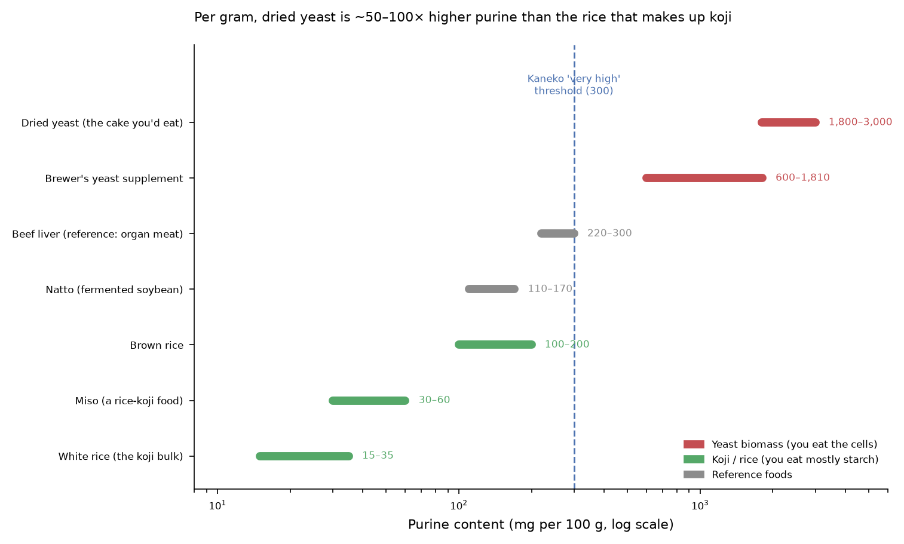

# Purine Load: Koji vs. Yeast Chassis — A Quantified Comparison

**Status:** Settled (data-backed), 2026-06-30
**Tags:** purine, koji, yeast, chassis-selection, gout, dosing, self-experiment
**Question:** Does the engineered *chassis itself* (the biomass you ingest) add a meaningful
dietary purine load, and does this favor koji over yeast? Yes, decisively — and it had not
been quantified anywhere in the corpus before now.

---

## TL;DR

Eating the engineered organism means eating its nucleic acids, and nucleic acids ARE purines.
The chassis is not a purine-neutral delivery vehicle. When you quantify it against the
gold-standard Japanese HPLC food tables (Kaneko 2014) and the USDA purine database (2025):

- **Dried yeast is one of the highest-purine foods that exists** — ~1,800–3,000 mg/100 g
  (Kaneko's "very high" class starts at 300). Brewer's yeast supplements: 600–1,810 mg/100 g.
- **Koji is mostly rice**, and white rice is ~15–35 mg/100 g (Kaneko "very low" class). Miso,
  a rice-koji food, is ~30–60 mg/100 g.
- **At therapeutic uricase dose, the yeast track delivers ~15–120× more dietary purine per
  day than the koji track** (~180–300 mg/day vs. ~2–12 mg/day).
- **The yeast path's purine load — from the medicine alone — is 45–75% of Japan's entire
  400 mg/day gout limit.** The koji path's is 1–3%.

This is a **genuine, previously-unquantified argument for the koji chassis** on the oral
self-dosing path, independent of the documented reasons (multi-chokepoint coverage,
food-grade positioning, dual-household benefit).

---

## Why this matters: the chassis is not purine-neutral

Every cell's DNA and RNA are built from purine (adenine, guanine) and pyrimidine bases. When
you digest cells, those nucleic acids are broken down and the purines are metabolized to uric
acid. So **the more cell mass you eat — and the more nucleic-acid-dense that cell mass is —
the more purine you ingest.**

- **Yeast** is a dense pile of metabolically active single cells. Fast-growing microbes pack
  a lot of RNA (ribosomes) per gram. That's exactly why dried yeast sits at the very top of
  purine food tables, alongside organ meats and fish milt.
- **Koji** is *Aspergillus oryzae* mold grown *through steamed rice*. The bulk of what you
  eat is rice starch, with the mold mycelium woven in. White rice is one of the lowest-purine
  foods known. The mold adds some, but you're eating mostly low-purine substrate.

This distinction was implicit in the corpus's existing "beer is fighting the delivery
vehicle" note (uricase.md, engineered-yeast-uricase-proposal.md §139) — but that note was
about *alcohol + beer's liquid purine content*. The **dried-yeast-biomass** purine load, the
thing you actually swallow on the harvest-the-cake path, was never quantified until now.

---

## The verified numbers

Total purines, mg per 100 g (sources below):

| Food | Purines (mg/100 g) | Kaneko class | What you're eating |
|---|---|---|---|
| **Dried yeast** | **1,800–3,000** | very high (>300) | the yeast cake itself |
| Brewer's yeast supplement | 600–1,810 | very high | concentrated cells |
| Beef liver (reference) | ~220–300 | high/very high | organ meat benchmark |
| Natto (reference) | ~110–170 | moderate | fermented soybean |
| Brown rice | ~100–200 | moderate | — |
| **Miso (a rice-koji food)** | **~30–60** | very low | rice + koji + soy |
| **White rice (the koji bulk)** | **~15–35** | very low | koji's main mass |

**Per-day purine load at therapeutic uricase dose:**

| Track | Daily amount eaten | Purine load/day | % of 400 mg gout limit |
|---|---|---|---|
| **Yeast** (harvest-the-cake) | ~10 g dried yeast | **~180–300 mg** | **45–75%** |
| **Koji** | ~10–15 g dry koji | **~2–12 mg** | **1–3%** |

The yeast track spends nearly your whole daily purine budget on the medicine before you've
eaten any actual food. The koji track is rounding error.

---

## Important caveats (where this is soft)

1. **No direct purine assay of engineered koji or amazake exists.** The koji band (25–80
   mg/100 g) is bounded between measured white rice and miso — a reasoned estimate, not a
   measured value for *this* product. A real HPLC assay of the actual koji is the way to
   close this. (Flagged as an experiment below.)
2. **This is dietary/ingested purine, separate from the uricase mechanism.** The whole point
   of the engineered strain is that it carries uricase, which destroys uric acid in the gut.
   Even on the yeast path, the carried uricase may degrade much of the co-ingested purine load
   in situ. The *net* effect (purine in vs. uricase destroying urate) is what matters and is
   genuinely unknown — but starting from a 15–120× lower purine baseline is a structural
   advantage for koji regardless.
3. **Yeast purine can be reduced.** Industrial yeast-protein purification drops purines from
   ~150–200 to ~9–16 mg/100 g (Angel Yeast data), and a 6-month trial of 20 g/day purified
   yeast protein showed no serum-urate rise. But that purification is a processing step a
   home builder can't easily replicate — the raw harvested cake is the high-purine form.
4. **Doses are order-of-magnitude.** Both rest on the unconfirmed "13% of cell protein is
   uricase" peak and the project's koji dosing estimates. Real per-strain activity assays
   replace these.

---

## Implication for chassis selection

This does **not** kill the yeast track — yeast remains the right *first build* because it
needs no lab (home lithium-acetate transformation vs. koji protoplasting). But it adds a real
consideration that belongs in the decision:

- **Yeast track:** easiest to build at home, but the biomass you ingest carries a high purine
  load that works against the goal. Best treated as a **proof-of-concept / learning build**,
  or paired with a purine-reduction step, or dosed knowing the load.
- **Koji track:** harder to build (needs the protoplasting lab step), but the chassis is
  intrinsically low-purine because it's mostly rice. Better suited to **sustained daily
  dosing** — which is the actual therapeutic use case.

This reinforces the existing chokepoint-first logic: koji was already the priority chassis
for multi-node coverage and food-grade positioning. Add "intrinsically low dietary purine
load" to that list.

---

## New experiment this surfaces

**Direct purine assay of the actual engineered koji and yeast products** (HPLC, the Kaneko
method, or send samples to a food-testing lab). Closes caveat #1. Cheap, decisive, and turns
the estimated koji band into a measured number. Pairs naturally with the planned Phase 0/1
self-experiment: measure the purine the product actually delivers, alongside whether eating
it moves serum urate up or down on the home meter.

---

## Sources

- Kaneko K, Aoyagi Y, Fukuuchi T, Inazawa K, Yamaoka N. *Total purine and purine base content
  of common foodstuffs for facilitating nutritional therapy for gout and hyperuricemia.* Biol
  Pharm Bull. 2014;37(5):709–721. doi:10.1248/bpb.b13-00967. (Gold-standard Japanese HPLC
  food purine tables; classification thresholds; yeast, rice, miso, natto values.)
- USDA & ODS-NIH Database for the Purine Content of Foods, Release 2.0 (the database title
  appears in a 2025 USDA-ARS documentation listing; the specific dried-yeast values cited
  here cross-reference the Kaneko HPLC tables and should be confirmed against the database's
  own entries before being treated as exact). Dried-yeast and brewer's-yeast purine ranges,
  and the "very high >300 mg/100 g" class, are consistent across the Kaneko 2014/2020 tables.
- Kaneko K, et al. *Determination of total purine and purine base content of 80 food products.*
  Nucleosides Nucleotides Nucleic Acids. 2020;39:1449–1457. (Dried yeast >300 mg/100 g;
  supplement range 81.9–516 mg/100 g.)
- Angel Yeast technical FAQ (2026): yeast-protein purine 150–200 mg/100 g raw, 9–16 mg/100 g
  purified; 20 g/day × 6 mo trial showed no serum-urate rise. (Industry source — treat as
  vendor data, not peer-reviewed.)
- Japanese Guideline for the Management of Hyperuricemia and Gout: <400 mg/day dietary purine
  target.
- Existing corpus: uricase.md (beer-as-vehicle purine note), engineered-yeast-uricase-
  proposal.md §139, koji-endgame-strain.md (koji dosing 10–15 g/day dry).
